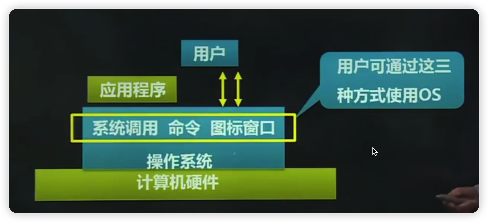
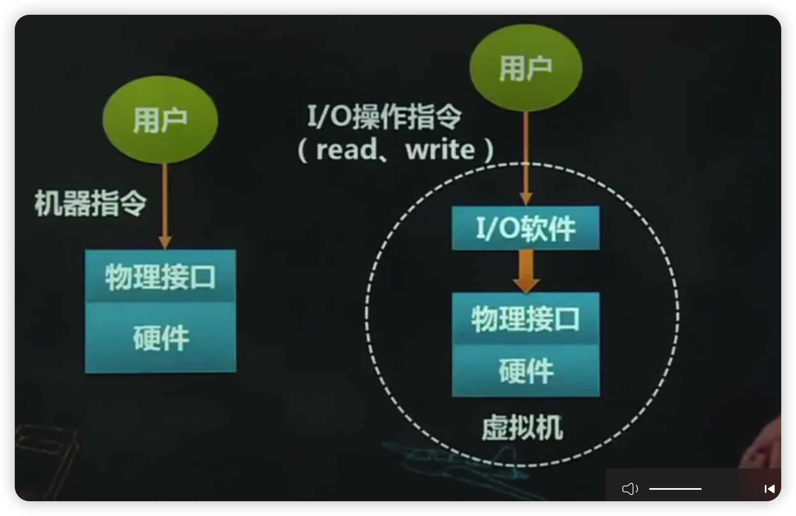
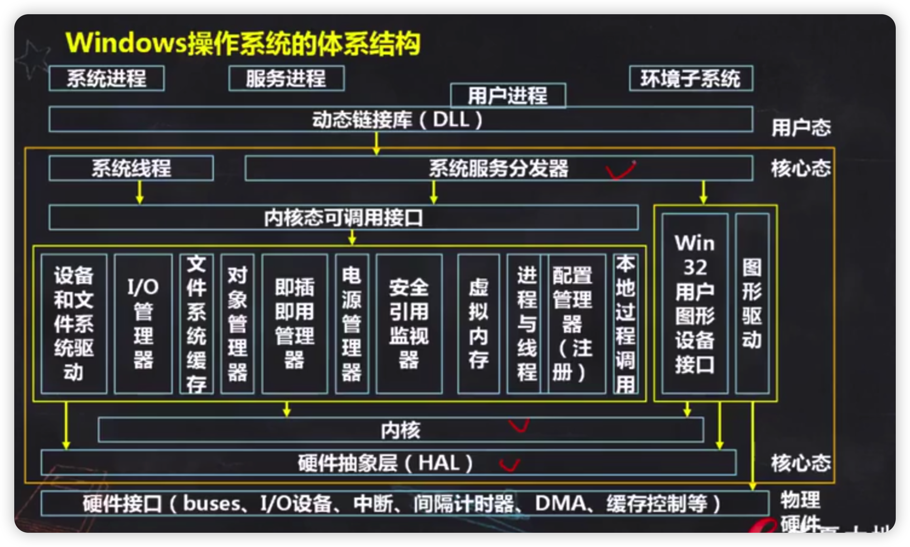
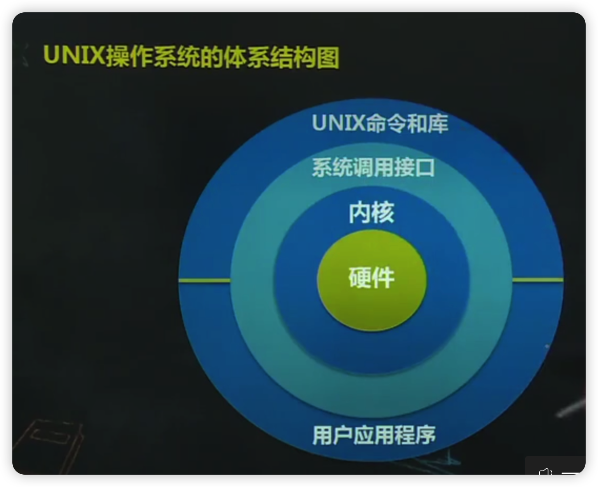

- [本章考试重点](#本章考试重点)
- [1、第一节操作系统的概念](#1第一节操作系统的概念)
  - [1.1、一、计算机系统](#11一计算机系统)
    - [1.1.1、定义](#111定义)
    - [1.1.2、分类](#112分类)
    - [1.1.3、组成](#113组成)
  - [1.2、二、操作系统的定义](#12二操作系统的定义)
  - [1.3、三、操作系统的特征](#13三操作系统的特征)
    - [1.3.1、并发性](#131并发性)
    - [1.3.2、共享性](#132共享性)
    - [1.3.3、随机性](#133随机性)
  - [1.4、四、研究操作系统的观点](#14四研究操作系统的观点)
    - [1.4.1、软件的观点](#141软件的观点)
    - [1.4.2、资源管理的观点](#142资源管理的观点)
    - [1.4.3、进程的观点](#143进程的观点)
    - [1.4.4、虚机器的观点](#144虚机器的观点)
    - [1.4.5、服务提供者观点](#145服务提供者观点)
  - [1.5、五、操作系统的功能](#15五操作系统的功能)
    - [1.5.1、进程管理](#151进程管理)
    - [1.5.2、存储管理](#152存储管理)
    - [1.5.3、文件管理](#153文件管理)
    - [1.5.4、设备管理](#154设备管理)
    - [1.5.5、5.用户接口](#1555用户接口)
- [2、第二节操作系统的体系结构](#2第二节操作系统的体系结构)
  - [2.1、Windows:操作系统的体系结构](#21windows操作系统的体系结构)
    - [2.1.1、内核](#211内核)
    - [2.1.2、硬件抽象层HAL](#212硬件抽象层hal)
    - [2.1.3、3执行体](#2133执行体)
    - [2.1.4.系统进程和系统线程](#214系统进程和系统线程)
  - [2.2、二、UNIX操作系统的体系结构](#22二unix操作系统的体系结构)
    - [2.2.1、内核层](#221内核层)
    - [2.2.2、系统层](#222系统层)
    - [2.2.3、应用层](#223应用层)
  - [2.3、三、Linux操作系统的体系结构](#23三linux操作系统的体系结构)
  - [2.4、四、Android操作系统的体系结构](#24四android操作系统的体系结构)
- [3、第三节操作系统的发展](#3第三节操作系统的发展)
- [4、第四节操作系统的分类](#4第四节操作系统的分类)
  - [4.1、批处理处理系统](#41批处理处理系统)
    - [4.1.1、基本工作方式](#411基本工作方式)
    - [4.1.2、特点与分类](#412特点与分类)
    - [4.1.3、设计思想](#413设计思想)
    - [4.1.4、作业控制说明书](#414作业控制说明书)
    - [4.1.5、一般指令和特权指令](#415一般指令和特权指令)
    - [4.1.6、系统调用的过程](#416系统调用的过程)
    - [4.1.7、SPOOLing技术](#417spooling技术)
  - [4.2、分时系统](#42分时系统)
    - [4.2.1、基本工作方式](#421基本工作方式)
    - [4.2.2、特点](#422特点)
  - [4.3、实时系统](#43实时系统)
  - [4.4、嵌入式操作系统](#44嵌入式操作系统)
    - [4.4.1、定义](#441定义)
  - [4.5、其他操作系统](#45其他操作系统)
- [5、第五节操作系统设计](#5第五节操作系统设计)
  - [5.1、一、操作系统的设计过程](#51一操作系统的设计过程)
  - [5.2、二、操作系统的设计目标](#52二操作系统的设计目标)
  - [5.3、三、操作系统的结构设计](#53三操作系统的结构设计)
  - [5.4、四、操作系统的结构](#54四操作系统的结构)
- [本章小结](#本章小结)

# 本章考试重点

1.操作系统的基本概念和操作系统的地位
2.操作系统的主要特征和基本功能
3.操作系统的体系结构
4.操作系统的发展和结构
5.常用操作系统结构设计方法

# 1、第一节操作系统的概念

## 1.1、一、计算机系统

### 1.1.1、定义

计算机系统是一种可以按用户的要求接收和存储信息、自动进行数据处理并输出结果信息的系统。

### 1.1.2、分类

- 广义：机械式系统和电子式系统
- 电子式系统：模拟式和数字式计算机系统

### 1.1.3、组成

硬件（子）系统和软件（子）系统

- 硬件系统
  - 中央处理器(CPU)、内存储器、外存储器（磁盘、磁带）
  - 输入输出设备（键盘、鼠标、显示器、打印机…）

- 软件系统(程序、数据)
  - 应用软件：文字处理、图形图像处理科学计算、MIS.…
  - 支撑软件：数据库、网络、多媒体.
  - 系统软件：操作系统、编译程序…

在计算机系统中，集中了`资源管理功能和控制程序`执行功能的一种软件，称为`操作系统`。计算机系统的**资源**：`硬件资源、软件资源`

## 1.2、二、操作系统的定义

本书定义：

操作系统是计算机系统中的一个`系统软件`，它是这样一些`程序模块的集合`：它们能有效地`组织和管理`计算机系统中的硬件及软件资源，合理地组织计算机工作流程，控制程序的执行，并向用户提供各种服务功能使得用户能够灵活、方便、有效地使用计算机，并使整个计算机系统能高效地运行。

定义解析

- 1.组织和管理计算机系统中的硬件资源和软件资源。

  在操作系统中，设计了各种表格或数据结构，将所有的软硬件资源都加以登记。比如：PCB、系统设备表等。

- 2.“有效”
  
  指操作系统在管理计算机资源时要考虑到系统运行的效率和利源的利用率。要尽可能提高中央处理器的利用率，让它尽可能少的空转，应该在保证访问效能的前提下尽可能有效地利用其它资源。比如：减少内存、硬盘空间的浪费等

- 3.合理
  
  指操作系统要“公平”对待不同的用户程序保证系统不发生“死锁”和“饥饿”的现象。

- 4.“方便”
  
  指操作系统的人机界面要考虑到用户使用界面和程序接口两个方面的易用性、易学性和易维护性。
  
  `用户使用接口`：命令、图形界面，如Vindow图形界面。
  
  `程序接口`：程序员能够使用操作系统提供的服务供程编程。如Window提供的AP接口，Linux的系统调用。

## 1.3、三、操作系统的特征

### 1.3.1、并发性

是指在计算机系统中同时存在着若干个运行着的程序，从宏观上看，这些程序在同时向前推进。

### 1.3.2、共享性

操作系统需与多个用户程序共用系统中的各种资源比如CPU、内存、外部设备等。

### 1.3.3、随机性

操作系统不能对运行的程序的行为以及硬件设备的情况作出任何事先的假定。

即操作系统不能预知程序在什么时候运行，什么时候因为什么原因暂停，什么时候能得到资源继续运行什么时候运行结束等，这些都是不可预知的。

## 1.4、四、研究操作系统的观点

### 1.4.1、软件的观点

操作系统是一种大型系统软件，它是多种功能程序的集合。有外在特性和内在特性。

外在特性：接口

内在特性：与硬件交互

### 1.4.2、资源管理的观点

操作系统负责登记谁在使用什么样的资源，系统中还有哪些资源空闲，当前响应了谁对资源的请求，以及回收那些不再使用的资源等。

### 1.4.3、进程的观点

把操作系统看做由多个可以同时独立运行的程序和一个对这些程序进行协调的核心。

侧重于分析系统各部分的并行工作，研究处理各项管理任务的分割以及这些管理任务相互之间的关系比如：竞净资源、进程通信等。

### 1.4.4、虚机器的观点

在操作系统的支持下，用户不需要直接使用硬件机器（裸机），而是通过操作系统提供的各种手段来控制和使用计算机。

例如，把所有对设备和文件的操作抽象为统一的打开、关闭、读、写等，用户感觉不到底层的操作差异。

把操作系统的全部功能，包括系统调用、命令、作业控制语言等，称为操作系统虚机器。

### 1.4.5、服务提供者观点

从用户的角度，站在操作系统之外观察操作系统认为该服务提供者为用户提供了比裸机功能更强、服务质量更高、更方便灵活的虚拟机。

## 1.5、五、操作系统的功能

### 1.5.1、进程管理

进程管理的实质：对中央处理器进行管理。或者称为处理机管理。

多道程序技术：多个程序同时放入内存，如果一个程序因为等待某个条件而不能运行，就把处理器专用权转交给另一个可运行程序。

进程的引入：为了描述多道程序的并发而引入

进程的简单定义：一个程序的运行过程

进程管理的内容：进程控制、进程同步、进程间通信、调度。

### 1.5.2、存储管理

(1)任务：管理计算机内存的资源

(2)功能

- ①`内存的分配与回收`：当多个程序共享有限的内存资源时，要考虑如何为多个程序分配有限的内存空间，以及程序运行完毕还需要内存回收。
- ②`存储保护`：存储在内存中的多个程序和数据应该彼此隔离、互不侵扰。
- ③`内存扩充`：将辅助存储器作为内存的扩充空间

### 1.5.3、文件管理

(1)任务：

有效地支持文件的存储、检索和修改等操作，解决文件的共享、保密和保护问题，以便用户方便、安全地访问文件。

(2)功能

- ①文件存储空间的管理
- ②目录管理
- ③文件系统的安全性

### 1.5.4、设备管理

(1)设备管理的含义

指计算机系统中除了处理器和内存以外的所有输入、输出设备的管理。

(2)功能：

负责外部设备的分配、启动和故障处理。

(3)采用的技术

中断技术、通道技术、虚拟设备技术、缓冲技术，尽可能发挥设备和主机的并行能力。

### 1.5.5、5.用户接口

从用户观点看，操作系统是用户与计算机之间的接口。

任务：为用户提供一个使用系统的良好环境，使用户能有效地组织自己的工作流程，并使整个系统高效地运行。

# 2、第二节操作系统的体系结构

## 2.1、Windows:操作系统的体系结构

### 2.1.1、内核

功能：线程调度、陷入处理和异常调度、中断处理和调度、多处理器同步、供执行体使用的基本内核对象。

### 2.1.2、硬件抽象层HAL

系统可移植性的关键分，为运行在Windows操作系统上的硬件平台低级接口，隐藏了各种与硬件有关的细节，如/○接口等专用的和依赖于计算机平台的函数。

### 2.1.3、3执行体

属于内核，以系统函数的形式提供了系统的服务，可通过Win32API进行访问

### 2.1.4.系统进程和系统线程

执行系统代码

## 2.2、二、UNIX操作系统的体系结构

### 2.2.1、内核层

是操作系统管理和控制中心，常驻内存。有两种接口：内核与硬件的接口和内核与shell的接口。

内核本身分为两部分：进程控制子系统和文件子系统。

### 2.2.2、系统层

内核层与应用层之间，供程序员开发调用，包括进程管理、文件管理、中断状态。

### 2.2.3、应用层

面向用户操作的界面

## 2.3、三、Linux操作系统的体系结构  

四个部分：内核、shell、文件系统和应用程序

## 2.4、四、Android操作系统的体系结构

四个部分：从低到高：应用程序层、应用框架层、系统运行库层和Linux内核层。

# 3、第三节操作系统的发展

发展过程

- 1.手工阶段
- 2.监控程序
- 3.多道批处理
- 4.分时与实时操作系统
- 5.UNX通用操作系统
- 6.个人计算机操作系统
- 7.Android操作系统

# 4、第四节操作系统的分类

**根据用户界面和功能特征分类**，三种基本类型

## 4.1、批处理处理系统

### 4.1.1、基本工作方式

用户将作业交给系统操作员，系统操作员在收到作业后，并不立即将作业输入计算机，而是收到一定数量的用户作业之后，组成一批作业，再把这批作业输入到计算机中。这批作业可在系统中形成一个连续的、自动转接的作业流。

系统操作员然后启动操作系统，系统自动、依次执行每个作业。

最后由操作员将执行完毕的作业交给用户

### 4.1.2、特点与分类

特点：成批处理，用户不能干预自己作业的运行

目标：系统资源利用率高，作业吞吐率高。

分类：简单批收处理和多道批处理

### 4.1.3、设计思想

在监控程序启动之前，操作员有选择地把若干个作业合并成一批作业，将这批作业安装在输入设备上。然后启动监控程序，监控程序将自动控制这批作业的执行

作业的运行与衔接都由监控程序自动控制，从而有效地提高了作业运行的效率。

### 4.1.4、作业控制说明书

作业控制说明书是由作业控制语言编写的一段程序它通常存储在被处理作业的前面。

作业的运行由作业控制说明书来传递给监控程序运行过程中，监控程序读入并解释作业说明书，以控制各个作业步的执行。

### 4.1.5、一般指令和特权指令

`操作系统的运行模式`：用户模式和特权模式

`处理器的状态`：目态和管态

`机器指令`：一般指令和特权指令

`系统调用`：用户程序不能直接使用特权指令，它们必须向操作系统请求这些功能，这些功能通过系统调用完成。

### 4.1.6、系统调用的过程

首先，当系统调用发生时，由中断或异常处理程序，把控制流程转移到监控程序内的一些特定位置，处理器模式变为特权模式。

其次，由监控程序执行被请求的功能。

最后，恢复现场，运行模式转变为用户模式，控制权交给用户程序。

### 4.1.7、SPOOLing技术

是多道程序设计的关键技术之一，也称为`假脱机技术`。

## 4.2、分时系统

### 4.2.1、基本工作方式

在分时系统中，一台主机连接了若干个终端，每个终端可由一个用户使用。用户通过终端交互式地向系统提出命令请求，系统接收用户命令之后，采用时间片轮转方式处理服务请求，并通过交互方式在终端上向用户显示结果。

### 4.2.2、特点

- 多路性
- 交互性
- 独占性
- 及时性
  
## 4.3、实时系统

实时操作系统是指，使计算机能在规定的时间内及时响应外部事件的请求，同时完成对该事件的处理并能够控制所有实时设备和实时任务协调一致地工作的操作系统。

目标：在严格时间范围内，对外部请求做出反应系统具有高可靠性。

分类：硬实时系统和软实时系统

能力：除了多道程序系统的基本能力外，还有以下功能

- (1)实时时钟管理
- (2)过载防护
- (3)高可靠性

**随着体系结构的发展**新类型

## 4.4、嵌入式操作系统

### 4.4.1、定义

在各种电器、电子和智能机械上，嵌入安装着各种微处理器或微控制芯片。

嵌入式操作系统就是运行在嵌入式芯片环境中对整个芯片以及它所操作、控制的各种部件装置等资源进行统一协调、调度、指挥和控制的系统软件。

## 4.5、其他操作系统

- 1.个人操作系统
- 2.网络操作系统
- 3.分布式操作系统

# 5、第五节操作系统设计

## 5.1、一、操作系统的设计过程

1.功能设计

确定所设计的操作系统应具备哪些功能以及操作系统的类型。跟目标有关。

2.算法设计

选择和设计满足系统功能的算法和策略，并分析和估算其效能。

3.结构设计

## 5.2、二、操作系统的设计目标

- 1.可靠性
- 2.高效性
- 3.易维护性
- 4.可移植性
- 5.安全性
- 6简明性

## 5.3、三、操作系统的结构设计

操作系统结构研究的目标

- 1.系统模块化
- 2.模块标准化
- 3.通信规范化

## 5.4、四、操作系统的结构

常见的操作系统结构

- 1.整体式结构
- 2.层次式结构
- 3.微内核（客户/服务器）结构

# 本章小结

本章主要讲述计算机系统、操作系统的定义、操作系统的特征、操作系统的发展、操作系统的分类、操作系
统的功能、操作系统设计等内容，重点掌握如下内容：

1.计算机系统

计算机系统的分层结构、计算机系统的组成、计算机系统的资源分类。

2.操作系统的定义

3.操作系统的分类

- (1)批处理系统的基本工作方式、特点、工作原理、目标
- (2)分时系统的基本工作方式、设计思想、特点
- (3)实时系统的定义、设计目标
- (4)嵌入式操作的有点、运行环境
- (5)网络操作系统的定义、应用
- (6)分布式操作的特征、优点

4.操作系统设计

- (1)操作系统的设计过程：功能设计、算法设计、结构设计
- (2)操作系统的设计目标：可靠性、高效性、易维护性、可移植性、安全性、简明性
- (3)操作系统的结构：整体式结构、层次式结构、微内核结构
