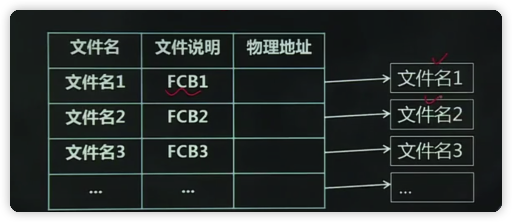
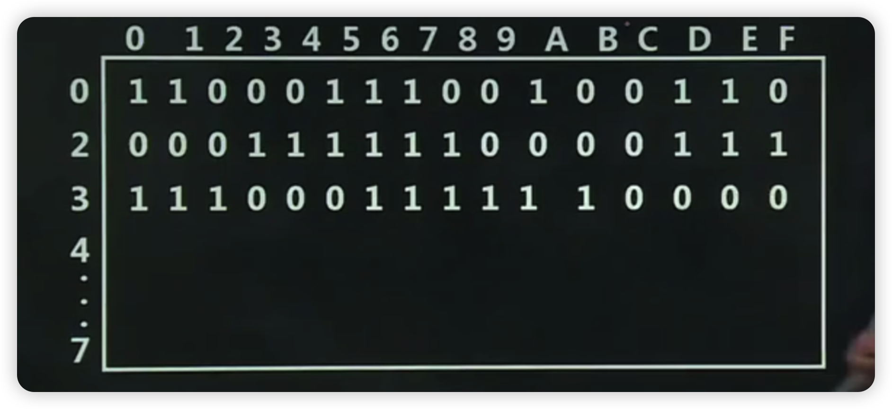
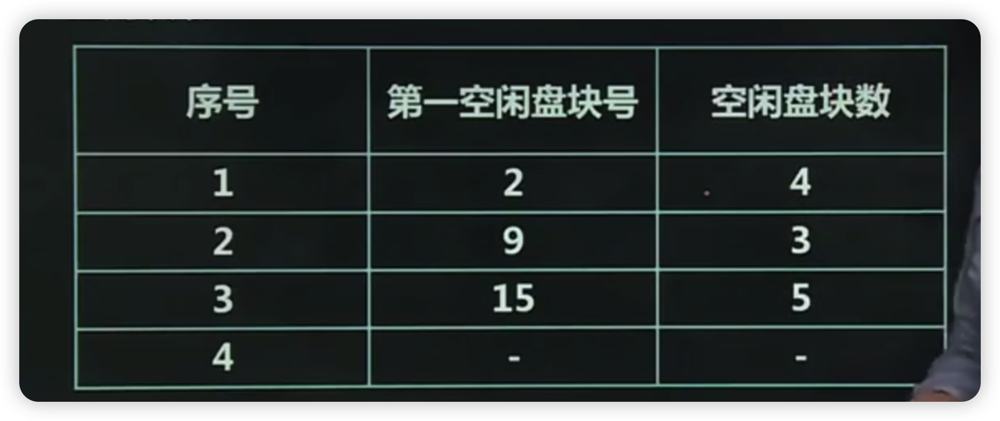
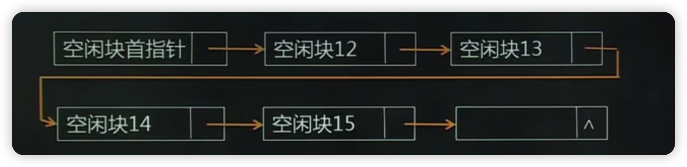
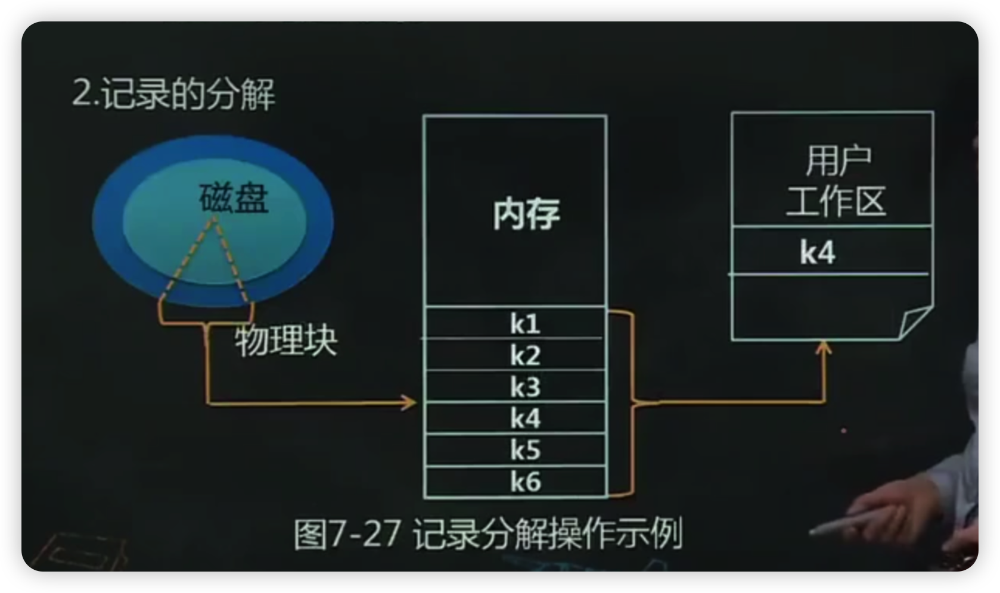
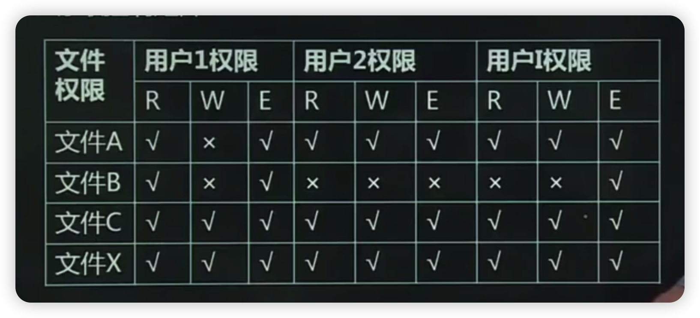

- [本章考试重点](#本章考试重点)
- [1、第一节文件系统的基本概念](#1第一节文件系统的基本概念)
  - [1.1、一、文件系统的任务](#11一文件系统的任务)
    - [1.1.1.文件的定义](#111文件的定义)
    - [1.1.2.文件系统的定义](#112文件系统的定义)
  - [1.2、二、文件的存储介质及存取方式](#12二文件的存储介质及存取方式)
    - [1.2.1.外存储设备的特点](#121外存储设备的特点)
    - [1.2.2.外存储设备的存储介质](#122外存储设备的存储介质)
    - [1.2.3.文件在存储设备中的存取方式](#123文件在存储设备中的存取方式)
  - [1.3、三、文件的分类](#13三文件的分类)
    - [1.3.1.按文件的用途分类](#131按文件的用途分类)
    - [1.3.2.按文件的组织方式分类](#132按文件的组织方式分类)
    - [1.3.3.一些常见的文件分类方式](#133一些常见的文件分类方式)
    - [1.3.4.UNDX类操作系统中文件的分类](#134undx类操作系统中文件的分类)
- [2、第二节文件的逻辑结构和物理结构](#2第二节文件的逻辑结构和物理结构)
  - [2.1、一、文件的逻辑结构](#21一文件的逻辑结构)
    - [2.1.1.设计文件逻辑结构的原则](#211设计文件逻辑结构的原则)
    - [2.1.2.文件的逻辑结构](#212文件的逻辑结构)
  - [2.2、二、文件的物理结构](#22二文件的物理结构)
    - [2.2.1.顺序结构](#221顺序结构)
    - [2.2.2.链接结构](#222链接结构)
    - [2.2.3.索引结构](#223索引结构)
- [3、文件目录](#3文件目录)
  - [3.1、一、文件控制块](#31一文件控制块)
    - [3.1.1.文件控制块](#311文件控制块)
    - [3.1.2.文件目录](#312文件目录)
    - [3.1.3.文件控制块的内容](#313文件控制块的内容)
  - [3.2、文件目录和当前目录](#32文件目录和当前目录)
    - [3.2.1.一级目录结构](#321一级目录结构)
    - [3.2.2.二级目录结构](#322二级目录结构)
    - [3.2.3.多级目录](#323多级目录)
    - [3.2.4.当前目录与目录检索](#324当前目录与目录检索)
  - [3.3、三、目录项和目录文件](#33三目录项和目录文件)
    - [3.3.1.目录项](#331目录项)
    - [3.3.2.目录文件](#332目录文件)
  - [3.4、四、目录项分解法](#34四目录项分解法)
    - [3.4.1.目的](#341目的)
    - [3.4.2.分解](#342分解)
    - [3.4.3.优点](#343优点)
  - [3.5、五、UNIX的文件目录结构](#35五unix的文件目录结构)
    - [3.5.1.i结点的引入](#351i结点的引入)
    - [3.5.2.结点的内容](#352结点的内容)
  - [3.6、六、FAT文件系统的实现](#36六fat文件系统的实现)
- [4、第四节文件存储空间管理](#4第四节文件存储空间管理)
  - [4.1、磁盘空间管理](#41磁盘空间管理)
    - [4.1.1.位示图](#411位示图)
    - [4.1.2.空闲块表](#412空闲块表)
    - [4.2.3.空闲块链](#423空闲块链)
  - [4.3、三、空闲块成组链接法](#43三空闲块成组链接法)
    - [4.3.1.成组链接的含义](#431成组链接的含义)
    - [4.3.2.成组链接法的分配](#432成组链接法的分配)
    - [4.3.3.成组链接法的回收](#433成组链接法的回收)
    - [4.3.4.成组链接法的优点](#434成组链接法的优点)
- [5、第五节实现文件系统的表目](#5第五节实现文件系统的表目)
  - [5.1、一、系统打开文件表](#51一系统打开文件表)
  - [5.2、二、用户打开文件表](#52二用户打开文件表)
- [6、第六节文件](#6第六节文件)
  - [6.1、一、典型的文件操作](#61一典型的文件操作)
  - [6.2、二、典型的目录操作](#62二典型的目录操作)
- [7、第七节文件系统的性能](#7第七节文件系统的性能)
  - [7.1、磁盘高速缓存](#71磁盘高速缓存)
  - [7.1.1.记录的成组](#711记录的成组)
    - [7.1.2.记录的分解](#712记录的分解)
  - [7.2、二、RAID技术](#72二raid技术)
- [8、第八节文件共享、保护和保密](#8第八节文件共享保护和保密)
  - [8.1、一、文件共享](#81一文件共享)
    - [8.1.1.文件共享的概念](#811文件共享的概念)
    - [8.1.2.文件共享的分类](#812文件共享的分类)
    - [8.1.3.文件共享的实现方法](#813文件共享的实现方法)
  - [8.2、二、文件的保护](#82二文件的保护)
  - [8.3、三、UNX的文件使用权限管理方案](#83三unx的文件使用权限管理方案)
    - [8.3.1.存取控制矩阵](#831存取控制矩阵)
    - [8.3.2.UNDⅨ中的文件存取权限](#832undⅸ中的文件存取权限)
    - [8.4、四、文件的保密措施](#84四文件的保密措施)

<https://www.bilibili.com/video/BV1i5411G7JF?p=24&vd_source=1a3e236d757ed516a67f8c9b0103998f>

# 本章考试重点

- 1.文件、文件名及文件系统的概念
- 2.文件控制块、目录项、文件目录及目录文件的概念
- 3.文件的逻辑结构和物理结构
- 4.目录检索、磁盘空间管理、记录的成组与分解
- 5.文件和目录的各种操作
- 6.文件共享和文件保护的方法、文件的保密措施

# 1、第一节文件系统的基本概念

## 1.1、一、文件系统的任务

### 1.1.1.文件的定义

(1)研究文件系统的两种观点

用户观点：关心文件由什么组成，如何命名如何保护文件，可以进行何种操作。

系统观点：文件目录是怎样实现的，怎样管理存储空间，文件存储位置，磁盘实际运作方式，存取速度，磁盘利用率等等。

(2)文件的定义：一组带标识的、在逻辑上有完整意义的信息项的序列。

(3)读写指针：读指针用来记录文件当前的读取位置，写指针用来记录文件当前的写入位置。

(4)特点：存储在磁盘，可长期保存

### 1.1.2.文件系统的定义

文件系统是操作系统中统一管理信息资源的一种软件。它管理文件的存储、检索、更新，提供更安全的共享和保护手段，并且方便用户使用。

功能

- (1)统一管理文件的存储空间，实施存储空间的分配与回收
- (2)实现文件按名存取，以对用户透明的方式管理名字空间
- (3)实现文件信息的共享，并提供文件的共享和保密措施。
- (4)向用户提供一个方便使用的接口
- (5)系统维护及向用户提供有关信息
- (6)保持文件系统的执行效率
- (7)提供与/O的统一接▣

## 1.2、二、文件的存储介质及存取方式

### 1.2.1.外存储设备的特点

- 特点：容量大、断电后仍可保存信息
- 组成：驱动部分和存储介质部分。
- 种类：磁盘、磁带、磁鼓、纸带、光盘、闪存

### 1.2.2.外存储设备的存储介质

(1)磁带。 特点：容量大，存取速度慢，适合顺序存储

(2)磁盘。分类：软盘和硬盘。特点：容量大，成本低，适合随机存储

(3)光盘是利用在激光的作用下特性发生变化的一些材料制成的非磁性记录介质。特点：容量大、速度快、价格便宜

(4)闪存。特点：电擦除，随机存取、可靠性高、寿命长

### 1.2.3.文件在存储设备中的存取方式

顺序存取：按从前到后的次序依次访问文件的各个信息项。

随机存取：又称直接存取，允许用户按任意的次序、直接存取文件中的任意一个记录，或者根据存取命令把读写指针移到文件中的指定记录处读取。

## 1.3、三、文件的分类

### 1.3.1.按文件的用途分类

- (1)系统文件
- (2)库函数文件
- (3)用户文件

### 1.3.2.按文件的组织方式分类

- (1)普通文件
- (2)目录文件
- (3)特殊文件

### 1.3.3.一些常见的文件分类方式

- (1)按文件的保护方式：只读文件、读写文件、可执行文件无保护文件
- (2)按信息的流向分：输入文件、输出文件、输入输出文件
- (3)按存放时限分：临时文件、永久文件、档案文件
- (4)按存储介质分：磁盘文件、磁带文件、卡片文件等
- (5)按文件的组织结构分类：逻辑文件、物理文件

### 1.3.4.UNDX类操作系统中文件的分类

- (1)普通文件
- (2)目录文件
- (3)特殊文件

# 2、第二节文件的逻辑结构和物理结构

文件的逻辑结构：从用户观点出发所观察到的文件组织形式

文件的物理结构：又称为文件的存储结构。是指系统将文件存储在外存上所形成的一种存储组织形式，是用户不能看见。

## 2.1、一、文件的逻辑结构

### 2.1.1.设计文件逻辑结构的原则

- (1)易于操作
- (2)查找快捷
- (3)修改方便
- (4)空间紧凑

### 2.1.2.文件的逻辑结构

文件的逻辑结构所描述的信息是文件中信息的组织形式，可分为三类：

- (1)流式文件：有序字符的集合，基本单位是字符。源程序、目标代码等属于流式文件
- (2)记录式文件：是一组有序记录的集合，基本单位是记录。又可分为定长记录文件和变长记录文件。

## 2.2、二、文件的物理结构

### 2.2.1.顺序结构

(1)顺序结构原理

又称连续结构，它把逻辑上连续的文件信息依次存放在连续编号的物理块中。

(2)顺序结构的优缺点

- 优点
  - 存取速度快，一旦知道了文件在存储设备上的起始块号和文件长度，便能快速进行存取。
  - 支持顺序存放和随机存取

- 缺点
  - 文件不能动态增长
  - 要求为一个文件分配连续的存储空间
  - 不能灵活地删除和插入记录
  - 出现碎片

### 2.2.2.链接结构

(1)链接结构原理

将逻辑上连续的文件分散存储在若干个不连续的物理块中。每个物理块中都设有一个指针，指向其后续的物理块。

- 优点
  - 解决了碎片问题，提高了磁盘空间利用率
  - 文件可以动态扩充

- 缺点
  - 存取速度慢，不适于随机存取
  - 可靠性差

### 2.2.3.索引结构

(1)索引结构原理

为每个文件分配一个索引块（表），把分配给该文件的所有盘块号，都记录在该索引块中。

- 优点
  - 文件动态增长
  - 不要求为一个文件分配连续的存储空间
  - 能灵活地删除和插入记录
  - 能顺序存取和随机存取

- 缺点
  - 引起较多的寻道次数和寻道时间
  - 索引表本身增加了存储空间的开销

# 3、文件目录

## 3.1、一、文件控制块

### 3.1.1.文件控制块

为文件设置的用于描述和控制文件的数据结构。文件管理程序可借助于文件控制块中的信息，对文件施以各种操作。

### 3.1.2.文件目录

文件控制块的有序集合(文件与文件控制块对应)称为文件目录，一个文件控制块就是一个文件目录项。

### 3.1.3.文件控制块的内容

(1)基本信息类：文件名、文件物理位置、文件逻辑结构、文件的物理结构。

(2)存取控制信息类：文件主的存取权限、核准用户的存取权限以及一般用户的存取权限。

(3)使用信息类：文件的建立日期和时间、文件上一次修改的日期和时间、当前已打开该文件的进程数、是否被其它进程锁住、文件在内存中是否已被修改但尚未拷贝到盘上等。

## 3.2、文件目录和当前目录

### 3.2.1.一级目录结构

优点：简单且能实现目录管理的基本功能—按名存取。

缺点：查找速度慢、不允许重名

### 3.2.2.二级目录结构

为改变一级目录文件目录命名冲突，并提高对目录文件检索速度而将目录分为两级：一级称为主文件目录，给出用户名，用户子目录所在的物理位置；二级称为用户文件目录，给出该用户所有文件的FCB。

优点：解决了文件的重名问题和文件共享问题提高搜索速度，查找时间降低。

缺点：不太适合大量用户和大量文件的大系统增加了系统开销。

### 3.2.3.多级目录

多级目录结构也称树形目录，产生于UNX操作系统，已被现代操作系统广泛采用。

优点：层次结构清晰，便于管理和保护；有利于文件分类；解决重名问题；提高文件检索速度；能进行存取权限的控制。

缺点：查找一个文件按路径名逐层检查，由于每个文件都放在外存，多次访盘影响速度。

### 3.2.4.当前目录与目录检索

当前目录：当前正在使用的目录(也称工作目录或值班目录)。

目录检索：用户访问文件时，需要进行目录检索，这时用户给出文件名，系统按名寻找目录项。

检索方法：全路径名（绝对路径名），相对路径。

## 3.3、三、目录项和目录文件

### 3.3.1.目录项

一个文件控制块做成一个定长记录，这个记录称为目录项。

### 3.3.2.目录文件

多个文件的文件控制块集中在一起组成了文件的目录。文件目录以文件的形式保存，该文件称为目录文件。

## 3.4、四、目录项分解法

### 3.4.1.目的

加快目录检索速度

### 3.4.2.分解

目录项分解成两部分：符号目录项（次部）和基本目录项（主部）。

符号目录项：包含文件名和文件号

基本目录项：除文件名以外的FCB的其他全部信息

### 3.4.3.优点

减少磁盘的访问次数，提高文件目录检索速度

## 3.5、五、UNIX的文件目录结构

### 3.5.1.i结点的引入

文件目录通常是存放在磁盘上的，可能要占用大量的盘块。在查找目录的过程中，需要多次启动磁盘。UNX系统，采用了把文件名与文件描述信息分开的办法，亦即，使文件描述信息单独形成一个称为索引结点的数据结构，简称为结点。

### 3.5.2.结点的内容

文件主标识符、文件类型、文件存取权限、文件物理地址、文件长度、文件连接计数、文件存取时间等。

## 3.6、六、FAT文件系统的实现

FAT的含义：文件分配表-File Allocation Table,最初为DOS系统设计，适合小容量的磁盘，分配给文件的所有盘块号都放在该表中

三个版本：FAT-12、FAT-16、FAT-32

# 4、第四节文件存储空间管理

## 4.1、磁盘空间管理

基本思想：对于磁盘空间的分配和回收的方法。

### 4.1.1.位示图

### 4.1.2.空闲块表

### 4.2.3.空闲块链

## 4.3、三、空闲块成组链接法

### 4.3.1.成组链接的含义

文件区中的所有空闲盘块，被分成若干个组，比如将每100个盘块作为一组。

将每一组含有的盘块总数N和该组所有的盘块号记入其前一组的第一个盘块中。这样，由各组的第一个盘块可链成一条链。如图7-22所示。

### 4.3.2.成组链接法的分配

在空闲块链中，不足100块的组，通常放在内存专用块中，系统初始化时，先把专用块内容读到内存中需要分配时，就直接在内存中找到哪块是空闲的，然后进行分配，空闲块数减1，如果这一组的第一个空闲块也要分配，在分配之前，先把其保存的下一组的空闲盘块号读入内存中，再分配出去，依次类推。

### 4.3.3.成组链接法的回收

归还一个空闲盘块时，把要归还的块号登记在当前组中，空闲块数加1，如果当前组已满100块，则把这100个块号写到要归还的那块中，该块就成为新组的第一块。

### 4.3.4.成组链接法的优点

分配和回收空闲块时均在内存中查找和修改只有在一组空闲块分配完或空闲的磁盘块构成一组时才需要启动磁盘读写，效率高，能快速找到大量空闲盘块的地址，UNⅨ采取这种方案。

# 5、第五节实现文件系统的表目

## 5.1、一、系统打开文件表

专门用来保存已打开文件的文件控制块，通常放在内存。

共享计数：记录有多少个进程同时打开该文件。

修改标志：指文件控制块或结点的内容是否被修改过，如果修改过，则关闭文件时要将文件控制块写回磁盘。

## 5.2、二、用户打开文件表

每个用户都有一个“用户打开文件表”，其位置记录在PCB中，以UNX为例，内容如下：

# 6、第六节文件

## 6.1、一、典型的文件操作

- 1.建立文件
- 2.打开文件
- 3.读文件
- 4.写文件
- 5.关闭文件
- 6.删除文件

## 6.2、二、典型的目录操作

以UNX系统为例

- 1.创建目录creat
- 2.打开目录opendir
- 3.读目录readdir
- 4.创建链接ink
- 5.删除链接uink
- 6.修改目录名rename
- 7.关闭目录closedir
- 8.删除目录delete

# 7、第七节文件系统的性能

## 7.1、磁盘高速缓存

系统在内存中保存一些磁盘块，这些磁盘块在逻辑上属于磁盘，内存的这一区域被称为块高速缓存。

运行时，系统检查所有的读请求，查看文件块是否在高速缓存，在，则读；不在，首先启动磁盘，将所需块读到高速缓存，再复制到其他内存区域。若高速缓存已满，按照淘汰算法，选择较少使用的磁盘块换出。

块高速缓存要定期写回磁盘，以保存对磁盘块的修改！

文件系统一致性问题：如果在修改过的磁盘块写回磁盘之前，系统出现故障，则文件系统有可能会处于不一致状态。特别是一些未被写会的块是结点、目录块或者包含空闲表的磁盘块时问题尤为严重。这一问题称为文件系统一致性问题。高速缓冲的典型应用：记录的成组

## 7.1.1.记录的成组

把若干个逻辑记录合成一组存储到一个物理块的工作，称为记录的成组。每块中的逻辑记录个数称为块因子

实现原理：信息交换以块为单位，故成组需要使用内存缓冲区来完成。缓冲区的长度=记录的长度*块因子。7-26所示：

优点：提高了磁盘利用率，减少了启动磁盘的次数，提高系统工作效率。

要考虑的因素：定长记录和不定长记录

### 7.1.2.记录的分解

从一组记录中把一个逻辑记录分离出来的操作称为记录的分解。过程：当用户请求读某记录时，文件系统首先找到该记录所在的磁盘块的位置，然后将把含有该记录的物理块全部读入内存缓冲区，从内存缓冲区分解出指定的记录，然后送到用户工作区。过程如图7-27所示。

## 7.2、二、RAID技术

RAID是英文Redundant Array of IndependentDsks的缩写，中文简称为独立冗余磁盘阵列。简单的说，RAID是一种把多块独立的硬盘（物理硬盘）按不同的方式组合起来形成一个硬盘组（逻辑硬盘），从而提供比单个硬盘更高的存储性能和提供数据备份技术

好处主要有以下三种：

- 通过把多个磁盘组织在一起作为一个逻辑卷提供磁盘跨越功能：
- 通过把数据分成多个数据块(Block)并行写入/读出多个磁盘以提高访问磁盘的速度：
- 通过镜像或校验操作提供容错能力；

RAID技术经过不断的发展，现在已拥有了从RAID O到7八种基本的RAID级别。另外，还有一些基本RAID级别的组合形式，如RAID10(RAID0与RAID1的组合)，RAID50(RAID0与RAID5的组合)等。不同RAID级别代表着不同的存储性能、数据安全性和存储成本。

# 8、第八节文件共享、保护和保密

## 8.1、一、文件共享

### 8.1.1.文件共享的概念

文件共享是指一个文件可以允许多个用户共同使用

### 8.1.2.文件共享的分类

从共享时间段上看，共享文件有两种使用情况

- (1)文件可以同时使用
- (2)文件不允许同时使用

在文件共享具体方式上，有三种共享方式

- (1)文件被多个用户使用，由存取权限控制
- (2)文件被多个用户使用，但分别用自己的读写指针
- (3)文件被多个程序使用，但共享读写指针

### 8.1.3.文件共享的实现方法

多级目录结构，常用的是连接法，分两种

- (1)允许目录项连接到任一表示文件目录的结点上。
- (2)只允许连接到表示普通文件的节点上

## 8.2、二、文件的保护

影响文件安全性的主要因素

- (1)人为因素：人们有意或无意的行为，会使文件系统中的数据遭到破坏或丢失；
- (2)系统因素：由于系统的某部分出现异常情况而造成数据的破坏或丢失，特别是作为数据存储主要介质的磁盘，一但出现故障，会产生难以估量的影响
- (3)自然因素：随着时间的推移，存放在磁盘上的数据会逐渐消失。

为了确保文件系统的安全性，可采取的措施

- (1)建立副本，即把同一个文件保存到多个存储介质上。
- (2)定时转储，即每个一定时间就把文件转储到其他的存储介质上。
- (3)规定文件的存取权限。可采用树形目录结构和存取控制表两种方法

## 8.3、三、UNX的文件使用权限管理方案

### 8.3.1.存取控制矩阵

### 8.3.2.UNDⅨ中的文件存取权限

UNDX中对文件的存取权限划分为两级。

在第一级中对访问者或者用户进行分类识别。将用户分为：文件主(owner)、文件主的同组用户(other)、其他用户(other)

在第二级中，对文件操作权限的权限设置。包括读(r)、写(w)、执行(x),不执行任何操作(-)

### 8.4、四、文件的保密措施

文件保密的目的，是防止不经文件拥有者授权而窃取文件。常用的文件保密措施有以下几种

- 1.隐蔽文件目录
- 2.设置口令
- 3.使用密码
- 4.病毒防范
