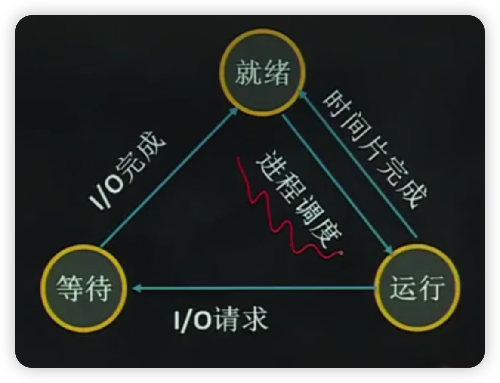
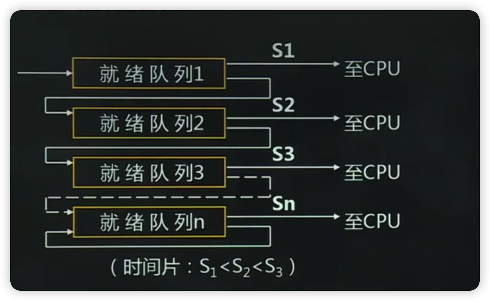

- [本章考试重点](#本章考试重点)
- [1、第一节多道程序设计](#1第一节多道程序设计)
  - [1.1、一、程序的顺序执行](#11一程序的顺序执行)
  - [1.2、二、程序的并发执行](#12二程序的并发执行)
  - [1.3、三、多道程序设计](#13三多道程序设计)
    - [1.3.1、多道程序设计环境特点](#131多道程序设计环境特点)
    - [1.3.2、多道程序设计环境缺陷](#132多道程序设计环境缺陷)
- [2、第二节进程](#2第二节进程)
  - [2.1、一、进程](#21一进程)
    - [2.1.1、进程和程序的联系](#211进程和程序的联系)
    - [2.1.2、进程和程序的区别](#212进程和程序的区别)
    - [2.1.3、可再入程序](#213可再入程序)
    - [2.1.4、3.进程的特征](#2143进程的特征)
  - [2.2、二、进程的状态与转换](#22二进程的状态与转换)
    - [2.2.1、三状态进程模型](#221三状态进程模型)
    - [2.2.2、五状态进程模型](#222五状态进程模型)
    - [2.2.3、七状态进程模型](#223七状态进程模型)
  - [2.3、三、进程控制块](#23三进程控制块)
    - [2.3.1、PCB的内容](#231pcb的内容)
    - [2.3.2、进程的组成](#232进程的组成)
    - [2.3.3、PCB组织](#233pcb组织)
    - [2.3.4、进程的队列](#234进程的队列)
    - [2.3.5、进程郢队列的组成](#235进程郢队列的组成)
  - [2.4、四、进程控制](#24四进程控制)
    - [2.4.1、进程控制原语](#241进程控制原语)
    - [2.4.1.1、创建原语](#2411创建原语)
      - [2.4.1.2、撤销原语](#2412撤销原语)
      - [2.4.1.3、阻塞原语](#2413阻塞原语)
      - [2.4.1.4、唤醒原语](#2414唤醒原语)
- [3、第三节线程](#3第三节线程)
  - [3.1、一、线程的基本概念](#31一线程的基本概念)
    - [3.1.1、什么是线程](#311什么是线程)
    - [3.1.2、线程的属性](#312线程的属性)
    - [3.1.2、引入线程的好处](#312引入线程的好处)
  - [3.2、二、进程和线程的比较](#32二进程和线程的比较)
  - [3.3、三、线程实现机制](#33三线程实现机制)
- [4、第四节进程调度](#4第四节进程调度)
  - [4.1、一、概述](#41一概述)
    - [4.1.1、进程调度的主要功能](#411进程调度的主要功能)
    - [4.1.2、进程调度的时机](#412进程调度的时机)
  - [4.2、二、调度算法设计原则](#42二调度算法设计原则)
  - [4.3、三、进程调度算法](#43三进程调度算法)
    - [4.3.1、先来先服务](#431先来先服务)
    - [4.3.2、最短进程优先算法](#432最短进程优先算法)
    - [4.3.3、最短剩余时间优先算法](#433最短剩余时间优先算法)
    - [4.3.4、最高响应比优先算法](#434最高响应比优先算法)
    - [4.3.5、轮转算法](#435轮转算法)
    - [4.3.6、最高优先级算法](#436最高优先级算法)
    - [4.3.7、多级反馈队列算法](#437多级反馈队列算法)
- [5、第五节系统内核](#5第五节系统内核)
  - [5.1、一、内核的概念](#51一内核的概念)
  - [5.2、二、内核的位置](#52二内核的位置)
  - [5.3、三、内核的功能](#53三内核的功能)

# 本章考试重点

1.多道程序设计

多道程序设计的概念、特点

2.进程

进程的定义、进程与程序的区别、进程的特征、进程的状态与转换、进程控制块、进程的组成、进程控制

3线程

线程的定义、引入线程的好处

4.进程调度

进程调度的功能、时机、调度算法

# 1、第一节多道程序设计

## 1.1、一、程序的顺序执行

1.顺序程序设计：

程序是在一个时间上按严格次序前后相继的操作序列。

计算机也是以顺序方式工作的：计算机一次执行条指令、对内存一次访问一个字节或字，对外部设备一次传送一个数据块等。

我们把一个具有独立功能的程序独占处理器直到得到最终结果的过程称为程序的顺序执行。

2、程序的顺序执行的特点

(1)顺序性

程序所规定的动作在机器上严格地按顺序执行。

(2)封闭性

程序运行后，其计算结果只取决于程序自身，程序执行得到的最终结果由给定的初始条件决定，不受外界因素影响。

(3)程序执行结果的确定性

程序执行的结果与其执行速度无关。

(4)程序执行结果的可再现性

如果程序在不同的时间执行，只要初始条件相同则结果就会相同。

## 1.2、二、程序的并发执行

所谓并发执行，是指两个或两个以上程序在计算机系统中，同时处于已开始执行且尚未结束的状态。能够参与并发执行的程序称为并发程序。并发程序的执行和程序顺序执行的特征不同

并发执行的特征如下：

- (1)在执行期间并发程序相互制约
- (2)程序与计算不再一一对应允许多个程序共享一个程序段
- (3)并发程序的执行结果不可再现并发程序与其执行的相对速度以及并发执行的多道程序之间的相互关系有关。
- (4)程序的并行执行和程序的并发执行程序的并发执行是宏观上的同时，微观是顺序。并行则是微观上是同时的。

## 1.3、三、多道程序设计

顺序环境下

并发环境下

### 1.3.1、多道程序设计环境特点

多道程序设计：就是允许多个程序同时进入内存并运行。根本目的是提高整个系统的效率

吞吐量：是指单位时间内系统所处理进程的道数是衡量系统效率的尺度。

- (1)独立性：在多道环境下执行的每道程序都是逻辑上独立的且执行速度与其他程序无关，执行的起止时间也是独立的。
- (2)随机性：程序和数据的输入与行开始时间都是随机的
- (3)资源共享性

### 1.3.2、多道程序设计环境缺陷

- (1)可能延长程序的执行时间
- (2)系统效率的提高有一定限度

# 2、第二节进程

## 2.1、一、进程

进程是具有一定独立功能的程序在某个数据集合上的一次运行活动，是系统进行资源分配和调度的一个独立单位。分为：系统进程和用户进程

### 2.1.1、进程和程序的联系

程序是构成进程的组成部分之一，一个进程的运行目标是执行它所对应的程序。

进程=程序+数据+进程控制块

### 2.1.2、进程和程序的区别

- ①程序是静态的，进程是动态的。
- ②二者是多对多的关系。

### 2.1.3、可再入程序

一个能够被多个用户同时调用的程序称作是“可再入”程序。

可再入程序必须是纯代码，程序在行过程中不会修改自己的代码，必须与数据区隔离。

比如：操作系统、编译程序，它们能同时被不同用户调用而形成不同的进程。

### 2.1.4、3.进程的特征

- (1)并发性
- (2)动态性
- (3)独立性
- (4)交往性
- (5)异步性
- (6)结构性

## 2.2、二、进程的状态与转换

### 2.2.1、三状态进程模型

- (1)运行状态
- (2)就绪状态
- (3)等待状态

状态转换

- (1)就绪-》运行
- (2)运行-》就绪
- (3)运行-》等待
- (4)等待-》就绪

### 2.2.2、五状态进程模型

- (1)运行状态
- (2)就绪状态
- (3)阻塞状态
- (4)创建状态
- (5)结束状态

### 2.2.3、七状态进程模型

## 2.3、三、进程控制块

为了便于系统控制和描述进程的活动过程，在操作系统核心中定义了一个专门的数据结构，称为PCB。PCB的作用：

- 描述进程的基本情况以及进程的运行变化过程。
- PCB是进程存在的唯一标志，当系统创建一个进程时，为进程设置一个PCB,再利用PCB对进程进行控制和管理。撤销进程时，系统收回PCB,进程也随之消亡。

### 2.3.1、PCB的内容

(1)调度信息

供进程调度时使用，包括进程名、进程号、地址空间信息、优先级、当前状态、资源清单、“家族”关系、消息队列指针、进程队列指针和当前打开文件等。

(2)现场信息

刻画了进程的运行情况，主要是CPU寄存器的信息，如程序状态字、时钟、界地址寄存器等。当程序中断时，需要保存现场信息。

### 2.3.2、进程的组成

- 进程由程序、数据和进程控制块组成
- PCB是“灵魂”；
- 程序和数据是“躯体”

### 2.3.3、PCB组织

- 线性方式
- 索引方式
- 链接方式

### 2.3.4、进程的队列

- 就绪队列
- 等待队列
- 运行队列

### 2.3.5、进程郢队列的组成

进程队列实际是PCB的链接，链接分为：单向链表和双向链表。

- 出队：一个进程从所在队列退出
- 入队：一个进程排入到指定队列
- 插队：一个进程插入到某个进程队列的指定位胃

## 2.4、四、进程控制

进程控制：

对进程整个生命周期中各种状态之间的转换进行的控制由原语实现。

原语：

就是由若干条指令组成的，用于完成一定功能的一个过程，是一个不可分割的基本单位，即原语在执行过程中不允许被中断。原子操作在系统态下执行，常驻内存。

### 2.4.1、进程控制原语

### 2.4.1.1、创建原语

一个进程可以使用创健原语创建一个新的进程前者称为父进程，后者称为子进程，子进程又可以创建新的进程，从而形成一个进程家族。

主要任务：建立进程控制块PCB。

过程：先申请一空闲PCB,然后将有关信息填入PCB,置进程状态为就绪状态，插入就绪都队列。

#### 2.4.1.2、撤销原语

当一个进程完成任务后，就应当撤销它，以便及时释放它所占用的资源。

撤销的实质：撤销进程控制块PCB。

过程：找到要被撤销进程的PCB,将它从所在队列中消去，撤销属于该进程的一切“子进程”，释放所占全部资源，并消去被徽销进程的PCB。

#### 2.4.1.3、阻塞原语

若某个进程的执行过程中需要/O操作，则该进程调用阻塞原语将其从运行状态转换为阻塞状态。

过程：产生中断，把处理器的当前状态保存在PCB的现场信息中，当前进程置为等待态，插入等待队列。

#### 2.4.1.4、唤醒原语

一个进程因为等待某事件的发生而处于等待状态当该事件发生后，就用唤醒原语将其转换为就绪状态。

过程：在等待队列中找到该进程，将进程的当前状态置为就绪状态，然后将它从等待队列中撤出并插入到就绪队列中排队，等待调度执行

# 3、第三节线程

## 3.1、一、线程的基本概念

进程的属性

- 一个可拥有资源的独立单位
- 可独立调度和分派的基本单位

程序并发执行所需付出的时空开销

- 创建进程的开销
  - 内存空间、I/O设备、PCB
- 撤销进程的开销
  - 对其资源作回收
- 进程切换的开销
  - 保留CPU环境，设置新进程CPU环境

这些开销，限制了系统中进程的数目，进程切换也不宜频繁，限制了并发程度的进一步提高

引入线程的目的：

- 引入进程是为了使多个进程并发执行。
- 引入线程是为了减少程序并发执行时所付出的时空开销。

### 3.1.1、什么是线程

在引入线程的操作系统中，线程是进程中的一个实体，是处理器调度和分配的基本单位。

线程基本上不拥有系统资源，只拥有少量在运行中必不可少的资源，但它可与同属一个进程的其他线程共享进程所拥有的全部资源。

一个线程可以创健和撤销另一个线程；同一个进程中的多个线程可以并发执行。

### 3.1.2、线程的属性

- (1)每个线程有一个唯一的标识和一张线程描述表。
- (2)不同的线程可以执行相同的程序
- (3)同一个进程中的各个线程共享该进程的内存地址空间
- (4)线程是处理器的独立调度单位，多个线程可以并发执行
- (5)一个线程具有生命周期，经历等待、就绪、运行等状态变化。

### 3.1.2、引入线程的好处

- (1)创建一个新线程花费时间少。
- (2)线程之间的切换花费时间少
- (3)线程之间通信无需调用内核，不需要额外的通信机制，使通信简单、信息传送速度快。

## 3.2、二、进程和线程的比较

1.调度

线程作为调度的基本单位，同进程中线程切换不引起进程切换，当不同进程的线程切换时才引起进程切换。

2.并发性

一个进程间的多个线程可并发，不同进程的多个线程也可以并发执行。

3.拥有资源

线程仅拥有隶属进程的资源；进程是拥有资源的独立单位。

4.系统开销

线程低，进程高。

## 3.3、三、线程实现机制

1.用户级线程

仅存在于用户空间，由用户层中的线程库提供对线程的创建、撤销、切换，以及线程之间的同步与通信等的支持，而无须内核的支持。

2.内核级线程

由OS直接支持，更灵活，方便。

3.混合方式

# 4、第四节进程调度

## 4.1、一、概述

### 4.1.1、进程调度的主要功能

- (1)记录系统中所有进程的执行状况；
- (2)根据一定的调度算法，从就绪队列中选出一个进程，准备把处理器分配给它；
- (3)分配处理器

### 4.1.2、进程调度的时机

- (1)正在执行的进程运行完毕
- (2)正在执行的进程由于某种错误而终止运行
- (3)时间片完
- (4)正在执行的进程调用阻塞原语将自己阻塞起来
- (5)创建了新的进程
- (6)正在行的进程调用了唤醒原语操作激活了等待资源的进程。

处理器的调度方式：非抢占式和抢占式

- (1)非抢占方式
  
  一旦把处理机分配给某进程后，就一直让它运行下去，决不会因为时钟中断，或任何其它原因，去抢占该正在运行进程的处理机，直至该进程完成，或发生某事件而被阻塞时，才把处理机分配给其它进程。

- (2)抢占方式
  
  允许调度程序根据某种原则，去暂停某个正在执行的进程，将已分配给该进程的处理机，重新分配给另一进程。
  抢占方式能满足实时任务的需求。但抢占方式比较复杂，所需付出统开销也较大。

## 4.2、二、调度算法设计原则

1.进程行为

I/O密集型和计算密集型

2.系统分类

批处理、交互式、实时系统

3.调度算法的设计目标

- 共同目标：资源利用率高、公平、平衡、强制执行策略。
- 批处理目标：平均周转时间短、系统吞吐量高、处理机利用率好
- 分时系统目标：响应时间快、均衡性
- 实时系统目标：截止时间的保证、可预测性

## 4.3、三、进程调度算法

周转时间 = 完成时间 - 到达时间

### 4.3.1、先来先服务

- (1)算法思想：总是把处理机分配给最先进入就绪都队列的进程，一个进程一旦分得处理机，便执行下去，直到该进程完成或阻塞时，才释放处理机。
- (2)优点：实现简单。
- (3)缺点：没考虑进程的优先级。

### 4.3.2、最短进程优先算法

- (1)算法思想：该算法从就绪队列中选出”下一个CPU执行期”最短的进程，为之分配处理机。
- (2)优点：所有进程都同时可运行时算法最优。

### 4.3.3、最短剩余时间优先算法

总是选择剩余时间最短的那个进程运行。当一个新的进程到达时，其整个时间同当前进程的剩余时间做比较，如果新进程时间更少，则当前进程被挂起，运行新进程。

### 4.3.4、最高响应比优先算法

- (1)算法思想：总是优先调度响应比最大的进程
- (2)性能：先来先服务和最短进程优先算法的折中

### 4.3.5、轮转算法

- (1)算法思想

  最早来自于分时系统。

  将处理器的处理时间划分成一个个时间片，就绪队列中的诸进程轮流运行一个时间片，当时间片结束时就强迫运行进程让出处理器，该进程进入就绪队列等待下一次调度。

- (2)影响时间片设置的因素

  - 系统响应时间
  - 就绪进程数目
  - 计算机的处理能力

  小结：时间片设得太短，导致过多的进程切换；太长响应时间变长。合理的时间片20~50ms

### 4.3.6、最高优先级算法

- (1)算法思想：
  
  为每个进程设立一个优先级，每次将处理器分配给具有最高优先级的就绪进程。

- (2)可以保证紧迫性进程优先运行

### 4.3.7、多级反馈队列算法

结合了先进先出、时间片轮转、可抢占式最高优先级调度算法。

- (1)算法思想要点
  - 被调度队列的设置
  - 在同一个队列内的调度原则
  - 在不同调度队列之间的调度原则
  - 进程优先级的调整原则

# 5、第五节系统内核

## 5.1、一、内核的概念

为了提高系统的运行效率、保护系统的关键部分不被破坏，一般把操作系统中提供支持系统运行的各种基本操作和基础功能的一组程序模块集中安排，形成一个操作系统的核心，称为系统核心或系统内核，简称内核。

## 5.2、二、内核的位置

内核本身不是进程，是系统进程和用户进程赖以活动的基础，一般内核常驻内存，操作系统其它部分则根据需要调进或调出内存。

## 5.3、三、内核的功能

- (1)中断处理程序
- (2)进程同步与互斥
- (3)进程调度
- (4)进程控制与通信
- (5)存储管理
- (6)时钟管理

内核的各种功能通过执行原语操作来实现
<!-- 40-->
