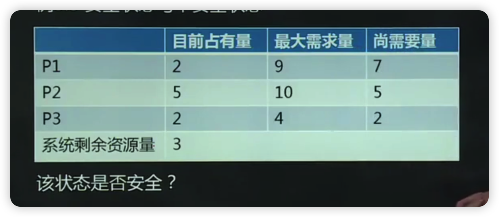
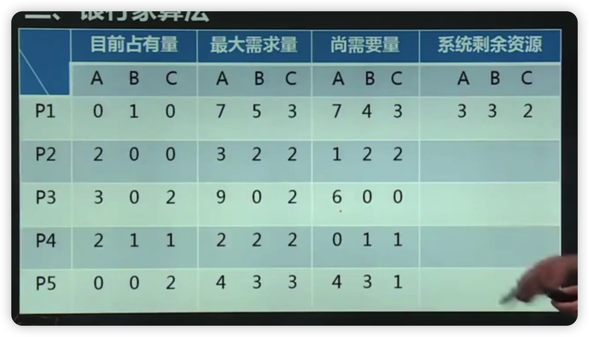
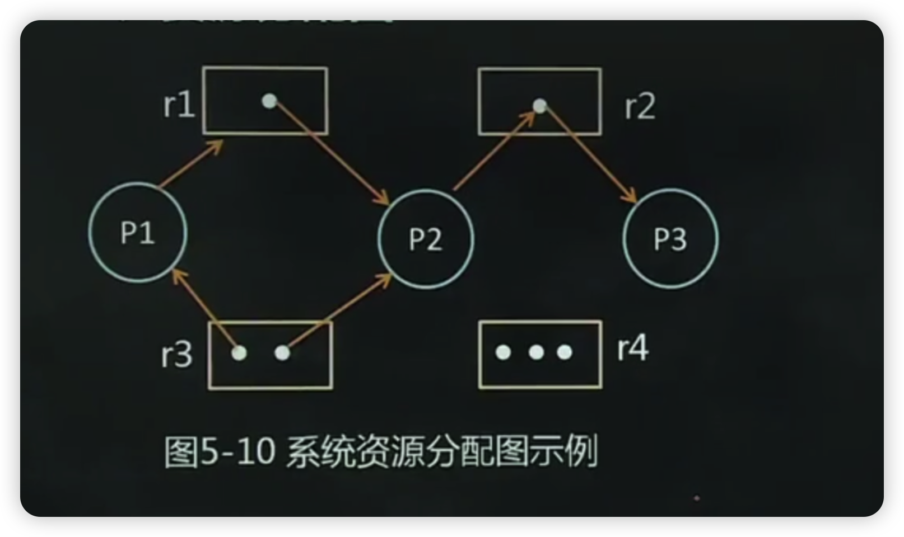
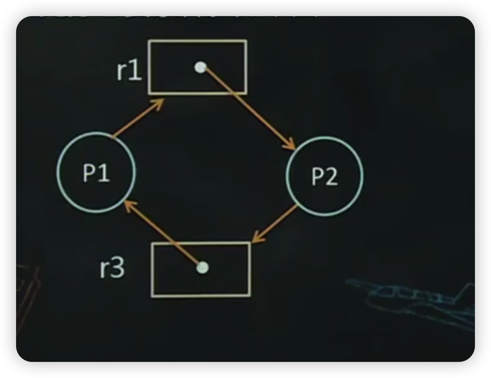
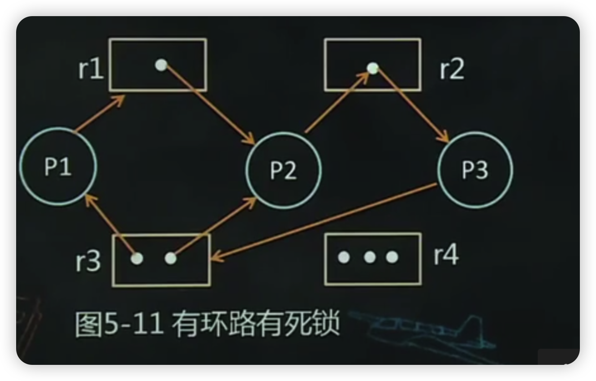
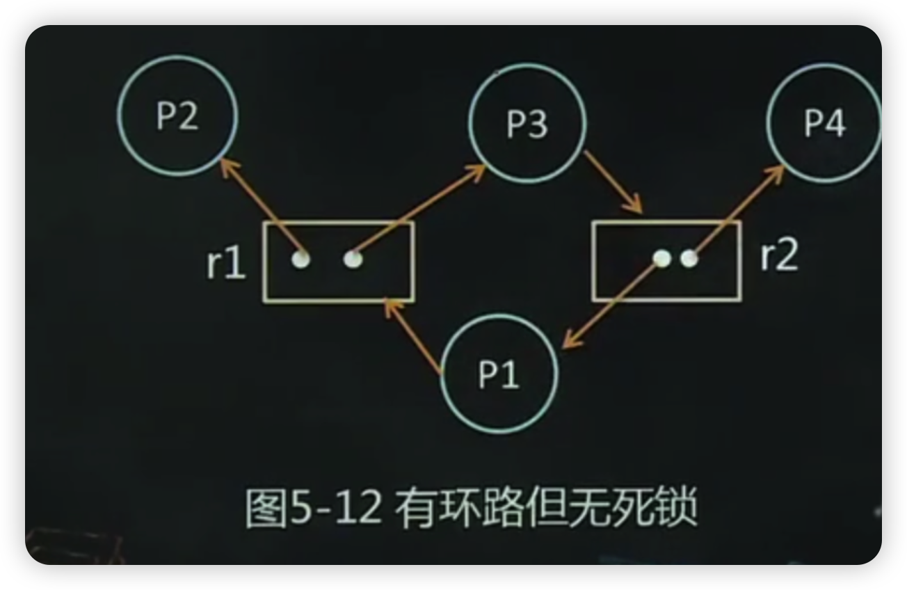

- [本章考试重点](#本章考试重点)
- [1、第一节死锁的产生](#1第一节死锁的产生)
  - [1.1、一、死锁的定义](#11一死锁的定义)
  - [1.2、二、产生死锁的原因](#12二产生死锁的原因)
  - [1.3、三、产生死锁的四个必要条件](#13三产生死锁的四个必要条件)
  - [1.4、四、解决死锁的方法](#14四解决死锁的方法)
- [2、第二节死锁预防](#2第二节死锁预防)
  - [2.1、一、死锁预防的概念](#21一死锁预防的概念)
  - [2.2、二、静态的资源分配策略](#22二静态的资源分配策略)
  - [2.3、三、资源的有序分配法](#23三资源的有序分配法)
- [3、第三节死锁避免](#3第三节死锁避免)
  - [3.1、一、死锁避免的概念](#31一死锁避免的概念)
  - [3.2、二、安全状态与安全序列](#32二安全状态与安全序列)
    - [3.2.1.安全状态](#321安全状态)
    - [3.2.2.安全序列](#322安全序列)
    - [3.2.3.安全状态与不安全状态的关系](#323安全状态与不安全状态的关系)
    - [3.2.4.安全状态与不安全状态的关系](#324安全状态与不安全状态的关系)
  - [3.3、三、银行家算法](#33三银行家算法)
- [4、第四节死锁的检测与解除](#4第四节死锁的检测与解除)
  - [4.1、一、死锁的检测和解除](#41一死锁的检测和解除)
    - [4.1.1.死锁的检测和解除](#411死锁的检测和解除)
  - [4.2、2.死锁检测时机](#422死锁检测时机)
  - [4.3、三、解除死锁的方法](#43三解除死锁的方法)
    - [4.3.1.剥夺资源](#431剥夺资源)
    - [4.3.2.撤销进程](#432撤销进程)
- [5、第五节资源分配图](#5第五节资源分配图)
  - [5.1、资源分配图](#51资源分配图)
    - [5.1.1.作用](#511作用)
    - [5.1.2.SRAG定义](#512srag定义)
  - [5.2、二、死锁定理](#52二死锁定理)
    - [5.2.1.作用](#521作用)
    - [5.2.2.死锁定理](#522死锁定理)
    - [5.3、三、资源分配图简化方法](#53三资源分配图简化方法)
- [6、第六节哲学家就餐问题](#6第六节哲学家就餐问题)

# 本章考试重点

- 1.死锁的基本概念、死锁的定义、死锁产生的原因和死锁产生的四个必要条件
- 2解决死锁的四个方法：死锁预防、避免死锁、检测和解除死锁、忽略死锁。
- 3.安全状态与不安全状态的意义、银行家算法
- 4.资源分配图及化简方法、死锁定理和判断死锁的方法

# 1、第一节死锁的产生

## 1.1、一、死锁的定义

指在多道程序系统中，一组进程中的每一个进程均无限期地等待被该组进程中的另一个进程所占用且永远不会释放的资源。

处于死锁状态的进程称为死锁进程。

## 1.2、二、产生死锁的原因

1.资源的概念

- (1)永久性资源（可重用资源）：如内存、外部设备、处理器等硬件资源。各种数据文件、表格、共享程序代码等软件资源
- (2)临时性资源（消耗性资源）指由某个进程产生、只为另一个进程使用一次或经过短暂时间后便不再使用的资源。如/O和时钟中断信号、同步信号、消息等。

2.产生死锁的原因

- (1)竞争资源系统在资源分配时出现失误、进程间对资源的相互争夺而造成僵局。
- (2)进程推进顺序不合理

## 1.3、三、产生死锁的四个必要条件

对于永久性资源，产生死锁的四个必要条件

- 互斥条件
- 不可剥夺条件
- 一请求和保持条件
- 一循环等待条件

## 1.4、四、解决死锁的方法

- 预防死锁
- 避免死锁
- 检测与解除死锁
- 忽略死锁

# 2、第二节死锁预防

## 2.1、一、死锁预防的概念

死锁预防：

是指在任何系统操作前（如分配资源、调度进程等），事先评估系统的可能情况，严格采取措施，使得产生死锁的四个必要条件不成立。

基本思想：

防患于未然。

具体做法：

破坏产生死锁的四个必要条件之一。

## 2.2、二、静态的资源分配策略

分配原则

一个进程在申请新资源的要求得不到满足时，便处于等待状态，而处于等待状态的进程的全部资源可以被剥夺。

两个策略

- 1.破坏不可剥夺条件

  两种方法：

  - (1)若一个进程已占用了某些资源，又要申请新的资源，在得不到新资源的同时释放原有资源，然后等待。
  - (2)若一个进程申请新资源，首先系统检查该资源是否可用，如果可用则分配。否则从其他等待进程剥夺资源分配给该进程，如果没有等待进程占有该资源，该进程必须等待，在等待过程中，资源也可能被剥夺。

- 2破坏请求和保持条件

  每个进程必须在开始执行前就申请它所需要的全部资源，仅当系统能满足进程的资源请求且把资源一次性分配给进程后，该进程才能研始执行！

## 2.3、三、资源的有序分配法

策略

破坏循环等待条件

方法

对系统所有资源类型进行线性排序，并赋予不同的序号。进程申请资源时，必须严格按照资源编号的顺序进行。即一个进程先得到编号小的资源，才能申请编号大的资源。释放资源时，次序相反。

一般原则：

较为紧缺、稀少的资源的编号较大

# 3、第三节死锁避免

前面讨论的死锁预防策略，总体上是增加了较强的限制条件，从而使实现较为简单，但却严重地影响了系统性能。

## 3.1、一、死锁避免的概念

基本思想：

系统对进程发出的每一个系统能够满足的资源申请进行动态检查，并根据检查结果决定是否分配资源；如果分配后系统不会发生死锁，则予与分配，否则，不予分配。

和死锁预防的区别

死锁预防是破坏产生死锁的四个必要条件之一严格地防止死锁的出现。而死锁避免是在系统运行过程中注意避免死锁的发生，即使死锁的必要条件存在也不一定发生死锁。

## 3.2、二、安全状态与安全序列

### 3.2.1.安全状态

如果操作系统能保证所有的进程在有限时间内得到所需的全部资源，则称系统放处于“安全状态”，否则说系统是不安全的。

判别：如果存在一个由系统中所有进程构成的安全序列{P1,P2,...,Pn},则系统处于安全状态。

### 3.2.2.安全序列

系统能按某种进程推进顺序{P1,P2,.,Pn},为每个进程P分配其所需资源，直至满足每个进程对资源的最大需求，使每个进程都可顺利地完成。此时称{P1,P2,.,Pn}为安全序列。

### 3.2.3.安全状态与不安全状态的关系

系统中不存在安全序列，则称系统为不安全状态。

### 3.2.4.安全状态与不安全状态的关系

例5.5安全状态与不安全状态

现有12个同类资源供3个进程共享，进程P1总共需要9个资源，但第一次先申请2个；进程P2总共需要10个资源，第一次要求分配5个资源；P3总共需要4个资源第一次请求2个资源。经过第一次分配后，系统还有3个资源未分配，系统状态如图5-5所示。

## 3.3、三、银行家算法

原意：确保银行在发放现金贷款时，不会发生不能满足所有客户需要的情况。

操作系统中：保证系统不会进入不安全状态的算法。下面举例说明银行家算法的资源分配算法。

例5.6

银行家算法应用示例假定系统中有五个进程{P1,P2,P3,P4,P5}和三类资源{A,B,C},各种资源的数量分别为10、5、7，资源分配情况如图所示。

# 4、第四节死锁的检测与解除

## 4.1、一、死锁的检测和解除

### 4.1.1.死锁的检测和解除

假如系统为进程分配资源时，不采取任何限制性措施来避免和预防死锁，而是在操作系统运行过程中不断地监督程序的执行和资源占用情况，判断是否发生死锁，一旦发生死锁，采取专门的措施解除死锁，并以最小代价使系统恢复正常。

## 4.2、2.死锁检测时机

(1)检测的实质：

- 检测算法检测是否存在“循环等待”条件。

(2)时机：

- 一次资源分配后
- 每次调度后
- 定时器定时运行检测程序
- 当某个进程长期啟处于阻塞状态或阻塞程序过多时

算法规则：

当任一进程P申请一个已被占用的资源R时，进行死锁检测，反复查找资源分配表和等待进程表，来确定Pj对资源R的请求是否导致形成环路，若是，出现死锁。

## 4.3、三、解除死锁的方法

### 4.3.1.剥夺资源

一旦死锁，挂起一些进程，剥夺它们占有的资源给死锁进程，以解除死锁。

### 4.3.2.撤销进程

撤销部分死锁进程，将它们占有的资源分配给另些死进程，直到死锁解除为止。可以一次撤销所有死锁进程，也可以逐个撤销。

# 5、第五节资源分配图

## 5.1、资源分配图

### 5.1.1.作用

描述系统中资源分配和申请情况，对死锁进行分析并采取对策

### 5.1.2.SRAG定义

是一张有向图，可定义为一个二元组，即，SRAG=(V,E),其中V是顶点的集合，包括进程集合、资源集合E是有向边的集合，是一个有序对\<Pi,ri\>,如图5-10所示。

## 5.2、二、死锁定理

### 5.2.1.作用

判定死锁的法则

### 5.2.2.死锁定理

(1)如果资源分配图中没有环路，则系统无死锁

(2)如果资源分配图中出现了环路，则可能存在死锁。具体判断如下：

如果处于环路中的每个资源类中均包含一个资源实例则环路存在意味着死锁的存在。此时，环路是死锁的充分必要条件。如下图：

如果处于环路中的每个资源类中实例的个数不全为1,则环路存在是死锁的必要条件而非充分条件。如图5-11和5-12所示

### 5.3、三、资源分配图简化方法

可以使用资源分配图简化方法，来检测系统是否为死锁状态。步骤如下

(1)在资源分配图中，找出一个既不阻塞又非独立的进程结点P。,在顺利的情况下，P可获得所需资源而继续运行，直至运行完毕，再释放其所占有的全部资源，这相当于消去p的请求边和分配边，使之成为孤立的结点。

(2)将P释放的资源分配给申请它的进程，若该进程能顺利运行完，释放资源，再次成为孤立结点。

(3)重复(1)(2)步，直到找不到符合条件的进程结点。经过化简后，若能消去所有的边，则该图可完全简化系统不存在死锁；否则不可完全简化，存在死锁。

# 6、第六节哲学家就餐问题

1.问题描述

(1)有五个哲学家围坐在一圆桌旁，每人面前有一只碗，碗里有面条，每两人之间放一只筷子

(2)每个哲学家的行为是思考，感到饥饿，然后吃饭；

(3)为了吃饭，每个哲学家必须拿到俩只筷子，并且每个人只能直接从自己的左边或右边去取筷子。
