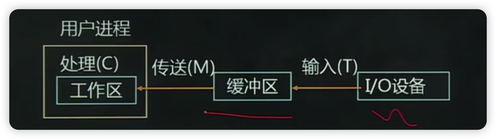

- [本章考试重点](#本章考试重点)
- [1、第一节I/O设备管理的基本概念](#1第一节io设备管理的基本概念)
  - [1.1、一、/O设备管理的任务](#11一o设备管理的任务)
  - [1.2、二、1/O设备分类](#12二1o设备分类)
  - [1.3、三、I/O设备管理与文件管理的关系](#13三io设备管理与文件管理的关系)
- [2、第二节I/O硬件和I/O软件的组成](#2第二节io硬件和io软件的组成)
  - [2.1、一、I/O硬件组成](#21一io硬件组成)
  - [2.2、二、I/O软件组成](#22二io软件组成)
    - [2.2.1、I/O软件结构的基本思想](#221io软件结构的基本思想)
    - [2.2.2、I/O软件结构](#222io软件结构)
  - [2.3、设备独立性](#23设备独立性)
- [3、第三节I/O设备控制方式](#3第三节io设备控制方式)
  - [3.1、一、程序控制方式](#31一程序控制方式)
  - [3.2、中断控制方式](#32中断控制方式)
  - [3.3、三、DMA方式](#33三dma方式)
  - [3.4、四、通道控制方式](#34四通道控制方式)
    - [3.4.1.引入通道的目的](#341引入通道的目的)
    - [3.4.2.通道的优点](#342通道的优点)
    - [3.4.3.通道的分类](#343通道的分类)
    - [3.4.4.通道的功能](#344通道的功能)
- [4、第四节设备分配与回收](#4第四节设备分配与回收)
  - [4.1、设备分配与回收](#41设备分配与回收)
    - [4.1.1、数据结构](#411数据结构)
    - [4.1.2.分配原则](#412分配原则)
    - [4.1.3.分配策略](#413分配策略)
  - [4.2、一、独占设备的分配](#42一独占设备的分配)
    - [4.2.1.设备的绝对号与相对号](#421设备的绝对号与相对号)
    - [4.2.2.设备的指定方式](#422设备的指定方式)
    - [4.2.3.独占设备的分配和释放](#423独占设备的分配和释放)
  - [4.3、二、共享设备的分配](#43二共享设备的分配)
- [5、第五节磁盘调度策略](#5第五节磁盘调度策略)
  - [5.1、信息传输时间](#51信息传输时间)
  - [5.2、二、移臂调度及调度算法](#52二移臂调度及调度算法)
    - [5.2.1.先来先服务调度算法](#521先来先服务调度算法)
    - [5.2.2.最短寻找时间优先调度算法](#522最短寻找时间优先调度算法)
    - [5.2.3.电梯调度算法](#523电梯调度算法)
    - [5.2.4.单向扫描调度算法](#524单向扫描调度算法)
  - [5.3、三、旋转调度优化](#53三旋转调度优化)
  - [5.4、四、信息的优化分布](#54四信息的优化分布)
- [6、第六节缓冲技术](#6第六节缓冲技术)
  - [6.1、缓冲的引入](#61缓冲的引入)
  - [6.2、二、缓冲的种类](#62二缓冲的种类)
    - [6.2.1.单缓冲](#621单缓冲)
    - [6.2.2.双缓冲](#622双缓冲)
    - [6.2.3.多缓冲](#623多缓冲)
    - [6.3.4.缓冲池](#634缓冲池)
  - [6.3、三、缓冲池管理](#63三缓冲池管理)
    - [6.3.1.缓冲池的组成](#631缓冲池的组成)
    - [6.3.2.缓冲池的操作](#632缓冲池的操作)
- [7、第七节虚拟设备技术](#7第七节虚拟设备技术)
  - [7.1、一、虚拟设备的实现原理-SPOOLing系统工作原理](#71一虚拟设备的实现原理-spooling系统工作原理)
  - [7.2、二、SPOOLing的组成和实现](#72二spooling的组成和实现)
    - [7.2.1.SPOOLing系统的组成](#721spooling系统的组成)
    - [7.2.2.SPOOLing系统的实现-打印机的值班进程](#722spooling系统的实现-打印机的值班进程)

# 本章考试重点

- 1.I/O设备管理的基本概念
- 2.I/O硬件和/O软件组成
- 3.I/O设备控制方式
- 4.设备分配与回收
- 5.磁盘驱动调度
- 6.缓冲技术
- 7.虚拟设备技术

# 1、第一节I/O设备管理的基本概念

## 1.1、一、/O设备管理的任务

1.解决I/O设备和CPU速度不匹配的矛盾
2提供简单易用的接口，实现对设备的统一管理
3.保证设备的安全性

## 1.2、二、1/O设备分类

1.按设备的使用特性分类

输入设备、输出设备、交互式设备、存储设备

2.按设备的信息组织方式分类

字符设备和块设备

3.按设备使用的可共享性分类

独占设备、共享设备、虚拟设备

虚拟设备是指在一类设备上模拟另一类设备。目的是为了提高设备利用率。

## 1.3、三、I/O设备管理与文件管理的关系

**I/O设备管理对象：**I/O设备，是对资源的管理，提供标准接口供用户用这些设备。

**文件管理对像：**设备里面存储的数据和信息，提供一整套对这些资源的管理规则，并且以文件及其配套的概念来具体实施。

**UNIX系统中：**所有设备都当做文件对象来管理。

# 2、第二节I/O硬件和I/O软件的组成

## 2.1、一、I/O硬件组成

- 第一层：处理器和内存，通过总线与接口部件连接。
- 第二层：接口（适配器
- 第三层：设备控制器，是一种电子部件，每个设备控制器都有若干个寄存器与处理器进行通信。
- 第四层：外围设备，设备并不直接与CPU进行通信而是与设备控制器进行通信。

不同的人对于I/O硬件的理解不同：

- 电子工程师/O硬件就是芯片、导线、电源
- 程序员：I/O硬件提供给软件的接口，如硬件能够接收的命令，它能够完成的功能以及让能够报告的错误等

本节主要介绍怎样对/O设备编程，而不是如何设计、制造和维护硬件。

硬件角度，I/O硬件由物理设备和电子部件两部分组成。

物理设备是达成I/O硬件功能的基础，对操作系统而言更注重的是其电子部件的控制方式。

## 2.2、二、I/O软件组成

### 2.2.1、I/O软件结构的基本思想

I/O软件组成一系列层次，较低的层次处理与硬件有关的细节，并将硬件的特征与较高的层隔离；较高的层则向用户提供一个友好的、清晰而规整的I/O接口。

### 2.2.2、I/O软件结构

四层：中断处理程序、设备驱动程序、设备独立层软件、用户层软件。


## 2.3、设备独立性

- 含义：
  
  除了直接与设备打交道的底层软件之外，其他部分的软件并不依赖于硬件。即应用程序中所使用的设备不局限于使用某个具体的物理设备，也称为设备无关性。

- 优点：
  
  当I/O设备更新时，没有必要重新编写全部I/O软件。实际应用只要安装了驱动程序，可以方便地安装好新的I/O设备。

设备独立性软件的功能做如下：

- 1.设备命名

  在操作系统的/O软件中，借用了与文件系统统命名的方法，即采用文件系统路径名的方法来命名设备

  例如：UND系统中，/dev/tty00,确定了一个殊文件，其中包含了主设备号和次设备号。主设备号用于寻找对应的设备驱动程序，而次设备号提供了设备驱动程序的有关参数，用来确定要读写的具体设备。

- 2.设备保护
  
  防止未授权用户对设备的非法使用
  
  UNX系统：存取权限模式，rwx位进行保护。

- 3.提供一个与设备无关的逻辑块
  
  不同的设备，存储空间大小、读取速度、传输速率各不相同，与设备无关软件通过向上层提供大小统一的逻辑块屏蔽这种不同，使得上层软件只与抽象设备打交道而不必考虑上述不同
- 4.缓冲
- 5.存储设备的块分配
- 6.独占设备的分配和释放
- 7.错误处理

# 3、第三节I/O设备控制方式

I/O设备的控制方式取决于I/O设备硬件与处理器和内存的连接方式以及设备的驱动程序，主要有四种方式：

- 1.程序控制方式
- 2.中断控制方式
- 3.DMA控制方式
- 4.通道控制方式

## 3.1、一、程序控制方式

程序控制方式也称为PIO(Programmer I/O)方式，是指由用户进程直接控制处理器或内存和外围设备之间进行信息传送的方式，也称为“忙-等”方式，轮询方式或循环测试方式，这种方式的控制者是用户进程。


- 优点：
  
  处理器和外设的操作能通过状态信息得到同步而且硬件结构比较简单

- 缺点：

  处理器效率较低，传输完全在处理器控制下完成对外部出现的异常事件无实时响应能力

## 3.2、中断控制方式

1.中断控制方式的处理过程


- (1)处理器通过数据总线发出命令，启动外设工作，当前进程阻塞，调度程序调度其他进程
- (2)外设数据准备好，置位中断请求触发器
- (3)若此时接口中断屏蔽器状态为非屏蔽状态则接口向处理器发送中断请求(IR)。
- (4)处理器接收中断请求，且中断为允许中断状态，则中断判优电路工作。
- (5)中断判优电路对优先级最高的中断请求给予响应(INTR),处理器中断正在执行的其他进程，转而执行中断服务程序。

2.优点

- (1)处理器与外设并行工作，提高计算机的利用率
- (2)具有实时响应能力
- (3)可及时处理异常情况，提高计算机的可靠性

## 3.3、三、DMA方式

1.DAM方式控制原理

DMA(直接访问内存)方式，是一种完全由硬件执行I/O数据交换的工作方式，数据交换不经过处理器，而直接在内存和I/O设备之间进行。传送方式结构图如图8-7所示。


2.DAM方式传送过程

(1)预处理阶段：由处理器#行I/O指令对DMAC(DMA控制器)进行初始化与启动。

(2)数据传送阶段：由DMAC控制总线进行传送。当外设数据准备好，发DMA请求，CPU当前机器周期结束响应DAM请求，DAMC从CPU接管总线的控制权，完成对内存寻址，决定数据传送的内存单元地址，对数据传送字进行计数，执行数据传送的操作。

(3)后处理阶段：传送结束，DMAC向处理器发中断请求，报告DMA操作结束。处理器响应中断，转入中断服务程序，完成DMA结束处理工作，包括数据校验，决定是否结束传送等。

3.优点：

操作均由硬件完成，传输速度快；处理器只在初始化和结束时参与，对数据传输基本不干预，可以减少大批量数据传送时处理器的开销；处理器与外设并行工作，效率高。

## 3.4、四、通道控制方式

### 3.4.1.引入通道的目的

通道是一个特殊功能的处理器，它有自己的指令和程序，可以实现对外围设备的统一管理和外围设备与内存之间的数据传送。

引入通道的目的是为了进一步减少数据输入输出对整个系统效率的影响。

### 3.4.2.通道的优点

与DMA方式相比，通道方式增加了处理器与通道操作的并行处理能力；增加了通道之间或同一通道内各设备的并行操作能力；为用户提供了灵活增加外设的可能性。

### 3.4.3.通道的分类

选择通道、数组多路通道、字节多路通道

### 3.4.4.通道的功能

- (1)接收处理器的指令，按指令要求与指定的外围设备进行通信
- (2)从内存读取属于该通道的指令并执行通道程序，向设备控制器和设备发送各种命令
- (3)组织外围设备和内存之间进行数据传送，并根据需要提供数据缓存的空间，以及提供数据存入内存的地址和传送的数据量。
- (4)从外围设备得到设备的状态信息，形成并保存通道本身的状态信息，根据要求将这些状态信息送到内存的指定单元，供处理器使用。
- (5)将外围设备的中断请求和通道本身的中断请求，按序及时报告处理器。

# 4、第四节设备分配与回收

## 4.1、设备分配与回收

### 4.1.1、数据结构

系统设备表、设备控制表、控制器控制表、通道控制表。

系统设备表


设备控制表


控制器控制表


通道控制表


### 4.1.2.分配原则

- (1)要充分发挥设备的使用率，尽可能让设备忙碌，但又要避免由于不合理的分配方法造成的死锁
- (2)要做到把用户程序和具体物理设备隔离开来即用户面对的是逻辑设备，而分配程序将在系统把逻辑设备转换成物理设备之后，再根据要求的物理设备号进行分配。
- (3)设备分配方式：静态分配和动态分配。静态分配效率低，动态分配可能死锁

### 4.1.3.分配策略

- 主要考虑的因素：/O设备的固有属性、分配算法、设备分配的安全性以及设备独立性。
- 设备固有属性：独占设备、共享设备、虚拟设备
- 分配算法：先来先服务、高优先级优先

## 4.2、一、独占设备的分配

### 4.2.1.设备的绝对号与相对号

绝对号：系统为每一台设备确定的一个编号，用来区分和识别各种不同类型的外部设备，以便进行管理。

相对号：由用户在程序中定义的设备编号称为设备的“相对号”。

二者的对应关系：规定用户使用“设备类相对号”来提出使用设备的要求，而系统在为用户分配具体设备的同时，建立设备的“绝对号”与用户使用的“设备类相对号”的对应关系。

### 4.2.2.设备的指定方式

两种方式：绝对号，设备类相对号。

使用绝对号的缺点，当指定的设备出现故障即使还有其他同类设备，作业的请求仍然得不到满足必须等待。

使用设备类相对号的好处：实现了设备的独立性，即用户程序使用的逻辑设备与程序实际执行时使用的物理设备无关。

### 4.2.3.独占设备的分配和释放

(1)设备分配表的组成，两部分：设备类表和设备表

分配过程

- 用户作业提出某类外部设备申请
- 系统首先检查“设备类表”，若现存台数能满足请求则取得该类设备的“设备表”始址；否则等待
- 系统再依次检查该类设备在设备表中的登记项
- 若找到“设备状态”为好，且未分配的设备则准备进行分配，否则等待
- 修改设备类表和设备表，进行设备分配

释放过程

系统收回设备时，对该台设备的“设备表”中的有关登记项进行修改，即把“分配状态”改为“未分配同时撤销该设备的作业名和设备相对号，最后，在该类设备的“设备类表”中，把该类设备的现存台数加1。

## 4.3、二、共享设备的分配

共享设备可被多个进程共享，但在每个I/O传输的单位时间内只由一个进程所占用，以块为传输单位，可以交叉进行，没有明显的申请和释放活动。

使用方法：

- (1)申请设备，如设备被占用，则进入设备等待队列，否则分配设备。
- (2)启动设备。I/O传输
- (3)释放设备。当设备结束，发出中断信号，系统唤醒一个等待设备的进程。

# 5、第五节磁盘调度策略

## 5.1、信息传输时间

信息在磁盘上按柱面存储，同一柱面的各磁道存储满，再放到下一个柱面。启动磁盘执行输入输出操作时，要把移动臂移到指定的柱面，再等待指定扇区旋转到磁头位置下，然后上指定的磁头进行读写，图8-12所示


```txt
位置计算

块号计算：b=k+s×（j+ixt)

t:每个柱面上的磁道数  
s:每个盘面上的扇区数  
i:柱面  
j:磁头  
k:扇区  

位置计算
假定要访问的磁盘块为p
令d=sxt;m=[p/d]n=p mod d,则
第p块在磁盘上的位置为：
柱面号=m
磁头号=[n/s]
扇区号=n mod s
```

## 5.2、二、移臂调度及调度算法

移臂调度：根据访问者指定的柱面位置来决定执行次序的调度，称为“移臂调度”

目的：尽可能减少操作中的寻找时间。

常用算法：先来先服务调度算法、最短寻找时间优先调度算法、电梯调度算法、单向扫描调度算法

### 5.2.1.先来先服务调度算法

根据进程访问磁盘的先后次序进行调度

优点：公平和简单

缺点：效率低

### 5.2.2.最短寻找时间优先调度算法

选择这样的进程，其要求访问的柱面号，与当前磁头所在的柱面距离最近，以使每次的寻找时间最短。

优点：平均每次磁头移动距离明显低于FCFS的距离固有较好的寻道性能，过去曾一度被广泛使用。

### 5.2.3.电梯调度算法

从移动臂当前位置开始沿着臂的移动方向去选择离当前移动臂最近的那个柱面访问，如果沿臂的移动方向无请求，就改变臂的移动方向再选择。

### 5.2.4.单向扫描调度算法

不考虑访问者等待的先后次序，总是从0号柱面开始向里扫描，按照各自所需要访问的柱面位置的次序去选择访问者。当移臂到达最后一个柱面后，立即返回0号柱面，再次进行扫描。

## 5.3、三、旋转调度优化

旋转调度：在移动臂定位后，若有若干个访问者等待访问该柱面的情况下，若从减少输入输出操作总时间为目标出发，应该优先选择延迟时间最短的访问者去执行。

根据延迟时间来决定执行次序的调度称为“旋转调度”

旋转调度时应分析下列情况

(1)若干访问者请求访问同磁道上的不同扇区  
(2)若干访问者请求访问不同磁道上的不同编号的扇区  
(3)若干访问者请求访问不同磁道上的具有相同编号的扇区  

(1)(2)总是为首先到达读写磁头位置下的扇区进行读写操作；(3)可任意选择一个读写磁头。

## 5.4、四、信息的优化分布

记录在磁道上的排列方式也会影响磁盘的输入输出操作时间。

例：假设某系统在磁盘初始化时把盘面分成8个扇区，今有8个逻辑记录被存储在同一个磁道的8个扇区中。处理程序要求从1至8顺序处理这8个记录。每次处理程序请求从磁盘上读出一个记录，然后花10秒进行处理，再读、再处理，直到8个记录处理结束。

假定磁盘转速为40ms/周，8个记录依次存储在磁道上，读记录5ms,处理记录10ms处理完第一个记录，第4个记录转到磁头下，处理第二个记录，把第二个记录旋转到磁头位置，即要延迟30ms,依次，处理8个记录需要时间8×(5+10)+7×30=330ms


# 6、第六节缓冲技术

## 6.1、缓冲的引入

- 1.缓和CPU与/O设备间速度不匹配的矛盾
- 2.减少外部中断次数和处理器进行中断处理所花费的时间
- 3.解决DMA或通道出现的瓶颈问题

## 6.2、二、缓冲的种类

根据系统设置的缓冲区的个数，分为：

- 1.单缓冲
- 2.双缓冲
- 3.多缓冲
- 4.缓冲池

### 6.2.1.单缓冲

在I/O设备和处理器之间设置一个缓冲区。


### 6.2.2.双缓冲

在I/O设备和处理器之间设置两个缓冲区。

### 6.2.3.多缓冲

具有多个缓冲区，其中一部分专门用于输入另一部分专门用于输出。

### 6.3.4.缓冲池

把多个缓冲区连接起来统一管理，每个缓冲区既可用于输入，也可用于输出。

## 6.3、三、缓冲池管理

### 6.3.1.缓冲池的组成

三个队列：

- 空缓冲队列emq
- 输入队列inq
- 输出队列outq

四种工作缓冲区

- 用于收容输入数据的工作缓冲区
- 用于提取输入数据的工作缓冲区
- 用于收容输出数据的工作缓冲区
- 用于提取输出数据的工作缓冲区。

### 6.3.2.缓冲池的操作

- 申请缓冲区：get_buf
- 收回缓冲区：put buf
- 选取缓冲区：take_buf,由get_buf调用
- 插入缓冲队列：add buf,由out bufi调用

# 7、第七节虚拟设备技术

## 7.1、一、虚拟设备的实现原理-SPOOLing系统工作原理

虚拟设备技术，又称为SPOOLing技术，其含义是同时外部设备联机操作，也称假脱机技术。三部分组成：输入程序模块、输出程序模块、作业调度。

工作原理

- (1)输入程序模块，在作业执行前就利用慢速设备将作业预先输入到后援存储器(如磁盘、磁鼓成为输入井)，称为预输入。
- (2)作业进入内存后，数据直接从输入井取出
- (3)作业输出数据时，把数据写入输出井，称为缓输出。待作业全部完成后，再由外部设备输出全部数据

## 7.2、二、SPOOLing的组成和实现

### 7.2.1.SPOOLing系统的组成


### 7.2.2.SPOOLing系统的实现-打印机的值班进程

SPOOLing技术的使用：

当用户进程请求打印输出时，SPOOLing系统同意为它打印输出，但并不真正立即把打印机分配给用户进程，假脱机管理进程只为它做两件事：

- ①在输出井中为之请求一个空闲磁盘块区，并将要打印的数据送入其中。
- ②再为用户进程申请一张空白的用户请求打印表，并将用户的打印要求填入其中，再将该表挂在请求打印队列上。
  
打印输出过程：如果打印机空闲，假脱机打印进程将从请求打印队列的队首取出一张请求打印表，根据表中的要求将要打印的数据，从输出井传送到内存缓冲区，再由打印机进行打印打印完毕后，假脱机打印进程再查看请求打印队列中是否还有等待打印的请求表，如此下去，直至请求打印队列为空，输出进程才将自己阻塞起来。仅当下次再有打印请求时，假脱机打印进程才被唤醒。

结论：把一台独占设备改造为可为多个进程共享的设备，实现了虚拟设备的功能。对每个用户而言，系统只是即时将数据输出到缓冲区，并没真正被打印，只是让用户感觉系统已为他打印。
