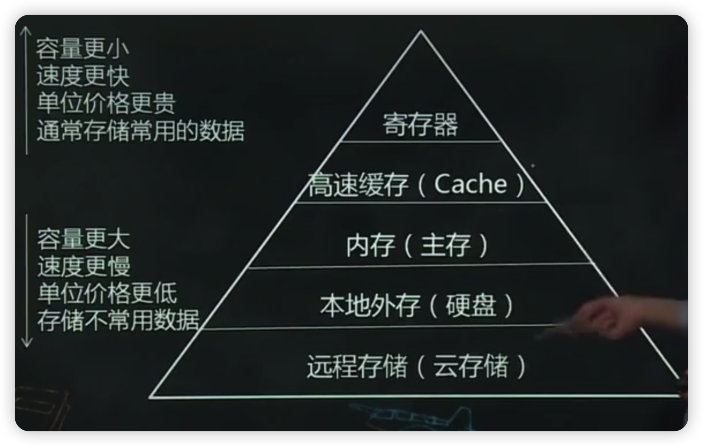
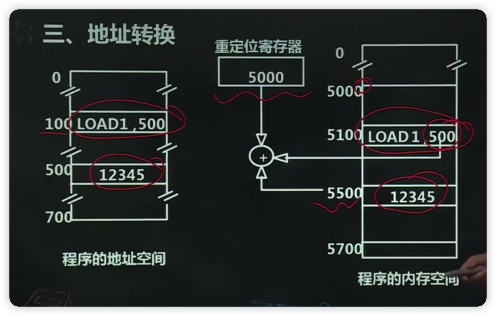
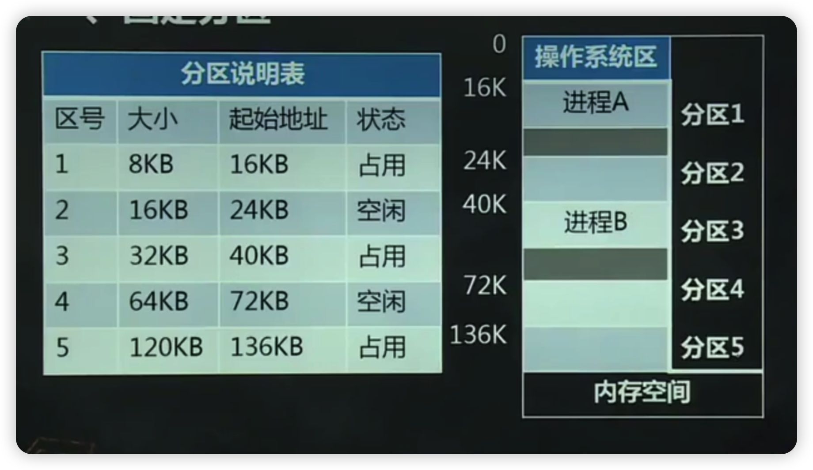
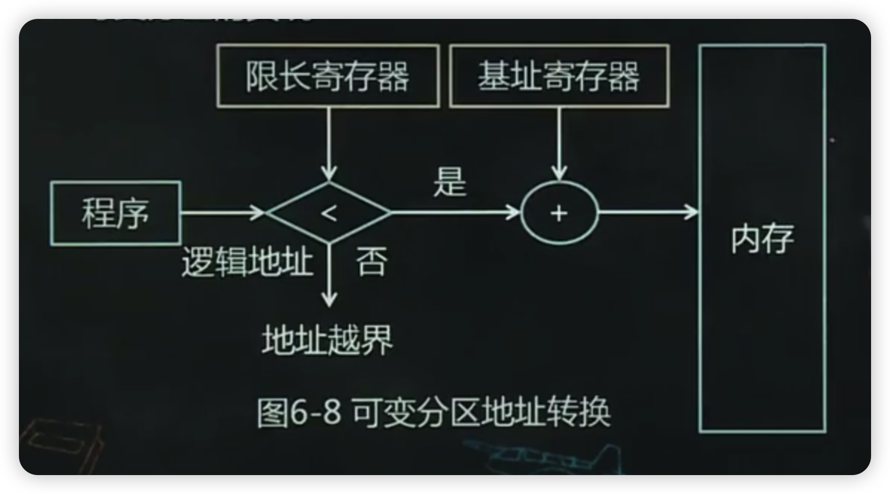
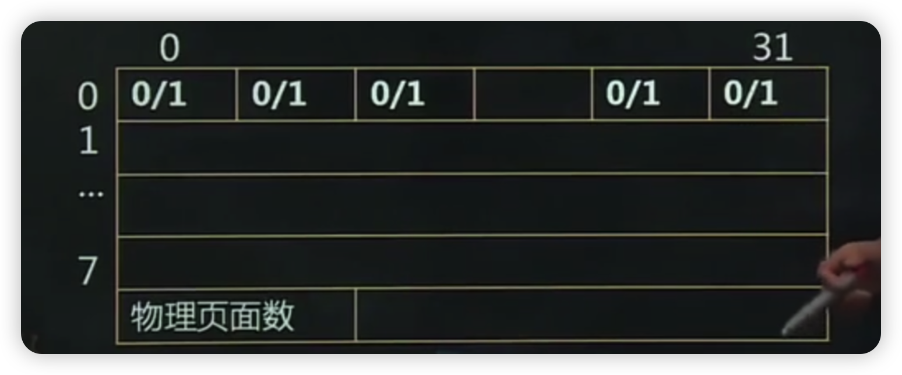
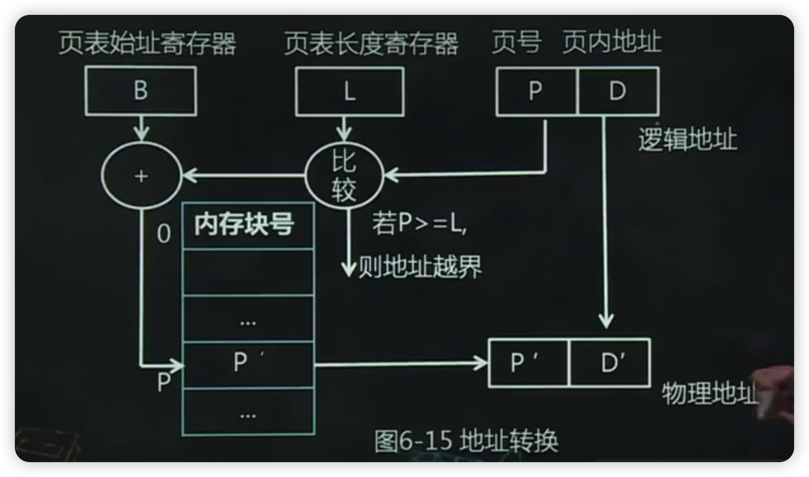
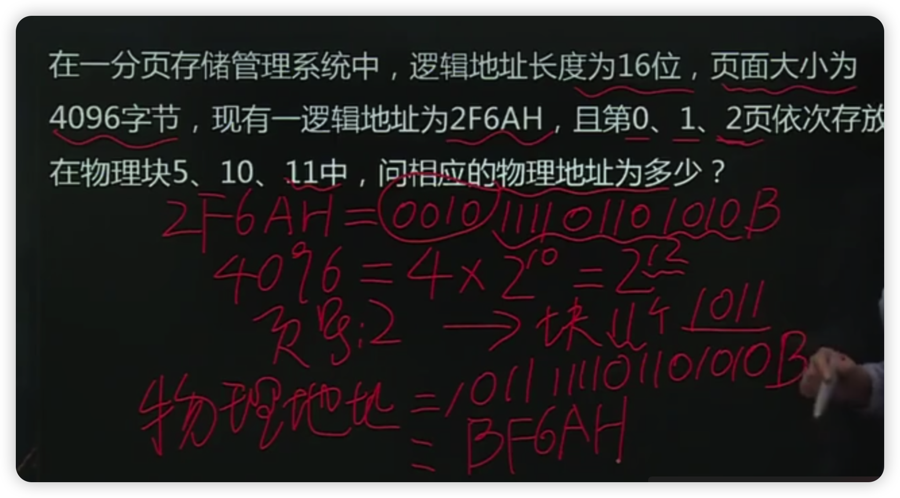

- [本章考试重点](#本章考试重点)
- [1、第一节存储管理概述](#1第一节存储管理概述)
  - [1.1、存储体系](#11存储体系)
  - [1.2、二、存储管理的任务](#12二存储管理的任务)
    - [1.2.1.内存的分配和回收](#121内存的分配和回收)
    - [1.2.2.存储共享](#122存储共享)
    - [1.2.3.存储保护](#123存储保护)
    - [1.2.4.“扩充“内存容量](#124扩充内存容量)
  - [1.3、三、地址转换](#13三地址转换)
    - [1.3.1.地址重定位](#131地址重定位)
    - [1.3.2.静态重定位](#132静态重定位)
    - [1.3.3.动态重定位](#133动态重定位)
- [2、第二节分区管理方案](#2第二节分区管理方案)
  - [2.1、一、固定分区](#21一固定分区)
    - [2.1.1.基本思想](#211基本思想)
    - [2.1.2.内存分配表与分区的分配、回收](#212内存分配表与分区的分配回收)
  - [2.2、二、可变分区](#22二可变分区)
    - [2.2.1.基本思想](#221基本思想)
    - [2.2.2.紧缩技术](#222紧缩技术)
    - [2.2.3.可变分区的实现](#223可变分区的实现)
    - [2.2.4.可变分区的分配策略](#224可变分区的分配策略)
    - [2.2.5.分区的回收](#225分区的回收)
    - [2.2.6.分区的保护](#226分区的保护)
  - [2.3、三、分区管理方案的优缺点](#23三分区管理方案的优缺点)
- [3、第三节覆盖与交换技术](#3第三节覆盖与交换技术)
  - [3.1、一、覆盖技术](#31一覆盖技术)
    - [3.1.1.概念](#311概念)
    - [3.1.2.实现](#312实现)
    - [3.1.3.解决的问题](#313解决的问题)
    - [3.1.4.优点](#314优点)
    - [3.1.5.缺点](#315缺点)
  - [3.2、二、交换技术](#32二交换技术)
    - [3.2.1.交换的含义](#321交换的含义)
    - [3.2.2.适用场合](#322适用场合)
    - [3.2.3.主要内容](#323主要内容)
- [4、第四节虚拟页式存储管理方案](#4第四节虚拟页式存储管理方案)
  - [4.1、一虚拟存储技术](#41一虚拟存储技术)
    - [4.1.1.基本思想](#411基本思想)
    - [4.1.2.虚拟存储器需要硬件支持](#412虚拟存储器需要硬件支持)
    - [4.1.3.工作原理](#413工作原理)
    - [4.1.4.与交换技术的区别](#414与交换技术的区别)
  - [4.2、二、虚拟页式存储管理](#42二虚拟页式存储管理)
    - [4.2.1.物理页面和页面](#421物理页面和页面)
    - [4.2.2.虚拟地址组成](#422虚拟地址组成)
  - [4.3、三、物理内存的分配与回收](#43三物理内存的分配与回收)
    - [4.3.1.位示图](#431位示图)
    - [4.3.2.内存分配与回收](#432内存分配与回收)
  - [4.4、四、虚拟页式存储地址转换过程](#44四虚拟页式存储地址转换过程)
    - [4.4.1.页式存储管理的地址转换](#441页式存储管理的地址转换)
    - [4.4.2.页表项](#442页表项)
    - [4.4.3.页表](#443页表)
    - [4.4.4.转换检测缓冲区(TLB)](#444转换检测缓冲区tlb)
    - [4.4.5.缺页异常处理](#445缺页异常处理)
    - [4.4.6.页面调度策略](#446页面调度策略)
    - [4.4.7.页面置换算法](#447页面置换算法)
    - [4.4.8.缺页率](#448缺页率)
  - [4.5、五、虚拟页式存储管理的优点缺点](#45五虚拟页式存储管理的优点缺点)
  - [4.6、六、虚拟存储管理的性能问题](#46六虚拟存储管理的性能问题)
    - [4.6.1、颠簸问题](#461颠簸问题)
    - [4.6.2、工作集模型](#462工作集模型)
- [本章小结](#本章小结)

# 本章考试重点

- 1.存储管理的任务
- 2.内存空间的划分、分配和回收
- 3.可变分区存储管理方案
- 4.覆盖技术与交换技术
- 5.虚拟页式存储管理
- 6.页面置换策略

# 1、第一节存储管理概述

## 1.1、存储体系

## 1.2、二、存储管理的任务

内存空间一般分为两个区域

系统区：存放操作系统常驻内存部分，用户不能占用这部分空间

用户区：分配给用户使用，用于装入和存储用户程序和数据，随时变化。

存储管理的实质：用户空间的管理

内存管理问题主要包括

- 内存管理方法
- 内存的分配与释放算法
- 虚拟存储器的管理
- 控制内存和外存之间的数据流动方法
- 地址变换技术
- 内存数据保护和共享技术

### 1.2.1.内存的分配和回收

(1)功能

- 记住每个存储区域的状态：空闲与否
- 实施分配：用户提出请求，分配内存
- 回收：回收用户释放的区域

(2)内存分配表

- 位示图表示法
- 空闲页面法
- 空闲块表法

(3)内存分配方式

- 静态分配：程序运行前分配内存，不允许“搬家
- 动态分配：程序运行时允许动态分配内存，且允许“搬家”

### 1.2.2.存储共享

所谓存储共享是指两个或多个进程共用内存中相同区域。

- 包括：代码共享和数据共享。
- 目的：节省内存空间，提高内存利用率；通过内存共享实现进程通信。

### 1.2.3.存储保护

目的：为多个程序共享内存提供保障，使在内存中的各道程序，只能访问它自己的区域，避免各道程序间相互干扰。

方法：

- (1)地址越界保护
- (2)权限保护

### 1.2.4.“扩充“内存容量

用户在编制程序时，不应该受内存容量的限制所以要采用一定技术来“扩充“内存的容量，使得用户得到比实际内存容量大得多得内存空间。

借助虚拟存储技术或交换技术完成，达到在逻辑上扩充内存容量的目的。

## 1.3、三、地址转换

### 1.3.1.地址重定位

(1)绝对地址

存储器以字节为单位编址，每个字节都有对应的地址。假定内存容量为n,则编号顺序为0,1,2，，n-1,该地址称为物理地址或绝对地址。

(2)物理地址空间：

由绝对地址对应的内存空间称为“物理地址空间”

(3)逻辑地址

在多道程序系统中，内存中同时存储了多个用户程序，每个用户不能预先知道他的程序被存储到了什么地方。为了方便，每个用户都可认为自己的程序和数据存储在一组“0”地址开始的连续空间中，用户程序中使用的地址，称为“逻辑地址”或”相对地址

(4)逻辑地址空间

由逻辑地址对应的存储空间称为逻辑地址空间。

当用户把程序装入内存时，存储管理为他分配的内存空间可能是从某一单元开始的一组连续的地址空间，它的起始地址不固定，即逻辑地址与物理地址经常不一致。

把逻辑地址转换为绝对地址的工作称为“地址重定位”，分为“静态重定位”和“动态重定位”两种。

### 1.3.2.静态重定位

内存在装入一个程序时，把程序中的指令和数据地址全部装换为绝对地址，该过程在程序运行前进行程序运行过程中无需再转换，这种转换方式成为“静态重定位”

### 1.3.3.动态重定位

内存在装入程序时，不进行地址转换，而是直接，把程序装入到分配的内存中，程序在执行过程中完成地，址的转换，这种转换方式成为“动态重定位”

# 2、第二节分区管理方案

## 2.1、一、固定分区

### 2.1.1.基本思想

多道程序环境下，整个用户空间划分为若干个固定大小的区域，每个分区中只装入一道作业。分区大小可以相同也可以不同。

### 2.1.2.内存分配表与分区的分配、回收

内存分配表是一张分区说明表，记录分区号、分区大小、分区起始地址及使用状态等。

分配时按照进程的内存需求，按一定策略从分区表中找到空闲分区进行分配。

回收时，将内存分区登记在分区说明表中，并将其状态置为空闲状态。示例：图6-4.

## 2.2、二、可变分区

### 2.2.1.基本思想

系统不预先划分固定分区，而是在装入程序时找划分内存分区，使为程序分配的内存区的大小正好等于程序的需求量，且分区的个数是可变的。

### 2.2.2.紧缩技术

内存经过一段时间分配后，会存在很多很小的空间。如右边的图，假定此时有进程E(40KB),此时空闲分区都不能满足它的需求。 解决办法：紧缩

紧缩应注意的问题

- (1)增加系统开销
- (2)移动是有条件的

比如进程正与设备交换信息，此时不能移动。所以，采用紧缩技术时，应该尽可能减少需要移动的进程数和信息量。

### 2.2.3.可变分区的实现

(1)硬件支持

两个专用控制寄存器：基址寄存器和限长寄存器

(2)绝对地址形成

程序装入内存后，分区的起始地址和长度装入两个寄存器，程序护行后，取出指令中的逻辑地址，绝对地址=逻辑地址+基址寄存器内容

(3)地址越界

当逻辑地址>限长寄存器值时，产生“地址越界”中断。

(4)地址转换过程。图6-8所示

### 2.2.4.可变分区的分配策略

- (1)首次适应算法

  思想：当接到内存申请时，查找分区说明表，直到找到一个大小能满足要求的空闲分区为止，将其分割并分配。

  优点：简单，可以快速做出分配决定

- (2)最优适应算法

  思想：当接到内存申请时，查找分区说明表找到一个大小能满足要求的最小空闲分区，将其分割并分配。

  优点：节约空间

  缺点：形成许多碎片

- (3)最坏适应算法

  思想：当接到内存申请时，查找分区说明表直到找到一个大小能满足要求的最大空闲分区，将其分割并分配。

  优点：碎片少

  缺点：分割了大的空间，遇到较大申请，无法满足。

### 2.2.5.分区的回收

当用户程序执行结束后，系统回收己使用完毕的分区将其记录在空闲区表中。假定归还的分区起始地址为S长度为L。考虑如下四种可能性：

- ①回收区与插入点的上邻空闲分区F1相邻接
- ②回收分区与插入点的下邻空闲分区F2相邻接
- ③回收区同时与插入点的上、下两个空闲分区相邻梓
- ④回收区既不与F1邻接，又不与F2邻接

### 2.2.6.分区的保护

两种方法：

- (1)系统设置界限寄存器，包括：上、下界寄存器或基址、限长寄存器。
- (2)保护键方法

## 2.3、三、分区管理方案的优缺点

- 优点：
  
  简单、表格不多，实现起来容易，内存额外开销小，保护措施也简单。在内存利用率方面可变分区比固定分区高。
  
- 缺点

  碎片多，不能为用户提供“虚存”，每个用户程序的存储受物理存储的限制。

# 3、第三节覆盖与交换技术

## 3.1、一、覆盖技术

### 3.1.1.概念

是指一个程序的若干程序段，或几个程序的某些部分共享某一个存储空间。

### 3.1.2.实现

把程序划分为若干个功能上相对独立的程序段，按照其自身逻辑结构使那些不会同时执行的程序段共享同一块内存区域

### 3.1.3.解决的问题

从用户级彻底解决内存小装不下程序的问题。

### 3.1.4.优点

打破了需要将一个程序的全部信息装入内存后程序才能运行的限制。在逻辑上扩充了内存空间，从而在某种程度上实现了在小容量内存上运行较大程序的功能。

### 3.1.5.缺点

对用户不透明，增加了用户的负担。

## 3.2、二、交换技术

### 3.2.1.交换的含义

进程从内存移到磁盘，并再移回内存。

### 3.2.2.适用场合

分时系统和大多数现在操作系统，是虚拟存储系统的基础。

### 3.2.3.主要内容

- (1)换出进程的选择
- (2)交换时机的确定
- (3)交换空间的分配
- (4)换入进程换回内存时位置的确定

# 4、第四节虚拟页式存储管理方案

## 4.1、一虚拟存储技术

### 4.1.1.基本思想

利用大容量外存来扩充内存，产生一个比有限的实际内存空间大的多的、逻辑的虚拟内存空间，简称虚存。采用二级存储器方式是一种设计技巧，受外存容量的限制。

### 4.1.2.虚拟存储器需要硬件支持

- (1)系统有容量足够大的外存
- (2)系统有一定容量的内存
- (3)实现虚-实转换的地址映射机制

### 4.1.3.工作原理

程序部分装入内存便可运行，其他部分需要运行时再装入内存。

### 4.1.4.与交换技术的区别

交换技术交换单位是进程；虚拟内存以页为单位进行交换

## 4.2、二、虚拟页式存储管理

### 4.2.1.物理页面和页面

物理页面：将内存分成大小相等的许多区，每个区称为一个”物理页面  
页面：将程序中的逻辑地址也进行分页，页的大小和物理页面大小一致。  

### 4.2.2.虚拟地址组成

虚拟页号+页内地址

## 4.3、三、物理内存的分配与回收

### 4.3.1.位示图

位示图中的每一位与一个物理块对应，其值为0/1，表示空闲/占用。

### 4.3.2.内存分配与回收

分配：在位示图中找出空闲物理页面数，如果能满足，则分配，并把相应位置为1，计算物理页面号。**物理页面号=字号×字长+位号**

回收：当归还物理页面时，计算归还页面在位示图中对应的位置，将1改为0
  

## 4.4、四、虚拟页式存储地址转换过程

### 4.4.1.页式存储管理的地址转换

页表：记录装入内存的逻辑页面与物理页面的对应关系。 是硬件进行地址转换的依据

硬件支持：页表始址寄存器和页表长度寄存器，分别用来存储正在运行程序的页表在内存的起始地址和页表的长度

地址转换过程

- (1)在执行检索前，先将页号与页表长度进行比较，若页号大于或等于页表长度，则地址越界」
- (2)若未出现越界错误，则将页表始址与页号和页表项长度的乘积相加，则找到该表项在页表中的位置，找到该页的物理页号
- (3)将有效地址的页内地址送入物理地址寄存器的块内地址字段中

(1)十进制计算

物理地址=物理页面号*块长+页内地址

(2)二进制计算：

物理页面号作为绝对地址的高位地址，页内地址作为它的地址部分。

**计算题**

### 4.4.2.页表项

- 物理页面号：页面在内存对应的物理页面号
- 有效位：页面是在内存还是外存
- 访问位：页面在内存中是否被访问过
- 修改位：页面在内存中是否被修改过
- 保护位：页面能否读/写

### 4.4.3.页表

- 多级页表
- 散列页表
- 反置页表

### 4.4.4.转换检测缓冲区(TLB)

高速缓存，也称为快表，登记了页表中的部分页号和物理页面的对应关系。地址转换过程及原理，图6-17所示。

### 4.4.5.缺页异常处理

- 缺页异常：若在页表中发现所要访问的页面不在内存，则产生缺页异常。
- 处理：查看有无空闲页面，若有，把要访问的页面调入内存；若无，选择一页换出内存，再把要访问的页面调入内存。

### 4.4.6.页面调度策略

- 调入策略：决定什么时候将一个页由外存调入内存。两种方法：请求调页和预调页。
- 置页策略：当产生缺页时，将所调入的页面置于何处。
- 置换策略：如果内存已满，确定哪个页面从内存中移出，为新的页面腾出空位。三种方法：固定分配局
部置换、可变分配全局置换、可变分配局部置换。

### 4.4.7.页面置换算法

“抖动”或“颠簸”：刚被换出的页面又立即要用，把它装入内存后，不久又被换出，换出不久又被调入内存，如此反复，使调度非常频繁。这种现象称为”抖动“或”颠簸

- (1)OPT-理想页面置换算法

  由Belady于1966年提出的一种理论上的算法，其所选择的被淘汰页面，将是以后永不使用的，或者是在最长（未来）时间内不再被访问的页面。采用OPT算法通常可保证获得最低的缺页率。

- (2)FIFO-先进先出

  总是选择最先装入内存的页面调出，或者说把驻留在内存中时间最长的那一页调出。

- (3)LRU--最近最少使用
  
  总是选择距离现在最长时间内没有被访问过的页面先调出。

### 4.4.8.缺页率

缺页率计算：f=F/A。F为缺页次数，A为页面总访问次数。

影响缺页率的因素：

- (1)分配给程序的物理页面数
- (2)页面的大小
- (3)程序编制方法
- (4)页面调度算法

## 4.5、五、虚拟页式存储管理的优点缺点

- 优点：
  
  不要求进程的程序段和数据段在内存中连续存放有效解决了碎片问题，提高了内存利用率  

- 缺点：
  
  存在页面空间的浪费，程序的最后一页往往有一部分得不到利用。  

## 4.6、六、虚拟存储管理的性能问题

### 4.6.1、颠簸问题

缺页率高引起，如页面置换算法不合理。  

**活动页面：**进程在一段时间内集中访问的一些页面，与程序的局部性有关。

如果分配给进程的物理页面少，则活动页面不能全部装入内存，可能频繁产生缺页，从而导致颠簸

### 4.6.2、工作集模型

工作集：对于给定的进程访问序列，从时刻(t-△)到时刻之间所访问页面的集合，称为该进程的工作集。
△称为工作集窗口。

采用工作集模型可以解决颠簸问题

解决方法：操作系统为每一个进程保持一个工作集，并为该进程提供与工作集大小相等的物理页面数这一过程可动态调整。

# 本章小结

本章主要讲述存储管理的相关概念以及存储管理的方法等内容，重点掌握如下内容

1.重要概念

绝对地址、逻辑地址、地址重定位、动态重定位、静态重定位

2.存储管理的任务

内存的分配与回收、存储共享、存储保护、“扩充”内存容量

3.分区管理方案

- 为程序提供的是一个连续分区，程序运行前必须全部装入内存。
- 固定分区基本思想，内存分配与回收
- 可变分区基本思想、紧缩技术、实现、空闲分区分配策略、分区的回收、分区的保护
- 分区管理方案的优缺点。

4.覆盖与交换技术

5.虚拟页式存储管理

基本思想、硬件支持、地址结构、分配与回收、地址转换、缺页处理、页面置换算法
