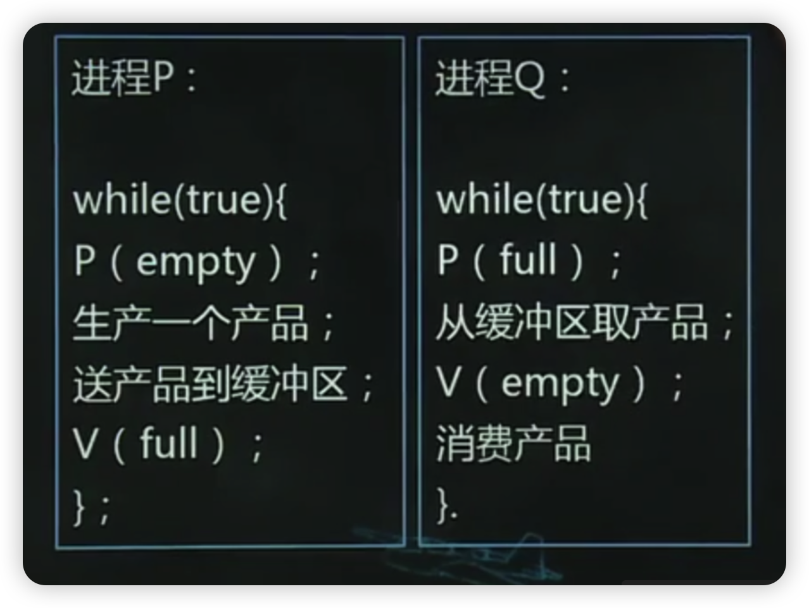

- [1、第一节进程间相互作用](#1第一节进程间相互作用)
  - [1.1、一、相关进程和无关进程](#11一相关进程和无关进程)
  - [1.2、二、与时间有关的错误](#12二与时间有关的错误)
- [2、第二节进程同步与互斥](#2第二节进程同步与互斥)
  - [2.1、一、进程的同步](#21一进程的同步)
  - [2.2、二、进程的互斥](#22二进程的互斥)
  - [2.3、三、临界区](#23三临界区)
- [3、第三节信号量及P、V操作](#3第三节信号量及pv操作)
  - [3.1、一、信号量](#31一信号量)
  - [3.2、二、P、V操作](#32二pv操作)
  - [3.3、三、信号量与P、V操作的物理含义](#33三信号量与pv操作的物理含义)
  - [3.4、四、用P、V操作实现进程之间的互斥](#34四用pv操作实现进程之间的互斥)
  - [3.5、五、用P、V操作实现进程间的同步](#35五用pv操作实现进程间的同步)
  - [3.6、六、信号量及P、V操作总结](#36六信号量及pv操作总结)
- [4、第四节经典的进程同步问题](#4第四节经典的进程同步问题)
  - [4.1、一、简单生产者-消费者问题](#41一简单生产者-消费者问题)
  - [4.2、二、多个生产者-消费者问题](#42二多个生产者-消费者问题)
  - [4.3、三、读者-写者问题](#43三读者-写者问题)
  - [4.4、四、同步与互斥的综合应用](#44四同步与互斥的综合应用)
- [5、第五节管程](#5第五节管程)
  - [5.1、一、管程的提出](#51一管程的提出)
  - [5.2、二、管程的概念及组成](#52二管程的概念及组成)
- [6、第六节进程通信](#6第六节进程通信)
  - [6.1、一、共享内存](#61一共享内存)
  - [6.2、二、消息机制-消息缓冲](#62二消息机制-消息缓冲)
  - [6.3、消息机制-信箱](#63消息机制-信箱)
  - [6.4、三、管道通信](#64三管道通信)

# 1、第一节进程间相互作用

## 1.1、一、相关进程和无关进程

1.相关进程：在逻辑上具有某种联系的进程

2.无关进程：在逻辑上没有联系的进程

3.举例

- (1)为两个不同的源程序进行编译的进程，它们可以并发执行，但它们之间无关
- (2)三个进程，分别是读数据进程、处理数据进程、打印结果进程，它们相互依赖、相互合作，是一组相关进程。

## 1.2、二、与时间有关的错误

对于相关进程来说，可能有若干并发进程同时使用共享资源，即一个进程一次使用未结束，另一进程也开始使用，形成交替使用共享资源。

结果：形成与时间有关的错误

# 2、第二节进程同步与互斥

## 2.1、一、进程的同步

是指进程之间一种直接的协同工作关系，一些进程相互合作共同完成一项任务。

例如

进程A从硬盘上读记录，每读出一个记录就存入缓冲区，进程B从缓冲区中取出记录加工，直至所有记录处理结束。

直接制约关系：A若没有把记录读入缓冲区，B等待反之，B若没有从缓冲区取出记录，A等待

## 2.2、二、进程的互斥

在系统中，许多进程常常需要共享资源，而这些共享资源往往需要排他性的使用，即一次只能为一个进程服务，因此，各进程间只能互斥使用这些资源，进程间的这种关系就是进程的互斥。

例如：

多个进程竞净使用打印机、一些变量、表格等资源。

进程间的互斥是一种间接制约关系

## 2.3、三、临界区

1.临界资源：

若在系统中的某些资源一次只允许一个进程使用则这类资源称为临界资源或洪享变量。

2.临界区：

访问临界资源的那段代码。

3.相关临界区

如果有若干进程共享某一临界资源，则该临界区称为相关临界区

4.相关临界区的调度使用原则：

- (1)当临界资源空闲时，若有一个进程要求进入临界区，应允许它立即进入。---有空让进，有效利用资源。
- (2)若有一个进程已在临界区，其他要求进入临界区的进程必须等待。---无空等待，互斥进入
- (3)当没有进程在临界区，而同时有多个进程要求进入临界区，选择其一进入，其他等待。---多种择一
- (4)任一进程进入临界区的要求应在有限时间满足 --有限等待，避免死等。
- (5)处于等待状态的进程应放弃占用改处理器。--让权等待，避免忙等。

# 3、第三节信号量及P、V操作

为保证进程的同步与互斥，系统中应该有解决这些问题的机制，称为同步机制。

实际上，同步是并发进程之间的执行时序上的一种相互制约关系。

进程互斥的实质也是同步，可把进程互斥看做是一种特殊的进程同步。

同步机制有两类：硬件同步机制、软件同步机制。

## 3.1、一、信号量

1.信号量的提出

1965年，荷兰学者Dijkstra首先提出关于信号量的概念，他把信号量定义为一个用于表示资源数目的整型量S,与一般整型量不同，除初始化外，仅能通过两个标准的操作P操作和V操作来访问。

2.P、V操作的使用

放在程序中，用P(S)和V(S)表达，实现进程间的同步与互斥。

## 3.2、二、P、V操作

1、P操作定义：

```txt
P(S){  
S=S-1;  
若S<0,将该进程状态置为等待状态，然后将该进程的PCB插入相应的S信号量等待队列队尾，直到有其他进程在S上执行V操作为止：  
}
```

2、V操作定义：

```txt
V(S)
S=S+1;
若S≤0，唤醒在S信号量队列中等待的一个进程，将其状
态改变为就绪态，并将其插入就绪队列；
行本操作的进程继续纳行

```

## 3.3、三、信号量与P、V操作的物理含义

信号量S表示某类可用的资源。对于不同的资源，用不同的信号表示。

- S>0时，S表示某类资源的可用数量
- S<0时，其绝对值表示排在S等待队列中进程的数目。
- 执行一次P操作，表示请求一个资源；
- 执行一次V操作，表示进程释放一个资源。

## 3.4、四、用P、V操作实现进程之间的互斥

假设有进程A、B竞争进入临界区，用P、V操作实现进程之间的互斥。

首先定义互斥型信号量S,并使之初值为1。

进程A:P(S)  
临界区操作：V(S)  

进程B:P(S)  
临界区操作；V(S)  

## 3.5、五、用P、V操作实现进程间的同步

解决思路
如果有两个进程同步，设置两个信号量S1,S2,初始值可以设为0。为了表达同步，同一信号量的P、V操作分属于两个进程，如例一


## 3.6、六、信号量及P、V操作总结

- 1、P、V操作必须成对出现
- 2、互斥操作时，P、V操作出现在同一个进程
- 3、同步操作时，P、V操作出现在不同进程
- 4、既有同步，又有互斥操作时，同步信号量P操作在前互斥信号量P操作在后，V操作顺序不限。

# 4、第四节经典的进程同步问题

## 4.1、一、简单生产者-消费者问题


1.二者关系描述

- (1)生产者生产产品放入缓冲区，消费者从缓冲区取产品，进行消费；
- (2)P进程不能往已经“满”的缓冲区放产品Q进程不放从“空”缓冲中取产品。

2.信号量设置

- empty,初值为1，用于指示空缓冲区数量
- fu川，初值为0，用于指示满缓冲区数量

3.解决方案



## 4.2、二、多个生产者-消费者问题

1.问题描述：

设有若干个生产者P1、P2、,若干个消费者Q1,Q2...他们通过一个环形缓冲池联系起来，如图4-3所示


2.同步问题和信号量设置：

生产者不能往“满”缓冲区中放产品，设置信号量empty,初始值为k,指示缓冲池中空缓冲区数目。消费者不能从“空”缓冲区中取产品，设置信号量fu川，初始值为0，指示缓冲池中的满缓冲区数目。

3.互斥问题和信号量设置

缓冲池必须互斥访问，设置信号量mutex,初值为1.

4.其他变量设置

整型量，j,初值为0，分别用于指示空缓冲区和满缓冲区位置

5、算法


## 4.3、三、读者-写者问题

1.问题描述

假定有某个共享文件F,系统允许若干进程对文件「进行读或写。读文件的进程称为读者，写文件的进程称为写者，他们遵守如下规定

- (1)多个进程可以同时读文件F
- (2)当一个进程在对文件F进行写时，不允许其他进程对文件进行读或写。
- (3)当有进程正在读文件时不允许任何进程去写文件。

2.问题分析

- (1)写者进程与写者进程之间互斥互斥文件F
- (2)写者进程与第一个读者之间互斥访问文件。

3.变量设定

- read count:整型量，当前正在读的读者进程个数，来一个读者，数量加1，走一个读者，数量减1；
- mutex:互斥信号量，对read count互斥访问。
- write:互斥信号量，写者与写者的互斥，写者与读者之间的互斥。

4.算法


## 4.4、四、同步与互斥的综合应用

例4-1：路口单双号交通管制

1、问题描述

某个城市为了解决市内汽车太多、拥堵问题，出台项措施：对进入市区的机动车辆实行单双号限行办法，规定单号单行，双号双行。

有一个进入市区中心的路口，进入该路口的道路有一条，离开该路口道路有两条，一条进入市区，一条进入环线。路口设有车牌识别设备和放行栅栏。如图4-4所示：


2、分析

- 可抽象为生产者-消费者问题
- 生产者：检查车辆牌号
- 消费者1：进入“市区放行栅栏”
- 消费者2：进入“环路放行栅栏”


# 5、第五节管程

## 5.1、一、管程的提出

信号量及PV操作的缺点：

- (1)程序易读性差
- (2)程序不利于修改和维护
- (3)正确性难以保证

为了更易于编写正确的程序，引入管程

## 5.2、二、管程的概念及组成

定义：

是一个由过程、变量及数据结构等组成的一个集合，它们组成一个特殊的模块或软件包。进程可在任何需要的时候调用管程中的过程。

组成：

管程名称、共享数据说明、对数据进行操作的组过程、对共享数据赋初值的语句。

# 6、第六节进程通信

## 6.1、一、共享内存

1.原理

在相互通信的进程之间设有一个公共内存区，一组进程向该公共内存中写，另一组进程从公共内存中读通过这种方式实现两组进程之间的信息交换

## 6.2、二、消息机制-消息缓冲

1.消息缓冲通信原理

进程间的数据交换，是以格式化的消息（也称为报文）为单位的。程序员直接利用操作系统提供的一组通信命令（原语），实现大量数据的传递，通信过程对用户是透明的。

消息格式：

```c
struct message_buffer{
int sender;/发送者进程标识符
int size;/消息长度
char*text;I消息正文
struct message_.buffer*next:/指向下一个消
息缓冲区的指针
}
```

## 6.3、消息机制-信箱

1.信箱通信原理：

为了实现进程间的通信，可以设计一个通信机构--信箱，以发送信件和接收信件为进程间通信的基本方式。

## 6.4、三、管道通信

所谓“管道”，是指用于连接一个读进程和一个写进程以实现他们之间通信的一个共享文件，又名pipe文件。

最早出现在UNⅨ系统中，是UNDⅨ系统进程通信的一大特色
