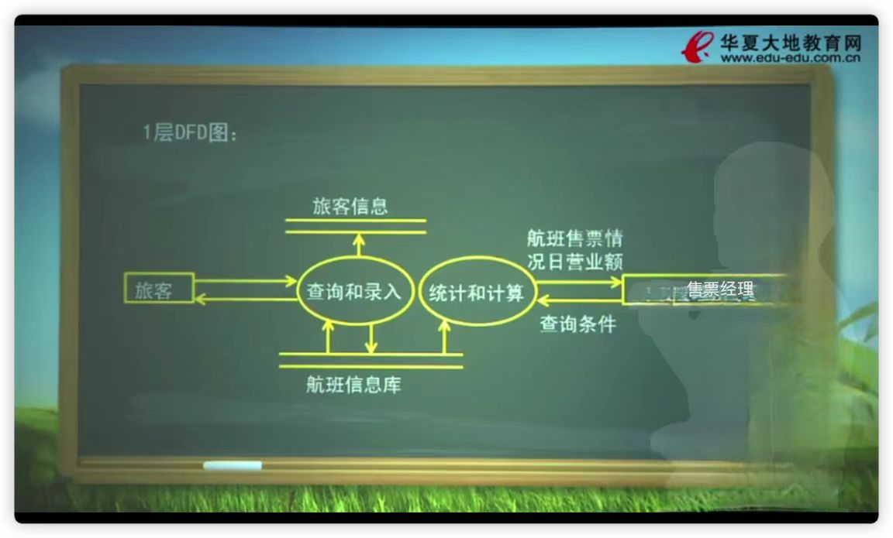

# 第三章 结构化方法

- [第三章 结构化方法](#第三章-结构化方法)
  - [笔记（粗）](#笔记粗)
    - [学习目标](#学习目标)
    - [需求分析面临的挑战](#需求分析面临的挑战)
    - [需求技术的基本特征](#需求技术的基本特征)
    - [一、需求分析中的基本术语](#一需求分析中的基本术语)
      - [表示方法](#表示方法)
    - [二、系统功能模型表示方法](#二系统功能模型表示方法)
      - [例子](#例子)
      - [一个简化的机票销售系统需求描述如下](#一个简化的机票销售系统需求描述如下)
    - [三、建模过程](#三建模过程)
    - [建模过程2-数据字典](#建模过程2-数据字典)
      - [表示符号](#表示符号)
    - [建模过程3-加工的描述](#建模过程3-加工的描述)
      - [1、判定表](#1判定表)
      - [2、判定树](#2判定树)
      - [3、结构化语言](#3结构化语言)
    - [四、应用中注意的问题](#四应用中注意的问题)
    - [五、需求验证](#五需求验证)
    - [练习](#练习)

## 笔记（粗）

### 学习目标

1、掌握结构化分析方法
(1)DFD
(2)数据字典
(3)决策树、决策表
2、掌握结构化设计方法
(1)控制结构图、PAD图、N-S图等

### 需求分析面临的挑战

- 问题空间理解
- 人与人之间的通信，“有效沟通”
- 需求的变化性

### 需求技术的基本特征

- 提供方便通信的机制
- 鼓励需求分析人员使用问题空间的术语思考问题，编写文档
- 提供定义系统边界的方法
- 提供支持抽象的基本机制
- 为需求分析人员提供多种可供选择的方案
- 提供特定的技术，适应需求的变化

### 一、需求分析中的基本术语

1、数据：客观事物的一种表示
2、信息：具有特定语义的数据
3、数据是信息的载体
4、数据流：数据的流动
5、加工：数据变换单元
6、数据存储
7、数据源和数据潭

#### 表示方法

### 二、系统功能模型表示方法

1、数据流图(DFD图)一种表示数据变换的图形化工具
2、数据流程图的元素:数据源数据潭，数据流，数据加工，数据存储

#### 例子

接收业务部门”交来的考勤记录，将考勤数据录入到工资变动文件，应用工资变动文件和固定工资文件计算工资，存入工资文件。根据工资文件做费用分配产生工资分配文件，最后根据这个文件编制转帐凭证送交“财务处”

#### 一个简化的机票销售系统需求描述如下

售票员根据旅客需要的航班，首先查询有无该航班机票。若有，则负责录入旅客的基本信息，并将指定的机票标志设置为售出：售票部经理可随时查询每一个航班的售票情况，并在当日结算时能计算出日营业额。请画出该系统的0层DFD图和1层DFD图（注：1层分解为查询和录入、统计和计算两个处理）

顶层数据流

1层DFD图

### 三、建模过程

1、自顶向下、逐步求精
2、建立系统环境图
3、0层图：从0层图开始对流程图中的要素编号
4、1层图
....

### 建模过程2-数据字典

定义数据流程图中所有数据流和数据存储的数据结构

#### 表示符号

顺序结构：+
选择结构：|
重复结构：{}
子界：m..n

### 建模过程3-加工的描述

#### 1、判定表

判断表(Decision Table)也称为决策表，是一个二维表，它说明了每一种条件组合所产生的结果

该表分为四个象限(quadrants):
左上限代表所有的条件；  
左下限代表可能的结果；  
右上限代表每一种条件的取值（用Y和N来表示）；  
右下限用X表示所对应的条件组合所产生的结果；  

- 【例题】请画出顾客购货的折扣政策的决策表
销售商在给顾客的折扣时，要考虑付款日期和交易额这两个因素。若付款日期在10天以内（含10天），则当交易额超过￥10.000时，给予5%的折扣：当交易额在￥5.000到￥10.000之间（含￥5,000）时，给予3%的折扣：当交易额低于￥5.000时，没有折扣。若付款日期超过10天，则无论交易额多少，均不给任何折扣

#### 2、判定树

判断树(Decision Tree)也称为决策树，是用来描述在一组不同的条件下，决策的行动是根据不同条件及其取值来选择的处理过程。业务规则的描述通常可以使用判断树这一过程描述工具

#### 3、结构化语言

若逻辑关系比较简单，可以用结构化自然语言来描述

- 【例题】如果应发工资低于4500，则无需缴税，否则需要交纳个人收入所得税

IF立发工资<4500
  无需缴税
ELSE
  交纳个人收入所得税

### 四、应用中注意的问题

1、模型平衡问题

- DFD图与数据字典的一致
- 底层加工的处理逻辑描述，与数据字典一致
2、信息的复杂性控制问题
- 上层数据流可以打包
- 下层模块个数：7士2
- 每个加工的数据流不能太多：增加层次

### 五、需求验证

1、验证：必要性、无歧义性、可测性、可跟踪
性、可测量性
2、需求中发现的错误类型

- 不正确的事实：40%
- 遗漏：31%
- 不致，13%
- 歧义性：5%
- 错放：2%
- 其它：9%

### 练习

【例题】教师申报科研成果的过程如下：教师上交科研材料和申报表，首先根据科研管理条例进行审核：对审查合格的材料，再根据科研管理条例和科研档案进行分类。分类完成后将科研成果存储到科研档案并报科研处备案。试画出数据流程图

