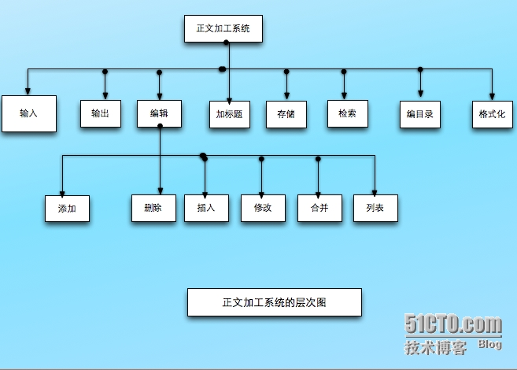

- [背景介绍](#背景介绍)
- [学习目标](#学习目标)
- [考点分析](#考点分析)
- [1、第一节结构化需求分析](#1第一节结构化需求分析)
  - [1.1、请分析字处理程序的各种需求](#11请分析字处理程序的各种需求)
  - [1.2、需求分析面临的挑战](#12需求分析面临的挑战)
  - [1.3、需求技术的基本特征](#13需求技术的基本特征)
  - [1.4、需求分析中的基本术语](#14需求分析中的基本术语)
    - [1.4.1、表示方法](#141表示方法)
  - [1.5、系统功能模型表示方法](#15系统功能模型表示方法)
    - [1.5.1、案例一](#151案例一)
    - [1.5.2、案例二：一个简化的机票销售系统需求描述如下](#152案例二一个简化的机票销售系统需求描述如下)
  - [1.6、建模过程](#16建模过程)
    - [1.6.1、建模过程1](#161建模过程1)
    - [1.6.2、建模过程2-数据字典](#162建模过程2-数据字典)
    - [1.6.3、建模过程3-加工的描述](#163建模过程3-加工的描述)
      - [1.6.3.1、判定表](#1631判定表)
        - [【例题】请画出顾客购货的折扣政策的决策表](#例题请画出顾客购货的折扣政策的决策表)
      - [1.6.3.2、判定树](#1632判定树)
        - [【例题】请画出顾客购货的折扣政策的决策树](#例题请画出顾客购货的折扣政策的决策树)
      - [1.6.3.3、结构化语言](#1633结构化语言)
  - [1.7、应用中注意的问题](#17应用中注意的问题)
  - [1.8、需求验证](#18需求验证)
  - [1.9、发现错误的方法](#19发现错误的方法)
  - [练习](#练习)
- [2、第二节结构化设计](#2第二节结构化设计)
  - [2.1、总体设计](#21总体设计)
  - [2.2、总体设计的步骤](#22总体设计的步骤)
  - [2.3、两种映射方法](#23两种映射方法)
  - [2.4、模块化及其启发式规则](#24模块化及其启发式规则)
    - [2.4.1、模块](#241模块)
    - [2.4.2、模块化的两个问题](#242模块化的两个问题)
    - [2.4.3、模块化](#243模块化)
      - [2.4.3.1、模块耦合](#2431模块耦合)
      - [2.4.3.2、模块内聚](#2432模块内聚)
      - [2.4.3.3、启发式规则](#2433启发式规则)
  - [2.5 详细设计](#25-详细设计)

# 背景介绍

结构化方法作为一种“思想”工具，可以用于定义需求，建立待建系统的功能模型：可用于定义满足需求的结构，给出一种特定的软件解决方案

# 学习目标

- 1、掌握结构化分析方法
  - (1)DFD
  - (2)数据字典
  - (3)决策树、决策表
- 2、掌握结构化设计方法
- (1)控制结构图、PAD图、N-S图等

# 考点分析  

本章是整个课程的重点内容，是软件工程理论体系中最经典的内容，占分值25%左右。

考核题型涉及单项选择题、填空题、简答题、综合应用题所有题目类型。

重点掌握：(1)DFD图（综合应用题）：(2)决策树、判定表：(3)模块结构图（耦合、内聚等概念)；(4)PAD图、N-S图

# 1、第一节结构化需求分析

- DFD图
- 数据字典
- 决策树、判定表

> 1、定义明确的需求，是系统成败的关键  
> 2、用户并不能明确地表达其需求  
> 3、沟通上的障碍  

## 1.1、请分析字处理程序的各种需求

- “用户能有效地纠正文档中的拼写错误“——业务需求
- “找出文档中的拼写错误并通过一个提供的替换项列表来供选择替换拼错的词”——用户需求
- 找出拼写错误的词并高亮度显示：显示提供替换词的对话框：实现整个文档范围的替换——功能需求

## 1.2、需求分析面临的挑战

- 问题空间理解
- 人与人之间的通信，“有效沟通
- 需求的变化性

## 1.3、需求技术的基本特征

- 提供方便通信的机制
- 鼓励需求分析人员使用问题空间的术语思考问题编写文档
- 提供定义系统边界的方法
- 提供支持抽象的基本机制
- 为需求分析人员提供多种可供选择的方案
- 提供特定的技术，适应需求的变化

## 1.4、需求分析中的基本术语

- 1、数据：客观事物的一种表示
- 2、信息：具有特定语义的数据
- 3、数据是信息的载体
- 4、数据流：数据的流动
- 5、加工：数据变换单元
- 6、数据存储
- 7、数据源和数据潭

### 1.4.1、表示方法

## 1.5、系统功能模型表示方法

- 1、数据流图(DFD图)
  
  一种表示数据变换的图形化工具
- 2、数据流程图的元素
  
  数据源数据潭，数据流，数据加工，数据存储

### 1.5.1、案例一

接收业务部门”交来的考勤记录，将考勤数据录入到工资变动文件，应用工资变动文件和固定工资文件计算工资，存入工资文件。根据工资文件做费用分配产生工资分配文件，最后根据这个文件编制转帐凭证送交“财务处”

解析

### 1.5.2、案例二：一个简化的机票销售系统需求描述如下

售票员根据旅客需要的航班，首先查询有无该航班机票。若有，则负责录入旅客的基本信息，并将指定的机票标志设置为售出：售票部经理可随时查询每一个航班的售票情况，并在当日结算时能计算出日营业额。请画出该系统的0层DFD图和1层DFD图（注：1层分解为查询和录入、统计和计算两个处理）

顶层数据流

1层DFD图

## 1.6、建模过程

### 1.6.1、建模过程1

1、自顶向下、逐步求精
2、建立系统环境图
3、0层图：从0层图开始对流程图中的要素编号
4、1层图

### 1.6.2、建模过程2-数据字典

定义数据流程图中所有数据流和数据存储的数据结构

- 顺序结构：+
- 选择结构：|
- 重复结构：{}
- 子界：m..n

### 1.6.3、建模过程3-加工的描述

#### 1.6.3.1、判定表

判断表(Decision Table)也称为决策表，是一个二维表，它说明了每一种条件组合所产生的结果

该表分为四个象限(quadrants):

- 左上限代表所有的条件；  
- 左下限代表可能的结果；  
- 右上限代表每一种条件的取值（用Y和N来表示）；  
- 右下限用X表示所对应的条件组合所产生的结果；  

##### 【例题】请画出顾客购货的折扣政策的决策表

销售商在给顾客的折扣时，要考虑付款日期和交易额这两个因素。若付款日期在10天以内（含10天），则当交易额超过￥10.000时，给予5%的折扣：当交易额在￥5.000到￥10.000之间（含￥5,000）时，给予3%的折扣：当交易额低于￥5.000时，没有折扣。若付款日期超过10天，则无论交易额多少，均不给任何折扣

#### 1.6.3.2、判定树

判断树(Decision Tree)也称为决策树，是用来描述在一组不同的条件下，决策的行动是根据不同条件及其取值来选择的处理过程。业务规则的描述通常可以使用判断树这一过程描述工具

##### 【例题】请画出顾客购货的折扣政策的决策树

销售商在给顾客的折扣时，要考虑付款日期和交易额这两个因素。若付款日期在10天以内（含10天)，则当交易额超过￥10,000时，给予5%的折扣：当交易额在￥5.000到￥10.000之间（含￥5000)时，给予3%的折扣：当交易额低于￥5.000时，没有折扣。若付款日期超过10天，则无论交易额多少，均不给任何折扣

#### 1.6.3.3、结构化语言

若逻辑关系比较简单，可以用结构化自然语言来描述

- 【例题】如果应发工资低于4500，则无需缴税，否则需要交纳个人收入所得税

IF立发工资<4500
  无需缴税
ELSE
  交纳个人收入所得税

## 1.7、应用中注意的问题

1、模型平衡问题

- DFD图与数据字典的一致
- 底层加工的处理逻辑描述，与数据字典一致

2、信息的复杂性控制问题

- 上层数据流可以打包
- 下层模块个数：7士2
- 每个加工的数据流不能太多：增加层次

## 1.8、需求验证

- 1、验证：必要性、无歧义性、可测性、可跟踪性、可测量性
- 2、需求中发现的错误类型
  - 不正确的事实：40%
  - 遗漏：31%
  - 不致，13%
  - 歧义性：5%
  - 错放：2%
  - 其它：9%

## 1.9、发现错误的方法

- 审查：65%
- 单元测试：10%
- 评估：10%
- 集成：5%
- 其它：10%

## 练习

【例题】教师申报科研成果的过程如下：教师上交科研材料和申报表，首先根据科研管理条例进行审核：对审查合格的材料，再根据科研管理条例和科研档案进行分类。分类完成后将科研成果存储到科研档案并报科研处备案。试画出数据流程图

【解析】

- 1、本题考查的知识点是：数据流图的绘制。
- 2、这是一个综合应用题的知识点。
- 3、数据流图的四个要素和数据流图的绘制方法

# 2、第二节结构化设计

- 总体设计
- 详细设计

结构化设计的任务

- 1、定义满足需求所需要的结构
- 2、确定“怎么做”的问题
- 3、划分为：
  - 总体设计：以系统为对象
  - 详细设计：以模块为对象

## 2.1、总体设计

1、总体设计的任务：把系统的功能需求分配到一个特定的软件系统结构中

2、引入了两个概念

- 模块：软件中具有特定标识的独立成分
- 模块调用：模块之间的一种使用关系

如何表达模块和模块调用？

- 1、Yourdon提出的`模块结构图`

  

- 2、`层次图`

  

- 3、美国IBM公司提出的`HIPO图`
  - H:层次图
  - IP0:输入处理输出图
  
  层次图+IP0图，每一个模块都有编号

  
  

## 2.2、总体设计的步骤

将DFD图映射为设计层面的模块及模块调用

- 将DFD图转换为初始的模块结构图
- 基于“高内聚、低耦合”的软件设计原理通过模块化，将初始的模块结构图转化为最终的模块结构图

## 2.3、两种映射方法

(1)变换设计

基于变换的数据流程图是一个线性的顺序结构，由输入、输出和变换中心三部分组成。

变换型数据流程图是一个线性的顺序结构，由输入臂、输出臂和变换中心三部分组成。其中变换中心使系统数据发生本质的变化，输入臂将物理输入变换成逻辑输入，而输出臂则将逻辑输出变换成物理输出。

如果待分解的模块是一个数据凝聚的模块，称该模块为以转换为中心的模块。可以把它分解为输入、处理、输出三大模块。

例子：

(2)事务设计

基于事务的数据流程图中有一个事务处理中心，它将输入分为许多相互平行的加工路径，然后根据输入的属性，选择某一加工路径。

如果模块为逻辑凝聚的模块，可以将它分解为一个检查业务类型的模块和一个调度模块，根据不同的业务类型，调度模块调用不同的下层模块。

例子：

## 2.4、模块化及其启发式规则

### 2.4.1、模块

执行一个特殊任务的一个过程以及相关的数据结构。模块通常由两部分组成：模块接口和模块体。

### 2.4.2、模块化的两个问题

- 1、如何将系统分解成软件模块
  - “分而治之”和“抽象
  - 自顶向下，逐步求精
  - 形成模块层次结构
- 2、如何设计模块

如何将系统分解

- 伪码
- 问题分析图PAD
- N-S图
  
### 2.4.3、模块化

把一个待开发的软件分解成若干个简单的具有高内聚低耦合的模块，这一过程称为模块化

#### 2.4.3.1、模块耦合

耦合(coup|ing)是对两个模块之间相互依赖程度的一种度量。模块间的依赖程度越大，则其耦合程度也就越大；反之，模块间的依赖程度越小，则其耦合程度也就越小

模块间耦合类型

- 内容耦合：一个模块直接修改或操作另一模块数据
- 公共耦合：两个模块共同引用一个全局数据项
- 控制耦合：一个模块向另一模块传递控制信号
- 标记耦合：一个模块向两个模块传递一个公共参對
- 数据耦合：模块之间通过参数来传递数据

#### 2.4.3.2、模块内聚

是指一个模块内部个成分之间相互关联程度的度量。也就是说，内聚是对模块内各处理动作组合强度的一种度量。很显然，一个模块的内聚越大越好。

内聚的类型

- 偶然内聚：模块的各成分没有任何关系
- 罗辑内聚：逻辑上相关的处理放在一起
- 时间内聚：模块内的功能在同一时间完成
- 过程内聚：模块内的处理以特定的次序执行
- 通信内聚：操作同一数据集
- 顺序内聚：一个成分的输出作为另一成分的输入
- 功能内聚：模块的所有成分完成单一的功能

#### 2.4.3.3、启发式规则

高内聚、低耦合

- 改进软件结构，提高软件独立性。
- 模块分解模块规模适中
- 力求深度、宽度、扇出、扇入适中。
  - 深度：表示其控制的层数。
  - 宽度：同一层次上模块总数的最大值。
  - 扇出：一个模块直接控制的下级模块的数目。
  - 扇入：有多少个上级模块直接调用它。
- 尽量使模块的作用域在其控制域内
  - 模块的控制域：这个模块本身以及所有直接或间接从属它的模块的集合
  - 模块的作用域：受该模块内一个判断所影响的所有模块的集合
- 尽力降低模块接口的复杂度
- 力求模块功能可以预测

## 2.5 详细设计

具体描述模块结构图中的每一模块，即给出实现模块功能的实施机制，包括一组例程和数据结构详细设计的目标：将总体设计阶段产生的系统高层结构映射为以相关术语表达的低层结构，也是系统的最终结构
