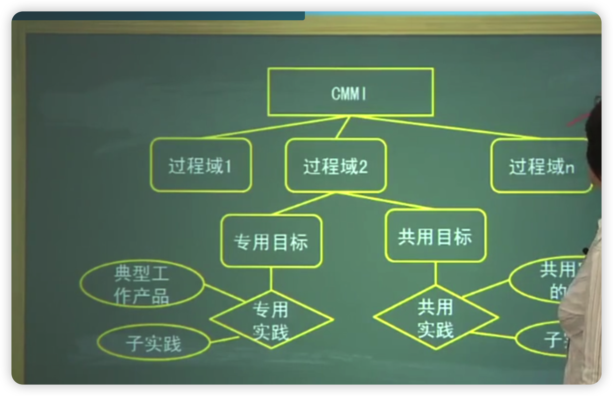
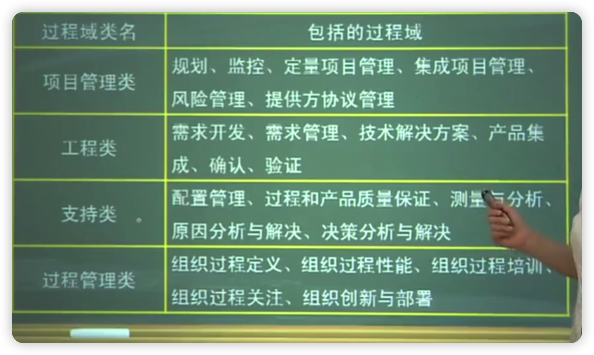
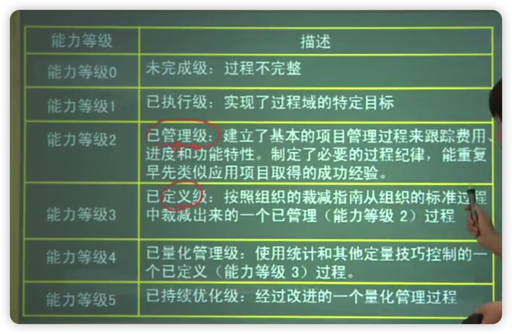
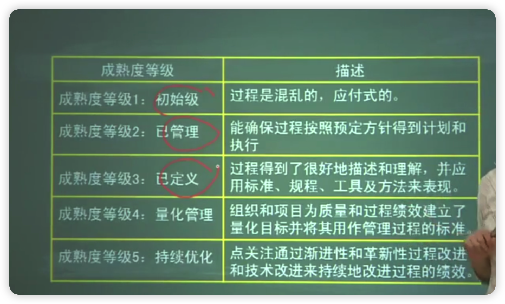
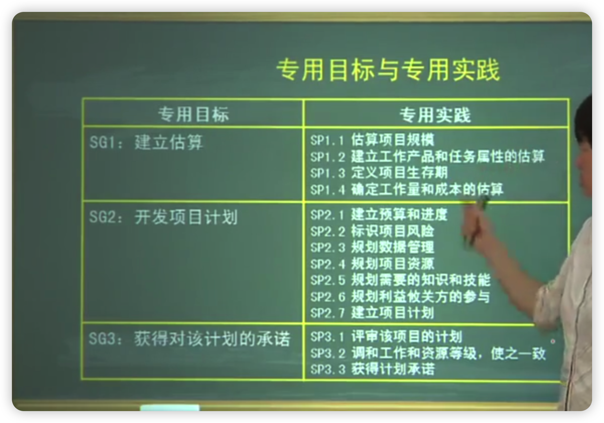
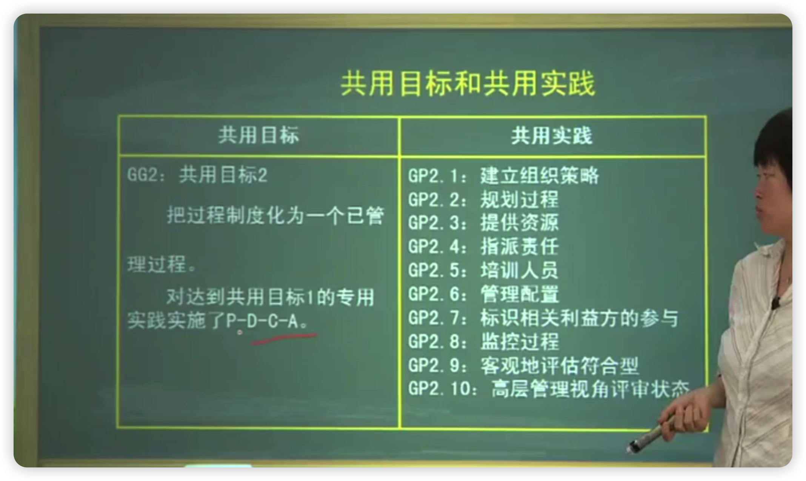
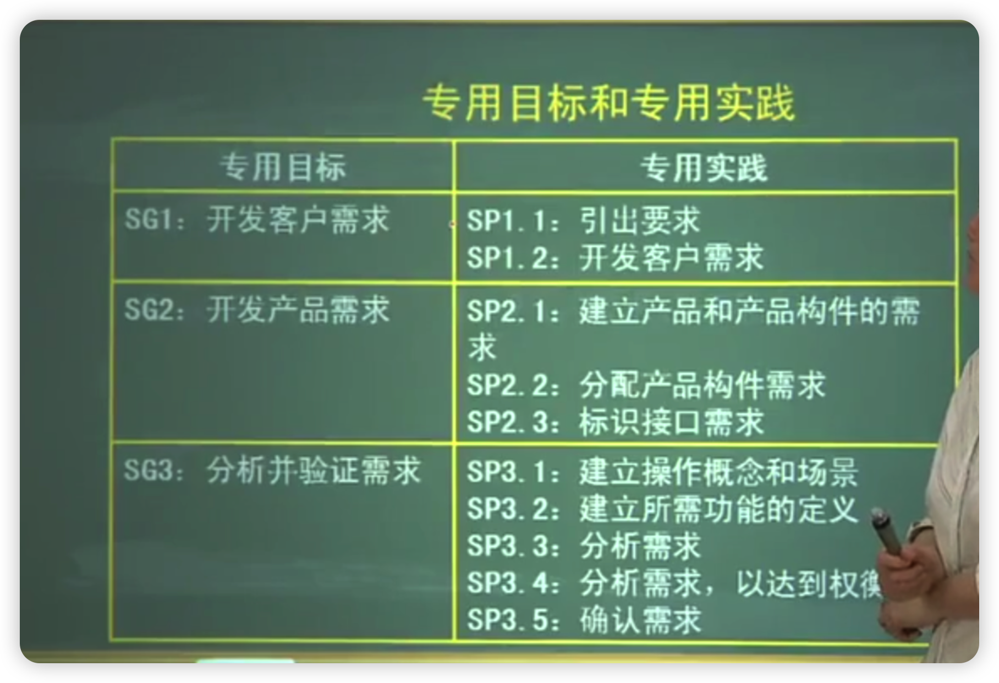
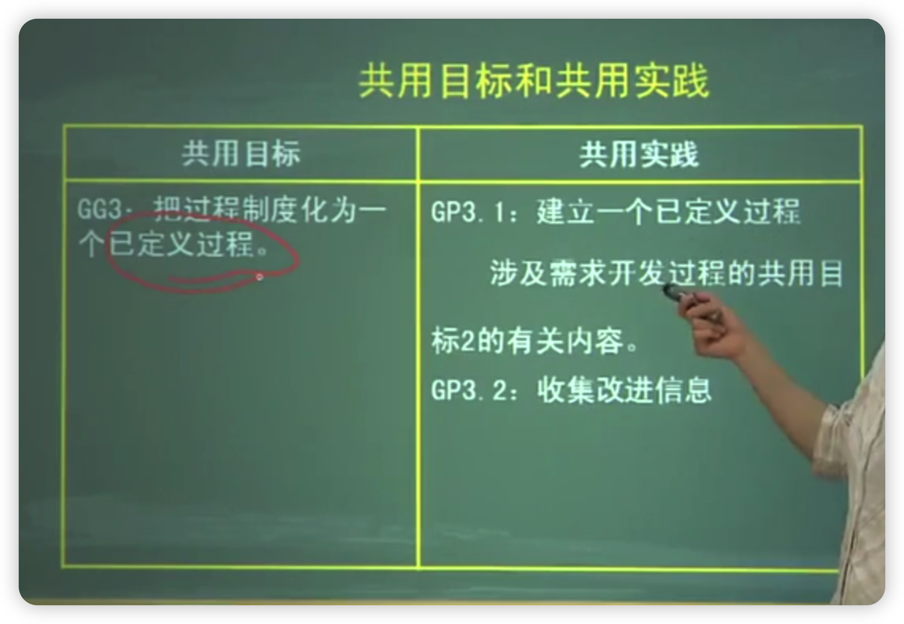

- [背景介绍](#背景介绍)
- [学习目标](#学习目标)
- [1、第一节背景和原理](#1第一节背景和原理)
  - [1.1、一、CMMI的含义](#11一cmmi的含义)
  - [1.2、二、CMMI的目的](#12二cmmi的目的)
  - [1.3、三、CMMI的构成](#13三cmmi的构成)
  - [1.4、四、CMMI的应用](#14四cmmi的应用)
- [2、第二节CMMI的模型部件](#2第二节cmmi的模型部件)
  - [2.1、CMMI的模型部件](#21cmmi的模型部件)
  - [2.2、一、过程域](#22一过程域)
  - [2.3、二、专用目标](#23二专用目标)
  - [2.4、三、专用实践](#24三专用实践)
  - [2.5、四、共用目标和共用实践](#25四共用目标和共用实践)
  - [2.6、五、典型工作产品](#26五典型工作产品)
  - [2.7、六、子实践](#27六子实践)
  - [2.8、七、共用实践的情化](#28七共用实践的情化)
  - [2.9、八、意图描述](#29八意图描述)
  - [2.10、九、简介性解释](#210九简介性解释)
  - [2.11、十、相关过程域](#211十相关过程域)
- [3、第三节CMMI的等级](#3第三节cmmi的等级)
  - [3.1、一、能力等级](#31一能力等级)
  - [3.2、二、组织成熟度等级](#32二组织成熟度等级)
- [4、第四节过程域举例](#4第四节过程域举例)
  - [4.1、一、项目规划](#41一项目规划)
  - [4.2、二、需求开发](#42二需求开发)
- [本章小结](#本章小结)

# 背景介绍

仅当对软件过程予以有效管理时，才能实现有效的软件工程

本章关注的是软件过程的改善问题

集成产品能力成熟度模型CMMI是针对系统/产品开发的能力成熟度模型，包含一些最佳实践，覆盖了产品从概念到交付和维护的整个生存周期。

# 学习目标

记住：什么是过程改善、过程域、专用目标和共用目标、能力等级、成熟度等级和过程制度化。

领会：CMMI有关最佳实践的组织、过程域的分类、能力等级的组成及各等级的特征、成熟度等级的组成及各等级的特征、能力等级和成熟度等级的关系

领会：达到共用目标2、共用目标3、共用目标4和共用目标5所要实施的共用实践。

领会：项目规划过程达到成熟度2级所要满足的专用目标、共用目标以及所要实施的实践

领会：需求开发过程域达到成熟度3级所要满足的专用目标、共用目标以及所要实施的实践

CMMI的核心理念、CMMI的模型部件、能力等级的划分及各等级的特征、成熟度等级的划分及各等级的特征、能力等级和成熟度等级的基本关系

# 1、第一节背景和原理

## 1.1、一、CMMI的含义

Capability Matur ity Model Integration forDeve lopment,集成化能力成熟度模型是由美国国防部与卡内基一梅隆大学和美国国防工业协会共同开发和研制的

## 1.2、二、CMMI的目的

其目的是帮助软件企业对软件工程过程进行管理和改进，增强开发与改进能力，从而能按时地、不超预算地开发出高质量的软件。

过程改进

## 1.3、三、CMMI的构成

- 软件CMM
- 产品集成开尔CMM
- 系统工程CMM

## 1.4、四、CMMI的应用

过程途径的基本假设：系统或产品的质量高度受开发和维护中所使用的过程质量的影响

质量支撑点：

- 人员
- 规程和方法
- 工具和设备

# 2、第二节CMMI的模型部件

CMMI是一种过程改善框架

过程改善：是指人为设计的一个活动程序，其目的是改进组织的过程性能和成熟度，并改进这一程序的结果

## 2.1、CMMI的模型部件

- 由一些过程域组成，过程域有自己的确定专用目标和公共目标。（长方形）
- 每个专用目标和公共目标的实现，分别依赖一些买践。（菱形）
- 每个专用实践有自己的子实践和确定的典型工作产品，符号：（椭圆）资料性部件

## 2.2、一、过程域

过程域：一个业务域中一束相关的实践，当它们起得以实现时，就满足被认为对该过程域的改善具有重要作用的一组条件

CMM1有22个过程域，分为四类，见下表所示：

## 2.3、二、专用目标

- 一个过程域中都有一个或多个专用目标
- 描述该过程域必须呈现的一些独有特征
- 专用目标可用于帮助确定一个过程域是否得以满足

## 2.4、三、专用实践

- 对于达到专用目标是重要的活动
- 期望以专用实践所描述的活动，会导致达到一个过程域的专用目标

## 2.5、四、共用目标和共用实践

可用于多个过程域

## 2.6、五、典型工作产品

- 专用实践所产生的输出样品
  
  【案例】专用实践“依据项目，监视项目规划参数的实际值

- 典型工作产品是：重大偏差的记录

## 2.7、六、子实践

子实践是对专用实践、共用实践的详细描述

【案例】专用实践：针对已标识的问题，采取纠正措施。子实践：针对已标识的问题，确定所需要的适当措施，并建立相应的文档

## 2.8、七、共用实践的情化

为一个共用实践唯一地应用于一个过程域，提供了相关的指导

## 2.9、八、意图描述

用来描述过程域的意图

## 2.10、九、简介性解释

用来描述该过程域中所涉及的主要概念

## 2.11、十、相关过程域

用来描述该过程域所引用的相关过程域

反映了过程域之间的关系

# 3、第三节CMMI的等级

两种类型的等级

能力等级：是一种过程改善路径，该路径可使组织针对单一过程域不断改善该过程域

成熟度等级：是一种过程改善路径，该路径可使组织针对一组过程域不断改善一组相关的过程域

## 3.1、一、能力等级

1、过程能力：

遵循一个过程可达到的预期结果的程度。表征组织对一个过程域的改善，是不断改善一个给定的过程域的一种手段。

2、能力等级

包含一个共性目标及其相关的共性实践，它们与一个过程域相关联，能够改进组织同那个过程域相关联的过程

## 3.2、二、组织成熟度等级

成熟度等级是指达到预先定义的组过程域所有目标的一种过程改善等级。一个成熟度等级是由预先定义的一个过程域集及其相关的一些专用实践和共用实践组成的

CMMI的阶段式表示模型定义了5个成熟度等级，在持续的过程改进上，每一等级都是构成下一阶段基础的一个层次，这些等级用从1到5的数字表示

成熟度等级包含的过程域

成熟度等级与能力等级的关系

- (1)为了达到成熟度2级，2级所包含的所有过程须达到能力等级2或更高级
- (2)为了达到成熟度3级，2级、3级所包含的所有过程域必须达到能力等级3或更高级
- (3)为了达到成熟度4级，2、3、4级所包含的所寸程域必须达到能力等级3或更高级

# 4、第四节过程域举例

两个过程域：项目规划(2级)和需求开发过程(3级)

## 4.1、一、项目规划

- 1、意图：建立并维护项目活动计划的定义
- 2、所要满足的专用目标、共用目标以及所要实施的实践：见下表

## 4.2、二、需求开发

1、意图生成并分析客户需求、产品需求和产品部件需求

2、专用目标和专用实践见下表：

# 本章小结

- 1、针对开发的CMMI是一个有关产品和服务的过程改善的成熟度模型，继承了三个源模型：软件CMM、系统工程CMM、集成产品开发CMM:
- 2、CMMI模型基于过程途径思想，通过过程把软件质量的3个支撑点：受训人员、规程和方法、工具，以开发所期望的系统产品：
- 3、CMMⅡ提供了两种过程改善路径，一个称为能力级，另一个称为成熟度等级：
- 4、能力等级有6个等级：
- 5、成熟度等级包括4个过程组、5个等级。
