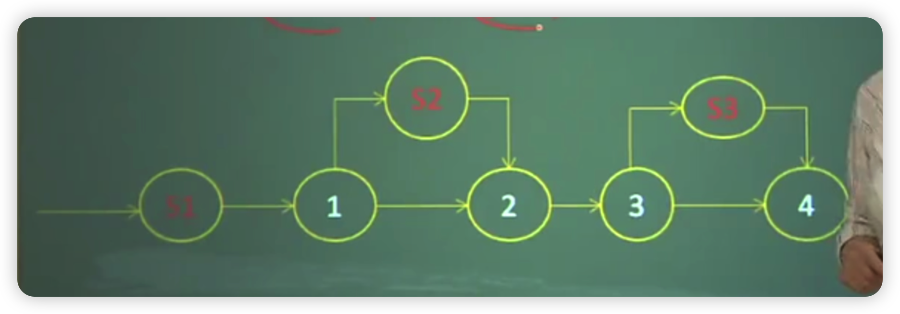
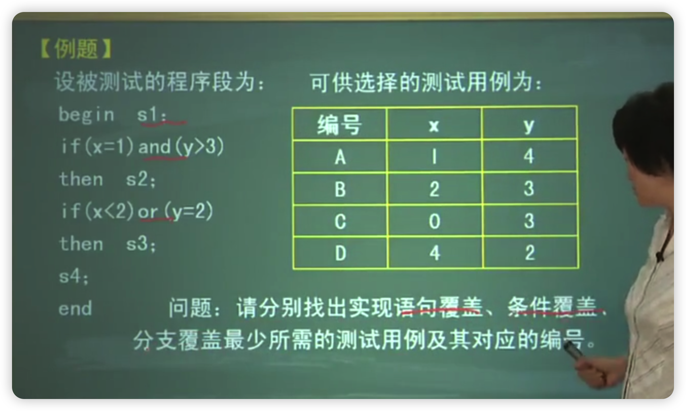
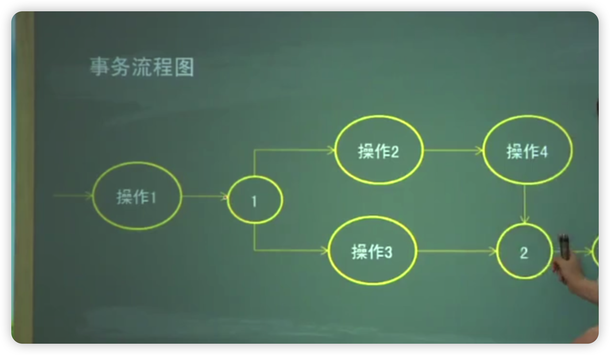
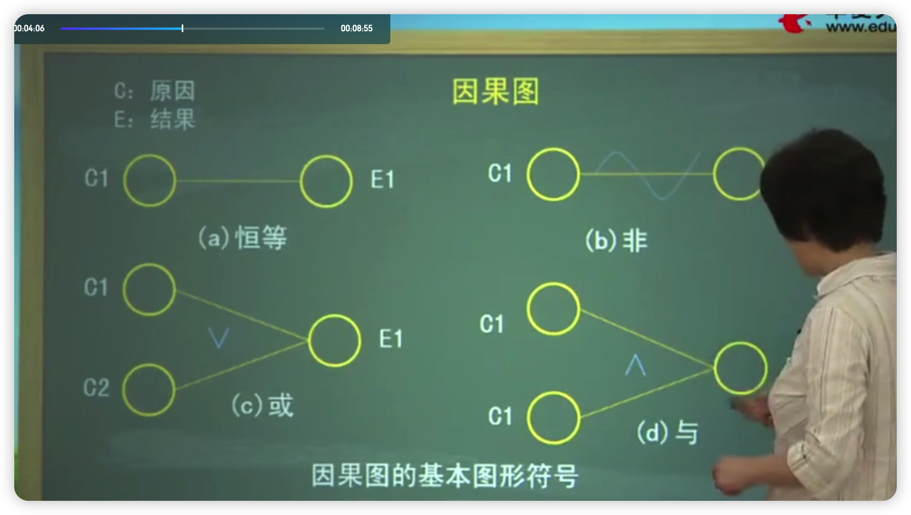

- [背景介绍](#背景介绍)
- [知识结构](#知识结构)
- [学习目标](#学习目标)
- [考点分析](#考点分析)
- [1、第一节软件测试目标与软件测试过程模型](#1第一节软件测试目标与软件测试过程模型)
  - [1.1、软件测试的对象](#11软件测试的对象)
  - [1.2、软件测试的目的](#12软件测试的目的)
  - [1.3、三、软件测试的定义](#13三软件测试的定义)
  - [1.4、四、“测试”和“调试”的区别](#14四测试和调试的区别)
  - [1.5、五、测试过程模型](#15五测试过程模型)
- [2、第二节软件测试技术](#2第二节软件测试技术)
  - [2.1、一、路径测试技术](#21一路径测试技术)
    - [2.1.1、控制流程图](#211控制流程图)
    - [2.1.2、测试策略](#212测试策略)
    - [2.1.3、路径选取与用例设计](#213路径选取与用例设计)
  - [2.2、二、基于事务流的测试技术](#22二基于事务流的测试技术)
  - [2.3、等价类法](#23等价类法)
  - [2.4、 四、边值分析法](#24-四边值分析法)
  - [2.5、五、因果图法](#25五因果图法)

# 背景介绍

- 错误是不可避免的，我们要做的就是发现它，并改正它
- 软件测试是保证软件过程质量和软件产品质量的基础。
- 软件测试是一种动态评估技术，通过执行程序发现其中的错误。

# 知识结构

三种软件测试技术：

- (1)基于程序路径的白盒测试技术
- (2)基于需求规约的事务流测试技术
- (3)等价类划分技术

# 学习目标

- 掌握软件测试的目的
- 软件测试的方法
- 软件测试的基本步骤
- 领会事务流测试的步骤
- 领会运用等价类划分技术进行测试的步骤
- 能够根据程序逻辑设计测试方案

# 考点分析

软件测试是本课程的重点内容，题目类型涉及单项选择题、填空题、简答题、综合应用题全部题型，分值在25%左右。

本章的重难点是：能够针对一个特定的软件模块，运用白盒测试技术创建该模块的被测试对象模型，并给出相应的测试用例。

既有基本概念，也有综合应用，一定要多做练习

# 1、第一节软件测试目标与软件测试过程模型

## 1.1、软件测试的对象

软件=程序+文档

测试对象：各个阶段产生的源程序和文档。

## 1.2、软件测试的目的

测试的目的应该是通过软件测试尽可能多地发现并改正软件种存在的错误。

## 1.3、三、软件测试的定义

软件测试(Software Testing)是按照特定规程发现软件错误的的过程。

使用人工或自动手段，运行或测定某个系统的过程，其目的是检验它是否满足规定的需求，或清楚了解预期结果与实际结果之间的差异。

## 1.4、四、“测试”和“调试”的区别

- 测试证明“失败”，调试证明“正确”
- 测试以已知条件开始，
- 测试时有计划的
- 测试是一个发现错误、改正错误、重新测试的过程
- 测试的执行是有规程的
- 测试由独立的测试小组完成
- 测试的执行和设计可由工具支持

## 1.5、五、测试过程模型

- 1、测试设计
  - 环境模型
  - 对象模型
  - 错误模型
- 2、测试执行
- 3、测试结果比较

# 2、第二节软件测试技术

软件测试

- 人工测试
  - 个人复查
  - 走查
  - 会审
- 机器测试
  - 黑盒测试
  - 白盒测试

## 2.1、一、路径测试技术

- 是一种白盒测试技术
- 依据的是程序的逻辑结构。
- 采用控制流程图来表达被测程序模型。
- 通过合理地选择一组穿过程序的路径，以达到某种测量度量。

### 2.1.1、控制流程图

是一种表示程序控制结构的图形化工具，其基本元素是过程块、节点、判定。

`过程块：`是没有被判定和或被节点分开的一组程序语句。基本特性是：若过程块中的某个语句被执行，则块中所有语句都被执行

`判定：`是一个程序点，此处控制流出现分叉

`节点：`也是程序点，此处控利流进结会。

`链：`是过程块、判定、节点之间种具有特定语义的关系

`路径：`是由链组成的，包含一串指令或语句，其长度由链的数目决定

对软件测试而言，限定路径为：从程序的入口开始，在出口结束


> 四个过程块S1、S2、S3、S4  
> 两个判定1、3  
> 两个节点2、4  

【例题】

```js
begin s1;
if (x=1)and (y>3)
then
s2;
if (x<2)or (y=2)
then s3;
s4:
end
```

### 2.1.2、测试策略

- 路径覆盖(PX)：执行所有可能穿过程序控制流程的路径。最强的测试度量。
- 语句覆盖(C1):至少执行程序中所有语句一次。最低的测试度量。
- 分支覆盖(P2):至少将程序中的每个分支执行一次
- 条件覆盖与条件组合覆盖

几种测试覆盖存在以下基本关系：

语句覆盖≤分支覆盖≤条件组合覆盖≤路径覆盖

思路

测试用例A:X=1,Y=4
T1=t,T2=t,T3=t,T4=f
所有语句执行一遍
为真的分支执行一遍

测试用例B:X=2,Y=3
T1=f,T2=f,T3=f,T4=f
否定分支执行一遍

测试用例C:X=0.Y=3
T1=f、T2=f、T3=t、T4=f

测试用例D:X=4,Y=2
T1=f、T2=f、T3=f、T4=t

【答案】
语句覆盖：A
分支覆盖：A,B
条件覆盖：A,B,C,D

### 2.1.3、路径选取与用例设计

最小的强制性测试需求是语句覆盖率

路径选取的一般原则：

- (1)选择最简单的、具有一定功能含义的入口/出口路径：
- (2)在已选取的基础上，选择无循环的路径，选取短路径、简单路径：
- (3)选取没有明显功能含义的路径，要研究该路径：

## 2.2、二、基于事务流的测试技术

是一种功能别试技术

属于黑盒测试技术

事务：是指从系统用户的角度出发所见到的一个工作单元，有其“生”，有其“亡”。如：

- 短信提醒
- 节日问候
- 数据更新

事务由一系列操作组成，用“事务流”表达。

事务流：是系统行为的一种表示方法，为功能测试建立了程序的动作模式。

事务流程图：表达系统的行为，多个事务流的执行


**事务流程图中的相关概念**

- 1、并生：事务处理产生一个新事务，由此这两个事务继续执行
- 2、丝分裂：事务处理产生两个新事务
- 3、汇集：事务的不同活动可以汇集一处
- 4、吸收：一个事务可以被另一个事务吸食
- 5、结合：两个事务结合后产生一个新事务

如何根据事务流程图设计测试用伤

- 步骤1：获得事务流程图
- 步骤2：浏览、复审
- 步骤3：用例设计
- 步骤4：测试执行
<!-- 70 -->

## 2.3、等价类法

是根据程序的1/0特性，将程序的输入划分为有限个等价区段，使得从每个区段内抽取的代表性数据进行的测试等价于该区段内任何数据的测试。

对于每个输入条件存在着程序有效输入的有效等价类和对程序错误输入的无效等价类。

- 1、如果某个输入条件规定了输入数据的取值范围，则可以确立一个有效等价类和两个无效等价类
- 2、如果某个输入条件规定了输入数据的个数，则可以确立一个有效等价类和两个无效等价类
- 3、如果某个输入条件规定了输入数据的一组可能取的值每一个输入值就是一个有效等价类，一个无效等价类
- 4、如果某个输入条件是一个布尔值，则可以划分一个有效等价类和一个无效等价类
- 5、如果某个输入条件规定了必须符合的条件，，则可以划分一个有效等价类和一个无效等价类
- 6、若在已划分的某个等价类中各元素在程序中的处理方式不同，则应将此等价类进一步划分为更小的等价类

## 2.4、 四、边值分析法

是一种根据引/0边界等价类上或紧靠边界的条件选择测试用例的更有效的方法。

## 2.5、五、因果图法

因一输入条件和果一输出结果，通过因果图将功能说明转换成一张判定表，然后为每种输入条件的组合设计测试用例。着重检查输入条件的组合。



原因和原因之间的约束关系

- (1)E(互斥)：只能有一个成立
- (2)1(包含)：至少有一个条件成立
- (3)0(唯一)：有且仅有一个成立
- (4)R(要求)：当a出现时，b必须出现
- (5)M(屏蔽)：当a=1时，b必须是0，当a=0时,b的值不确定。

用因果图生成测试用例的步骤

- 步骤1：找出模块的原因（输入条件或输入条件的等价类）的结果
- 步骤2：分析原因与结果之间的对应关系，画出因果图
- 步骤3：在因果图上标识出一些特定的约束和限制条件
- 步骤4：把因果图转化为判定表
- 步骤5：把判定表的每一列为依据，设计测试用例
