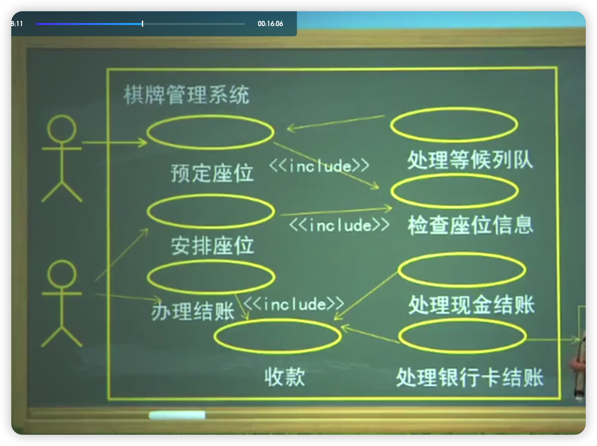

- [背景介绍](#背景介绍)
- [UML的8大术语](#uml的8大术语)
- [描述关系的术语](#描述关系的术语)
- [学习目标](#学习目标)
- [面向对象建模过程的步骤](#面向对象建模过程的步骤)
- [1、第一节UML术语表](#1第一节uml术语表)
  - [1.1、表达客观事物的术语](#11表达客观事物的术语)
    - [1.1.1、对象object](#111对象object)
    - [1.1.2、类](#112类)
      - [1.1.2.1、类的基本属性](#1121类的基本属性)
      - [1.1.2.2、类语义的进一步表达](#1122类语义的进一步表达)
      - [1.1.2.3、类的语义表达的详细程度取决于建模的意图](#1123类的语义表达的详细程度取决于建模的意图)
      - [1.1.2.4、类在建模中的用途](#1124类在建模中的用途)
      - [1.1.2.5、类要满足的基本条件](#1125类要满足的基本条件)
    - [1.1.3、接口](#113接口)
      - [1.1.3.1、接口的含义](#1131接口的含义)
      - [1.1.3.2、接口的表示](#1132接口的表示)
      - [1.1.3.3、使用中的问题](#1133使用中的问题)
      - [1.1.3.4、应用中注意的问题](#1134应用中注意的问题)
    - [1.1.4、协作](#114协作)
    - [1.1.5、用况(use case)用例](#115用况use-case用例)
    - [1.1.6、主动类](#116主动类)
    - [1.1.7、构件/组件](#117构件组件)
    - [1.1.8、制品(Artifact)](#118制品artifact)
    - [1.1.9、.节点](#119节点)
  - [1.2、表达关系的术语](#12表达关系的术语)
    - [1.2.1、关联(Association)](#121关联association)
    - [1.2.2、泛化/继承](#122泛化继承)
    - [1.2.3.细化/实现](#123细化实现)
    - [1.2.4、.依赖](#124依赖)
    - [1.2.5.关系术语的使用](#125关系术语的使用)
  - [1.3、表达组合信息的术语一包](#13表达组合信息的术语一包)
- [2、第二节UML的模型表达格式](#2第二节uml的模型表达格式)
  - [2.1、一、类图](#21一类图)
  - [2.2、二、用况图(use case图)](#22二用况图use-case图)
  - [2.3、三、状态图](#23三状态图)
  - [2.4、四、顺序图](#24四顺序图)
- [本章小结](#本章小结)

>[30分钟学会UML类图](https://zhuanlan.zhihu.com/p/109655171)  
> [面向对象——UML类图](https://zhuanlan.zhihu.com/p/149035395)  
> [设计模式 - UML 类图与接口图的表示](https://juejin.cn/post/6844903998080679943)
> [UML建模之状态图](https://www.cnblogs.com/ywqu/archive/2009/12/17/1626043.html)

# 背景介绍

面向对象技术的发展中，一个重要的里程碑是UML。UML是一种可视化的语言，可用于规约系统制品、构造系统的制品、建立系统制品的文档，可以作为软件需求规约、设计和实现的工具。UML给出了方法学中不同抽象层次术语以及模型表达工具，或者说UML给出规约软件系统/产品的术语和表达格式

UML在方法学中不同抽象层次

# UML的8大术语

- 类和对象
- 主动类
- 接口
- 构件
- 协作
- 制品
- 用况
- 节点

# 描述关系的术语

- 关联
- 泛化
- 实现
- 依赖

# 学习目标

- 掌握各种术语
- 掌握表达模型的用况图、类图、顺序图、状态图

# 面向对象建模过程的步骤

1、需求获取  

建立用况(use case)模型和用况场景

2、需求分析

建立活动图和状态图、类图（建立域模型、顺序图（实现用况）

3、编写需求规格说明书

4、需求验证

# 1、第一节UML术语表

- 表达客观事物的术语
- 表达关系的术语
- 表达组合关系的术语-包

## 1.1、表达客观事物的术语
<!-- TODO: 可能有操作题 -->

### 1.1.1、对象object

对象(object)是系统中用来描述客观事物的一个实体。一个对象由一组属性和对这组属性进行操作的一组方法组成

### 1.1.2、类

类(Class)是具有相同属性、操作、关系和语义的一组对象的集合，它为属于该类的全部对象提供了统一的抽象描述，其内部包括属性和服务两个主要部分

#### 1.1.2.1、类的基本属性

- “+”表示 public；
- “-”表示 private；
- “#”表示 protected；
- 不带符号表示 default。

类属性

- (1)可以有多个属性也可以没有属性
- (2)可见性：public,protected,private
- (3)多重性
- (4)初始值
- (5)性质串
- (6)作用范围

类操作

- (1)操作是对外提供的种服务
- (2)可以被其它对象调用
- (3)一个类可以有多个操作，也可以没有操作
- (4)操作可以是抽象操作
- (5)可见性
- (6)操作的表达语法
- (7)性质串

#### 1.1.2.2、类语义的进一步表达

- 详细叙述类的职责
- 通过类操作的注解，详细注释类的定义
- 通过类操作的注解，详细注释各操作的前置条件和后置条件
- 详述类的状态机（状态图）
- 详述类的内部结构（活动图）
- 类与其他类的协作（协作图）

#### 1.1.2.3、类的语义表达的详细程度取决于建模的意图

- 为了与最终用户和领域专家沟通：较低的形式化手段
- 为了支持正向和逆向工程：采用较高的形式化手段
- 为了对模型进行推理，证明其正确性：采用很高的形式化手段

#### 1.1.2.4、类在建模中的用途

- 模型化问题域中的概念
- 建立系统的职责分布模型
- 模型化建模中使用的基本类型

#### 1.1.2.5、类要满足的基本条件

一个结构良好的类，必须符合下列条件：

- 明确抽象了问题域或解域中某个有形事物或概念
- 包含了一个小的、明确定义的织责集，并能很好的实现
- 清晰地分离了抽象和实现

### 1.1.3、接口

#### 1.1.3.1、接口的含义

接口是操作的一个集合，其中每个操作描述了类构件或子系统的一个服务

#### 1.1.3.2、接口的表示

- 采用具有分栏和关键字\<interface\>的矩形符号来表示
- 采用小圆圈和半圆圈来表示

#### 1.1.3.3、使用中的问题

- 如何描述接口的语义
- 应用中应当注意的问题

#### 1.1.3.4、应用中注意的问题

- 接口智能被其它类目使用，其本身不能访问其它类目
- 接口描述类的外部可见操作，通常是该类的一个特定有限行为
- 接口不描述其中操作的实现，也没有属性和状态
- 接口之间没有关联、泛化、实现和依赖

### 1.1.4、协作

协作是一个交互，涉及交互的三要素：交互各方、交互方式以及交互内容。用虚线的椭圆

### 1.1.5、用况(use case)用例

对一组动作序列的描述，系统执行这些动作应产生对特定参与者有值的、可观察的结果。用实现的椭圆

### 1.1.6、主动类

至少具有一个进程或线程的类。能够启动系统的控制活动，并且其对象的行为通常与其它元素行为并发的

表示方法：两条竖线

用来模型化系统中的并发行为

### 1.1.7、构件/组件

- 系统设计中的一种模块化那件,通过外部接口隐藏了它的内部实现
- 具有相同接口的构件可以相互替代
- 构件可以嵌套
- 构件用于表达解空间中可独立标识的成分

### 1.1.8、制品(Artifact)

- 系统中包含物理信息的、可替代的物理都件
- 部署制品：这类制品是构成一个可执行系统必要而充分的制品，例如：DLL、EXE文件
- 工作产品制品：这类制品本质上是开发过程的产物，由源代码文件、数据文件等用来创建部署制品的事物构成
- 执行制品：这类制品是作为一个正在运行的系统的结果而被创建的。一般存在于内存之中

### 1.1.9、.节点

节点是在运行时存在的物理元素，通常表示一种具有记忆能力和处理能力的计算机资源

## 1.2、表达关系的术语

- 关联
- 泛化
- 细化
- 依赖

### 1.2.1、关联(Association)

- 关联反映了类和类之间的静态关系。关联在模型中，特别是在永久业务对象模型中是最基本的关系
- 关联是类目之间的一种结构关系，是对一组具有相同结构、相同链的描述
- 链：对象之间具有特定语义关系的抽象

关联的语义表达

- 关联名
- 导航
- 角色
- 可见性
- 多重性：多重性(Multiplicity)定义了与一个对象类相联系的对象类出现一次，该对象类可能出现的最小和最大的数目
- 限定符
- 聚合：一个类是另一类的一部分
- 组合：是聚合的一种特殊形式
- 关联类
  
  具有关联和类特性的模型元素
- 约束
  
  有序(ored)、无重复的(set)、有重复的(bag)、有序集合(order set)、列表(Iist)、只读(read only)

### 1.2.2、泛化/继承

特殊类（子类）的对象拥有其一般类（超类）的全部属性与服务，称作特殊类对一般类的继承(Inher itance)利用继承(inher itance),子类可以继承父类的属性和方法。子类/父类也可分别叫做特殊类/一般类、子类/超类、派生类/基类等。

### 1.2.3.细化/实现

- 细化是类目之间的语义关系，其中一个类目规约了保证另一类目执行的契约
- 用空心三角形的虚线表示
- 在以下2个地方会使用实现关系
  - 接口与实现它们的类和构件之间：
  - 用况与实现它们的协作之间。

### 1.2.4、.依赖

依赖是一种使用关系，用于描述一个类目使用另一类目的信息和服务

用有向虚线段表示

依赖-依赖的的分类：

- (1)绑定(Bind)
- (2)导出(Derive)
- (3)允许(Permit)
- (4)实例(Instantiate)

### 1.2.5.关系术语的使用

- 结构关系
- 继承关系
- 精化关系
- 依赖关系

## 1.3、表达组合信息的术语一包

包：是模型元素的一个分组，一个包本身可以被嵌套在其它包中，并且可以含有子包和其它类型的模型元素

- 包的可见性符号
- 包之间的关系
- 访问(use/access)
- 引入(import)
<!-- 50 -->

# 2、第二节UML的模型表达格式

## 2.1、一、类图

类图(class diagram)表达系统的静态结构信息，即系统是由哪些类组成的，这些类之间的关系是什么

类图显示系统各个部分以及怎样将它们组装起来

构造类图的三个关键问题是

- 系统中有哪些需要关心的类？
- 这些类是如何描述的？
- 这些类之间的联系是什么？

## 2.2、二、用况图(use case图)

- 用况是对一个参与者(actor)使用系统的一项功能时所进行的交互过程的一个文字描述序列
- 用况图是一种表达系统功能模型的图形化工具
- 用况是系统开发的起点
- 大多数的系统功能都可以表示成用况

用况图的6个模型元素：

- 主题
- 用况
- 参与者：系统用户、另一个系统、时间
- 关联、泛化、依赖

## 2.3、三、状态图

状态图(state chart diagram)使用状态、事件和转换来记录对象在其生命周期中所历经的状态序列

- 对象的初始状态是图中任何事件都未对该对象起作用时的状态
- 状态代表对象生命周期中的某一瞬间
- 转换表明作为对事件的响应结果，对象将从一种状态转换到另一种状态并执行某个动作
- 触发状态转换的事件在状态转换字符串中命名。双击一个状态转换，除事件签名以外，还可用字符串为其加注临界条件、动作表达式等标签

状态图中的3个术语：

- 状态：一个实例所处的特定阶段、所具有的对外呈现以及所能提供的服务
- 事件
  - 信号事件
  - 调用事件
  - 时间事件
  - 变化事件
- 状态转移

## 2.4、四、顺序图

顺序图(sequence diagram)表示了对象之间传送消息的时间顺序，也就是对象之间的交互顺序

这些交互是指在场景或用况的事件流中发生的

每一个对象（类）用一条生命线来表示一即用垂直线代表整个交互过程中对象的生命期

生命线之间的箭头连线代表消息

顺序图中的基本元素包括：

- 活动者，指用况中的活动者
- 对象，指在用况中的内部对象
- 生命线：在顺序图中的一个对象下面的竖线，用以显示这个对象的生命期
- 消息，指场景内由事件流定义的内部事件成为在对象和活动者或其他对象之间的消息

  消息的类型

  - (1)同步消息——返回消息，同步消息假定有一个返回消息同步消息用有实心的箭头表示：返回消息用虚线、箭头也不是实心来表示：
  - (2)反身消——消息的发送方和接收方是同一个对象：
  - (3)异步消息——没有返回值的消息，用非实心箭头表示：
  - (4)定时消息——对消息附加时间约束条件，包括：发送接受时间、已用时间等：

**控制操作子：**为了控制交互行为描述的复杂性，以便更清晰地表达顺序图中的复杂控制，UML给出了4中最常用的控制操作子

- `选择执行操作子`(Operator for Optional Execution)该控制操作子记为“Ot”,由两部分组成，一是监护条件，二是控制体
- `条件执行操作子`(Operator for Conditional Execution)该控制操作子记为“àt”,控制体通过水平线将其分成一些部分每一部分表示一个条件分支，每个分支有一个监护条件
- `并发执行操作子`(Operator for Parallel上xecution)该控制操作子记为“par”，该控制操作子的体通过水平线将其分为多个部分。每一部分表示一个并行计算。在大多数情况下，每一部分涉及不同的生命线。该控制操作子表明，当进入该控制操作子时，所有部分并发执行
- `迭代操作子`(Operator for Iterative Execution)。该控制操作子记为“Ioop”。

# 本章小结

- UML提供了跨越问题空间到“运行平台”之间的丰富的建模元素：提供了描述客观事物的8个术语和描述关系的4个术语
- 提供了相应的模型表示工具：用况图、类图、状态图、顺序图
- 为了表达概念模型和软件模型，UML提供了13种图形化工具：
