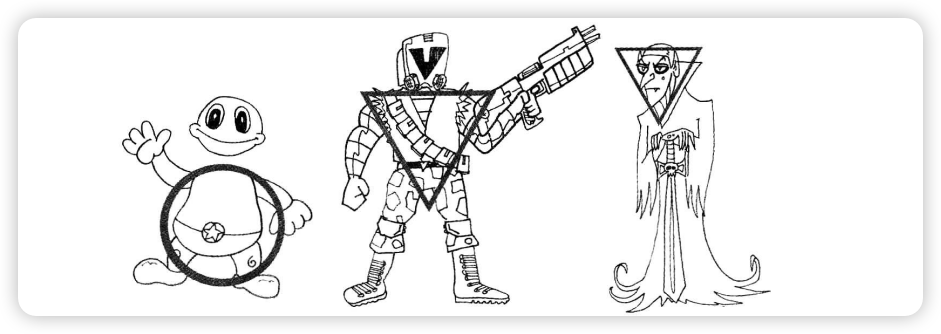
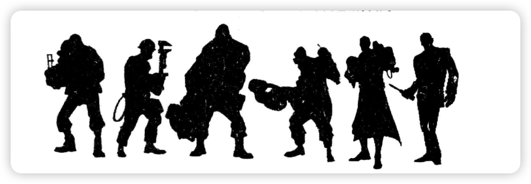
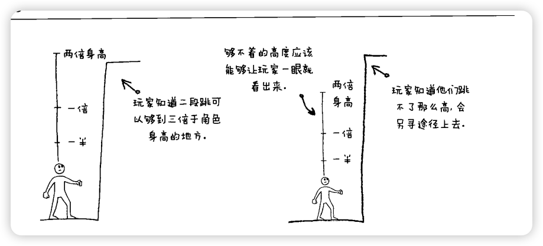
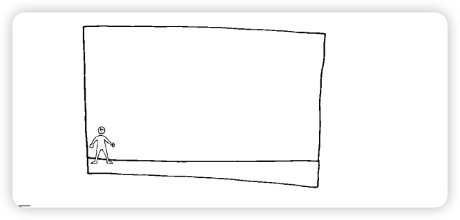
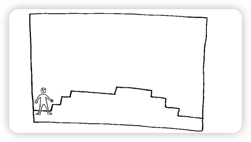
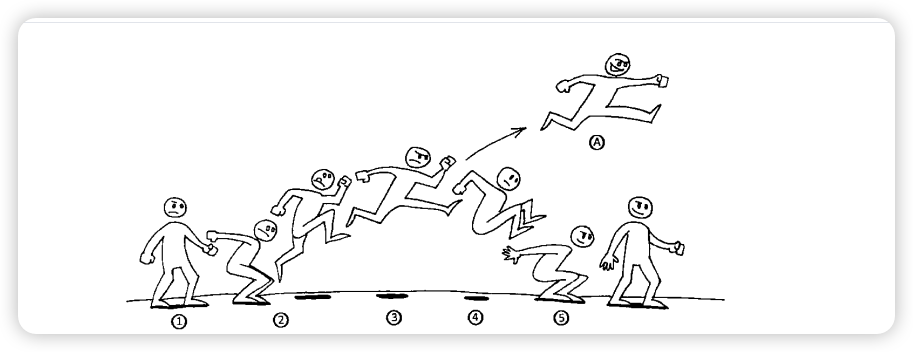
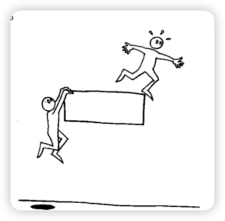

# 通关！游戏设计之道

- [通关！游戏设计之道](#通关游戏设计之道)
  - [第五章 3c之一一角色](#第五章-3c之一一角色)
    - [第5关的攻略与秘籍](#第5关的攻略与秘籍)
    - [角色](#角色)
    - [角色性格](#角色性格)
    - [角色要有性格](#角色要有性格)
    - [设计拟真角色的小建议](#设计拟真角色的小建议)
    - [游戏性](#游戏性)
      - [基本参数](#基本参数)
      - [触点](#触点)
      - [行走](#行走)
      - [空闲动作](#空闲动作)
      - [跳跃](#跳跃)
      - [攀援和趔趄](#攀援和趔趄)
      - [影子与我](#影子与我)
      - [水](#水)
      - [非直立行走的角色](#非直立行走的角色)
    - [细节](#细节)
      - [动作](#动作)
      - [外貌](#外貌)
      - [物品](#物品)
      - [武器](#武器)
    - [第二主角(Second Playable Character,SPC)](#第二主角second-playable-characterspc)
    - [非玩家角色(Non-player Character,NPC)](#非玩家角色non-player-characternpc)

## 第五章 3c之一一角色

游戏设计有3种最基本的元素，必须在游戏准备工作的前期就确定好，我把它们称为3C。

- 1.角色（Character）
- 2.镜头（Camera）
- 3.操控(Control)

如果你在游戏开发中途对上述3元素中的任意一个进行修改，就等于你在对游戏的整个玩法大动干戈，这样会需要耗费大量的精力来重做很多内容，并且也会把整个项目置于风险极高的处境。

### 第5关的攻略与秘籍

- 内在决定外在，功能决定形态：角色的行为和性格决定了他的形象。
- 每个角色都要有独特的体形、剪影、配色和质感。
- 主角的名字要怡当。
- 自定义会增加游戏对玩家的黏度。
- 用主角来定义游戏的基本参数
- 走路可没有任何游戏性可言。
- 利用主角的外观来反映他们在游戏里的状态.
- 游戏里的同伴和5P℃都要花功夫制作，尽量让他们和主角互补.
- 多人游戏要做好平衡性，这样每个角色才能各展所长。
- 活用汇以提高游戏的可玩性。

### 角色

- **内在功能决定外在形式**

在你创造一个角色时，首先要想他的性格是什么样的。下面这3种典型的角色性格特征，哪种更适合你的英雄？

马里奥：勇敢、精神饱满、快乐。
刺猬索尼克：迅捷、酷、急躁。
奎托斯：残暴、狠毒、自私。

圆形能让人觉得你的角色很友善。方形多用在强壮或者呆板的角色身上，而这取决于方形的大小。三角形比较有意思，倒三角用在身体上，往往可以给英雄带来孔武有力的感觉。但是，如果把同样的倒三角放在角色的头上，他们看起来就会比较邪恶。多钻研一下各种图形，试着用它们来搭配出令人难忘的角色。

另外一个专业设计人士和漫画家沿用至今的窍门是，画好角色的剪影。清晰鲜明的**剪影**对角色来说意义很多：

- 一瞥之下可以大概看出角色的性格；
- 区分于其他角色；
- 辨识敌我；
- 让角色在场景之中跃然而出。

用个例子来说明吧，我们看看《军团要塞2》里面各个角色的剪影。

### 角色性格

- 英雄角色
  - `做英雄该做的事`：拯救公主，拯救世界，拯救生命。
  - `英雄总有擅长的事情`：如劳拉对寻宝很在行，索尼克擅长疾速奔跑，西蒙是用鞭子的专家。一定要让你的英雄有个专长，武器也好，技能也好。
  - 但是…`人无完人`：好的英雄人物要合乎人情，也就是说他和我们一样，也得有自己的问题。奇怪的恐惧症，不现实的抱负，人际关系问题等，这些都能让英雄看起来更真实。但是，让角色有这些缺点，和**把这些缺点做成游戏里角色的弱点是两码事**。
- 幽默角色
  - `谈吐搞笑`：要写出搞笑的对话其实不是那么简单的。如果你自己写不出来，可以找专业人士帮忙。
  - `行为搞笑`：千万不要妄想靠装疯卖傻来糊弄人。这么做很低级，会让人觉得是你写不出什么搞笑的东西，而且，弄不好那些恶俗恶心的东西会影响到游戏的ESRB评级。
  - 搞笑的不一定是笑话：在60年代的《蝙蝠侠》电视剧集里，蝙蝠侠就是个很搞笑的角色，不是因为亚当·韦斯特（Adam West）逗，而是因为他把这个角色演得太严肃了：从穿蝙蝠装开蝙蝠车，到拽出腰带上的蝙蝠牌驱鲨剂，他把这些都演得像和吃饭睡觉一样稀松平常的事。正是这种荒谬的对比所产生的违和感和滑稽感，才让他看起来很搞笑。
- 坏角色
  - `不循规蹈矩`：不管是杀掉敌人还是开门关门的时候，都要特立独行。
  - `不是个好人`：当然，游戏里的每个角色基本都会打打杀杀和偷东西⑧，但是坏英雄似乎会更热衷于此。他们会用自己独特的方式来羞辱和折磨敌人，然后乐在其中。
  - `言谈要酷`，（基本）不会吼叫，因为他们又坏又狠，从不虚张声势。但是也要注意，寡言少语的冷酷角色，一不小心就会被弄成没有性格的哑巴。

### 角色要有性格

让每一个让玩家自己定制的细节，都能加深他们和角色之间的感情。你一定要给角色一件标志性的武器或标志性的装备（或是外表），而且不要让玩家改动，因为这些标志是角色身份的象征。绝大多数授权角色都要求保留他们的标志性武器装备，以突出自己的特点。

### 设计拟真角色的小建议

- `脸部比例`。如果为了突出某种性格而刻意强化一些脸部特征的话，拟真角色看起来会怪怪的。一些夸张的脸部特征，比如硕大的眼睛、夸张的下巴和过大的嘴巴，都有可能让角色看起来像怪物。
- `人物动作`。根据恐怖谷理论，角色建模越真实，它的动作就越容易让人看起来不自在。尽量不要弄出僵硬的手臂和肩膀动作。手部则是最不容易做好的部分，因为绝大多数游戏的美工都没法弄出指关节那么灵巧的细节，而仅仅是把手当做一块整体，最后看起来就和肉饼一样。人体是非常灵活的，所以要把角色的各种动作都做得尽量真实。你可以试着先给角色弄个骨架，来辅助做出更逼真的人物动作。
- `人性`。如果一个角色的样子和真人没有太大区别（特别是对非人类角
色，比如机器人或者外星人），大家就会自然而然地认为他的行为和性格也不应该和人类有太大区别。不过，《星球大战》里的R2-D2倒是个出人意料的示例。谈完拟真角色，现在我们该来谈谈另一种角色创作思路一如何设计艺术化角色。
- `脸部比例`。可以通过夸大眼睛、下巴和嘴巴来获得更好的角色效果，同时也可以让角色表达更丰富的感情。就像日本动漫和游戏里的那样
- `人物动作`。如果你们没有足够的时间和预算花在那些反向运动学、动作捕捉技术或者人体力学等高科技上面，那么最好还是用艺术手法来表现你的角色吧。角色越艺术化，他们的动作就能越夸张。你可以好好学学以前的动画大师，比如特克斯·艾夫尔（Tex Aver),他把卡通角色的夸张手法运用得非常精湛。

### 游戏性

#### 基本参数

玩任何游戏，都是从操纵主角开始。所以要先想好玩家和游戏世界之间的联系。主角有多高？其他角色和敌人与主角比起来要高多少或者矮多少？主角手能伸多长？如果主角是四脚着地的动物或者是部赛车，那么它有多大？在你设计主角时就该把这些比例大小都想好。**这些比例是主角的基本参数，也就是整个游戏设计的基石**。

主角的基本参数对玩家来说尤其重要，因为他们需要通过肉眼来估计自己的移动和跳跃距离，尽管他们自己可能意识不到这一点。在玩游戏的时候，他们能感觉到多远的东西可以够到，如果这些参数在游戏中途因为某种因素发生变化，玩家会很不爽，并且会厌恶这个游戏。首先要定下来的参数是主角的身高、移动速度和跳跃高度。我一般都会把**主角作为游戏世界里的标杆（单位）**。比如在《魔界英雄记》里，我们的度量单位叫做“1马克西莫单位”，当然，这个单位就是主角的高度和宽度。游戏里的所有距离、宽度和高度都用这个单位来表示。

#### 触点

在设定参数的同时，你得与程序员一起合作，确定出角色身上的哪些位置是用来和游戏世界交互的，这就是设定角色的触点一判定角色的位置及如何与游戏世界交互的点。需要判定的触点越多，就需要越多时间来运行代码。有些时候，角色只需要一个主触点就够了。最基本的触点位置有3个：头、脚和躯干。

- `头`。虽然在套接帽子模型的时候很有用，但是如果把头部作为主要的触点，可能会产生一些麻烦，特别是对于角色和地面的接触问题。主角有可能看起来不是踩在地上，而像是微微悬空。
- `脚`。把脚部作为主要的触点似乎比较符合逻辑，但是在获取道具时很容易出问题。（比如，如果道具放在主角的腰部高度，那主角还是得跳起来才能拿到。)
- `躯干`。恕我直言，这个部位最适合用来做角色的触点了。它不仅能够兼顾角色的上半部分和下半部分，而且也可以很自然地显示在玩家跑、跳穿过道具的同时获取道具的效果。

#### 行走

走路可不好玩！千万不要想当然地以为，玩家在收集小道具时会和你摆放它们时一样开心。同理，尽管有时调整一下节奏是应该的，但是**让玩家无缘无故地走过一大截空地**，无论游戏的画面有多美，都只会让玩家**感觉无聊**。玩家走路也该走得有意思。为什么要做成这样：

修改

这两块地图目的相同：让玩家从A点走到B点。但是，第二张图里面的路明显要有趣得多，它需要让玩家使用多种移动方式才能走过去，而不是呆板地直走。如果你非要让你的角色慢慢走，那么也一定要让他走得足够快，并且能派上用场。

#### 空闲动作

空闲动作(idle)指的是玩家没有操作时的角色动作，一般在玩家保持空闲几秒钟以后触发。空闲动作（一般来说）对游戏的进行不能带来任何影响。

如：《刺猬索尼克》里面的。当玩家停下脚步时，索尼克会一边用埋怨的眼神看着玩家，一边不耐烦地用脚不停点地。这家伙渴望奔跑！

要记住，在设计空闲动作时，不要设计那种很长很复杂的动画，因为玩家随时都可能摁下什么键而中止它。其实，无论空闲动作长与短，它都是游戏中间的一种小过渡，如果做得不好会适得其反，越长越容易出问题。把空闲动作尽量做得短小精悍吧。可以参考下面这些建议：

- 转武器玩、装弹或者把武器扛在肩上；
- 原地伸展或原地跑；
- 四处张望，或者被不知道哪来的噪音吸引；
- 打冷颤或者给自己擦汗；
- 蹬脚，弹掉鞋上的灰；
- 调整护甲或者背包位置；
- 扭响脖子或者掰响指关节；
- 弹空气吉它，或者自己跳个小舞；
- 查看地图或指南，或者打手机；
- 一边吹口哨一边双腿交叉作等待状；
- 吃东西喝水；
- 挠痒；
- 看表；
- 打呵欠或者打盹。

#### 跳跃

- 1.玩家处于普通状态，即玩家在走路、奔跑或其他状态。
- 2.玩家按下跳跃键。跳必须很迅速，因为许多玩家遇到危险时，第一反应就是跳。但是有时候，也要做一个起跳的动画来回应玩家的操作，这个起跳动作要尽可能短。
- 3.要尽快让角色到达最高点。A.如果游戏里可以进行二段跳，必须在第一跳达到最高点之前进行。一旦开始下落，再来二段跳会让人感觉很不自然。
- 4.下降像倒过来的跳跃。不要把下降时间弄得太长，会让人觉得轻飘飘的，玩家会觉得游戏不好玩，也会搅乱玩家对主角基本参数的感觉一除非玩家吃了什么强化道具或开启什么技能，可以在空中滑翔或漂浮。
- 5.着地的时间可以比起跳久一点，要让玩家感觉稳稳地踩在了地上。我不喜欢那种落地以后还要往前滑的感觉，因为那样可能会导致玩家跳起来以后还是滑下了悬崖或者平台。我觉得“游戏物理”比“现实物理”更有用的情景。

对于玩家短暂的滞空，也有一些值得考虑的设计细节。有些严格遵循物理法则的游戏，不允许玩家在空中调整跳跃轨迹，有的游戏允许玩家调整方向。还有一些游戏可以让玩家根据按住跳跃键的时间不同，做出不同高度的跳跃。

#### 攀援和趔趄

攀援和趔趄是让玩家避免摔死的两个很有用的技巧。玩家可以利用攀援来抓到比自己跳跃极限更高的地方。趔趄则更像对玩家过于靠近悬崖边的警告。**攀援**一般都是能让角色爬上**比自己跳跃高度高一个身子**的地方。

当玩家在台子边缘处于攀援状态，但是还没有爬上去或落回地面时，我们把这种状态叫做**吊挂**。有的游戏里会让玩家自动爬上去，完全忽略这个态，而其他游戏会把吊挂做成**一种玩法**，玩家可以通过吊挂来回避-些陷阱，或者等待通过平台的时机。

#### 影子与我

在创建游戏角色时，不要把影子给忘记了。影子可以给玩家带来下面这些好处。

- 影子在三维空间里可以作为玩家的参照物一特别是在玩家目测跳跃方向时。
- 影子让角色在游戏里有了根基，会让玩家觉得角色是有血有肉的。
- 影子可以帮助玩家试探台子的边缘。如果他们的影子没有“贴”在地面上，那就说明该地方不能立足。
- 影子能够改变光线和玩家的情绪。在一些恐怖游戏里，奇怪的阴影可以让玩家焦虑和分心，甚至有些时候他们会被自己的影子吓到。
- 影子也可以做成玩法的一部分：现在有些游戏里的AI已经可以根据影子来发现玩家了。这个用在潜行游戏里面效果特别好。

下面是一些关于影子设计的要煮

- 不要让角色的影子出现在两个地方。虽然现实中确实会发生这种情况，但是在游戏里看起来就像个bug。
- 不要让影子穿过别的东西，特别是在一些不平坦的地方。
- 不同光照条件下，和不同材质的表面所投射出的影子也不同。虽然游戏不用完全遵循现实法则，但是角色在水下时，如果影子和在地上一样，总会让人觉得怪怪的。

#### 水

要在游戏中清晰一致地表现出“落水=死亡”不然玩家可能会迷惑。单个场景里面的水应该作用一致。可以让角色下水的池子就不能太深，要不整关就都是可以见底的安全水池。

在设计水下环节时你一定要遵循下面这些规则。

- `玩家如何进入/离开水里`？入水和出水的地方要有明显的标识。可以做成有指示牌的平台，或者是倾斜入水的坡道，也可以做成游泳池里的泳梯一只要能让玩家明白“我该从这里下水/出水”就行了。
- `玩家可以在水下游泳吗`？或者只能在水面游？有些时候玩家要到后期才能潜水，有些时候则始终不能潜水。
- 如果玩家可以在水下游泳，那么`他们可以在水下呆很久`吗？有没有类似于氧气存量或者水压的指示仪来防止玩家赖在水里不走？
- `氧气重要吗`？玩家会因为缺氧而死吗？他们需要获取一些道具或者通过一些别的方法来得到空气供给吗？
- `玩家在水下可以攻击`吗？他们在游泳时也带着武器吗？通常水下的击打看起来都会很不自然，如果有武器，在武器的选择上也可能会给玩家带来困扰。
- 玩家碰到水底的时候有什么样的反应？是可以继续滑着走？还是会弹向水面？。玩家在水里可以做在地面上不能做的事吗？他们能拉动一些水底机关吗？或者驾驶那些经常在水下关卡里出现的小潜艇？
- 玩家在`水下和在地上的速`度一样吗？或者在水下能游得更快？
- 在水里改变方向或者深度，可能会给镜头带来一些问题，因为镜头总是会尝试和角色同方向运动。而水下的一些快速动作，则可能会导致镜头为了跟上角色的移动而产生不正常翻转。
  
#### 非直立行走的角色

做好四足动物角色的关键是，要根据它们的特点来设定基本参数，下面这些要素是需要谨记于心的。

- 四足动物需要`更大的转身幅度`：在设定角色参数时要把身体长度和转身时间考虑进去。
- 四条腿一般都意味着`可以跑得更快`，在设定角色的加速和减速效果时要考虑到这一点。
- 更宽的角色意味着`更大的占地面积`，而且在台子边缘吊挂时身躯也会更长。你要根据这种特点来调整游戏世界的参数。而且要加倍小心，谨防“歪心狼效应”。
- 大部分四足角色都比人类的平均身高要矮那么一点。所以你要考`虑到身高的差距所带来的影响`，让它们在攻击时，或者做一些本来很简单的事情（比如开门或开宝箱）时体现出这种差距。

### 细节

#### 动作

- 利用一些小暗示，比如让角色在游戏里自己转头，`盯着那些可以互动`、操作或者拾取的东西。
- 让角色`自动把手伸向可拾取物`与门把手。
- 让角色对`钟爱的物品产生正面的反映`，`对危险的物品则敬而远`之，比如尽量远离那些肯定会致死的玩意儿。
- 玩家的生命值也可以通过他们的动作来反映。在《生化危机》中，角色受重伤以后会变跛，移动速度也会降低。

#### 外貌

- 用角色的`外貌变化来反映他们的生命值`。在很多游戏中，角色的外观都会随着受伤的严重程度而发生变化，伤愈重看上去愈伤痕累累，愈发憔悴。在《蝙蝠侠：阿卡姆疯人院》里，玩家死得次数越多，蝙蝠侠的服装就越破。我们团队则借鉴了《魔界村》的手法，让马克西莫在生命值降低时失去护甲或者衣服。
- 把`角色的状态也做进外观中`。《死亡空间》的主角sac就穿了一套特殊的太空服，这套太空服背后发亮的脊柱部分同时也是玩家的血量计，而且上面还显示了氧气量和武器状态的读数。
- 利用视觉效果来表示角色的状态。比如让受伤的角色流血、漏油或者冒火星。

#### 物品

- 玩家的`装备也可以成为角色的一部分`，而不是只出现在物品菜单里面。在设计《魔界英雄记》时，我们让`那些道具（比如钥匙）挂在马克西莫的腰带上`。这样玩家随时都能知道自己已有哪些东西，而不用打开物品栏查看了。
- `任何主要技能的升级，都要有相对应的模型或者动画效果的改变`。令人难忘的角色要能让玩家时刻感到新意，因为玩家在整个游戏里面都会一直盯着这个角色。除此以外，最好还能像《魔兽世界》那样，让玩家在发现新装备时，可以打开一个预览页面，通过这个页面，玩家可以看到角色穿上这件装备以后的外形变化，也可以在这里尽情打粉自己的角色。

#### 武器

- 武器的提升，除了在数字上有个+3外，更好的办法是把这个`升级表现在武器的外形变化上`。可以让武器发光、冒火，增加一些符文、瞄准镜、喷射口或者别的什么“小玩意儿”，来反映武器的新功能。
- 如果你`不想改变武器的外形，那么可以考虑改变角色的动作`。比如说一把更猛的枪，带来的后坐力就会更大，角色拿枪的姿势也要做相应调整。

### 第二主角(Second Playable Character,SPC)

在设计第二主角时，你首先要决定的是，这个角色是能`操纵`的，还是仅仅是个`同伴`。

可以操控的第二主角允许玩家在不同的角色之间切换。当玩家选择操作一个角色时，另一个角色的行动就交给了AI。

SPC和同伴的区别在于，同伴是靠游戏里的AI控制的。

决定角色能力的参数类别越多，游戏就越容易平衡。角色能力参数譬如：

- 移动速度；
- 移动类型；
- 攻击速度和频率；
- 攻击强度；
- 攻击距离和持续时间；
- 护甲强度；
- 生命值；
- 体重；
- 特技（比如治疗或解谜）。

### 非玩家角色(Non-player Character,NPC)

来自各行各业，可以是任何形象：给玩家任务和奖励的国王，或者是打造武器盔甲的铁匠。你知道npc最可爱的地方是什么吗？对他们来说，你（玩家）是世界的中心！**他们的存在完全是为了帮助（或阻碍）你**！是不是很满足你的虚荣心？所以，在设置任何一个NPC时，基本上都离不开这个问题：**玩家在游戏里需要什么**

每个npc都要扮演一个角色，或者说都需要一份工作，一个存在的理由。每个NPC都有以下一项或多项作用：

- 向玩家提示下一步的目标；
- 引导完成目标（可以是给玩家钥匙、地图或者指路等）；
- 到达目的地的办法；
- 提供完成任务的奖励（可以是金钱、装备或者荣誉等）；
- 提供击败敌人的工具；
- 提供防御敌人致命攻击的装备；
- 给出谜题的答案或问题的解决办法；
- 成为游戏世界的背景和游戏中的主要人物一别太啰嗦；
- 阐述游戏玩法（不要重复玩家已经知道的东西）；
- 赞扬玩家的精彩行为（或当主角是大坏蛋时，又会饱含恐惧之色）；
- 搞笑。
