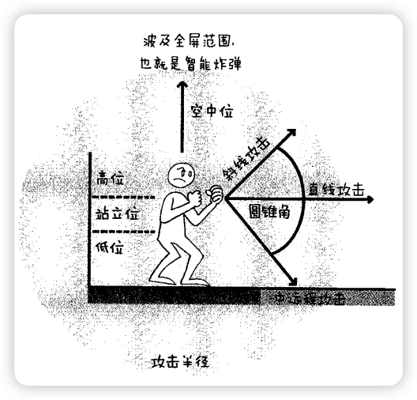
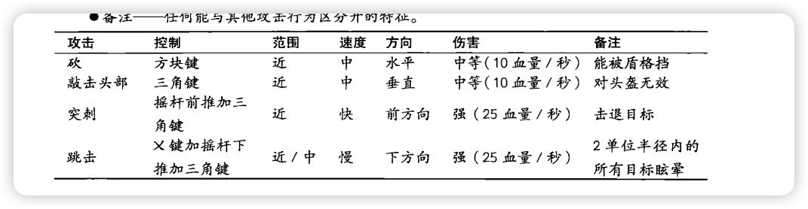

# 战斗的要素

- [战斗的要素](#战斗的要素)
  - [1、随笔](#1随笔)
  - [2、笔记](#2笔记)
    - [2.1、攻击](#21攻击)
      - [2.1.1攻击元素](#211攻击元素)
      - [2.1.2攻击方式](#212攻击方式)
    - [2.2、移动](#22移动)
      - [2.2.1、移动方式](#221移动方式)
    - [2.3、防守](#23防守)
      - [2.3.1、防守方式](#231防守方式)
    - [2.4武器](#24武器)

## 1、随笔
<!-- 查一下 -->
所有行动不外乎三种形式：防守、攻击及移动。这也就是战斗的要素，不论是战争，还是在拳击比赛。

反馈路线  
当玩家做出某种行为（击打、射击），即时可见结果（敌人被攻击并被消灭），并因此获得回报（经验、钱、能力提升）。这一简洁的反馈回路允许玩家同游戏世界快速频繁地互动。

弗洛伊德快乐原则

攻击链

你想要玩家拥有怎样的游戏体验  
如：FPS射爆的爽快，战旗头脑风暴，MOBA把人控到死，奶妈一口好奶。总结：

- 感官：视觉、听觉、触觉（操作）。
- 情感：喜怒哀乐、恩怨情仇、惊恶欲。
- 思考：冷静的思考、复杂的知识。
- 行动：与游戏机制互动、与玩家互动
- 联想：与接触过的书、电影、音乐、人或经历进行联结

角色的攻击范围  

- **近距离攻击**由擒拿、拳击、敲击、挥击、挠痒，以及诸如撞头、勾拳这类快速、爆发力强的动作组成。
- **中距离攻击**包括挥舞兵器、飞踹、冲锋攻击。
- **远距离攻击**包括开枪射击、扔炸弹、法术攻击。
- **范围效果**，比如智能炸弹和“超级”大招会对大范围内甚至全屏敌人造成影响。

攻击高度进行

**站立位高度**大约到玩家角色的肩膀。在这个高度，能打中和人差不多高的敌人或比之稍大点儿的家伙。
**低位攻击**的高度大约到敌人的腰（或更低），必须在下蹲或跪行的姿势下才能施展。
**高位攻击**通常在普通敌人的头顶上。只能通过跳起然后攻击的方式施展。高位攻击是专门对付飞行敌人或B0$类等大家伙的。
**空中位攻击**是玩家跳起来或飞在空中时进行攻击。

攻击对照表

## 2、笔记

### 2.1、攻击

如何对敌人造成伤害，达到消灭敌人的目的

#### 2.1.1攻击元素

设计攻击动作应该考虑的元素：除了攻击对照表外，还有攻击位置，攻击反馈，攻击链的。  

#### 2.1.2攻击方式

- QTE

  QTE其实就是敌人或是B0SS的血量降到一定程度时自动触发的战斗类小游戏。  

  如何设计

  - 没能及时按下正确的键，如何处理
  - QTE失败如何处理

- 肉搏
- 暗杀
- 擒拿

### 2.2、移动

从时空(时间和空间)A到底时空(时间和空间)B

#### 2.2.1、移动方式

- 闪避（翻滚）

  如何设计

  - 注意镜头的移动

    在翻滚或冲刺期间，镜头可能会撞上玩家想要躲过的东西。不建议让摄影机穿过机关（那看起来太敷衍）或让摄影机同玩家一起降低高度（因为这会让人感到迷惑）。考虑一下在玩家躲闪时把摄影机固定住，然后等玩家克服障碍后，再让镜头追上去。

- 冲锋
  
  也可以是一种攻击方式

- 跳跃

  如何设计

  - 保证玩家跳跃的最大高度大于能被跳跃攻击的最高敌人

### 2.3、防守

#### 2.3.1、防守方式

- 格挡
  
  如何设计

  - 快速触发，成功格挡给予反馈。
  - 格挡时间，是否可以一直格挡。

- 防具
  
  如何设计

  - 考虑是否需要负重系统
  - 提供防御之外的属性（移速、力量）

### 2.4武器

- 1、武器有自己对应的节奏
- 2、学会吸收优秀游戏的游戏设计
